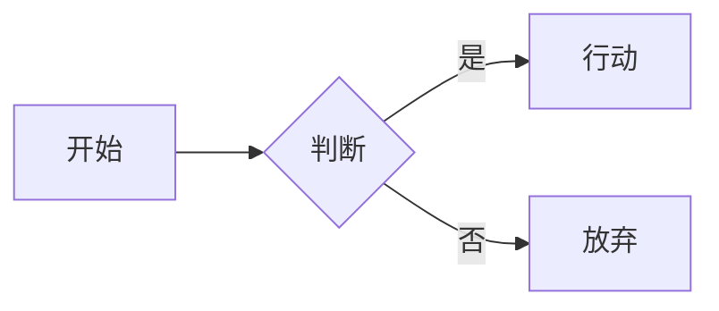

## 适用场景

为基于 **hugo-theme-stack** 的 Hugo 博客添加 Mermaid 图表渲染能力。

## 思路

hugo-theme-stack 提供 `layouts/partials/footer/custom.html` 作为自定义脚本注入点（该文件由 `footer/include.html` 包含，在 `baseof.html` 中加载）。利用该钩子注入 Mermaid 渲染脚本，保持与主题解耦、升级兼容。

## 步骤

### 1. hugo.yaml 添加全局开关

在 `params.article` 下新增 `mermaid: true`，与内置 `math` 参数同级：

```yaml
params:
  article:
    math: true
    mermaid: true   # ← 添加此行
    toc: true
```

### 2. 创建 layouts/partials/footer/custom.html

```html
{{- if or .Params.mermaid .Site.Params.article.mermaid -}}
<script type="module">
    import('https://cdn.jsdelivr.net/npm/mermaid@11/dist/mermaid.esm.min.mjs')
        .then((mermaidModule) => {
            const mermaid = mermaidModule.default;
            mermaid.initialize({
                startOnLoad: false,
                theme: document.body.classList.contains("dark") ? "dark" : "neutral"
            });
            Array.from(document.getElementsByClassName("language-mermaid")).forEach((el) => {
                el.parentElement.outerHTML = `<div class="mermaid">${el.innerHTML}</div>`;
            });
            mermaid.run();
        })
        .catch((error) => {
            console.warn('Mermaid 加载失败，图表将显示为代码块:', error);
        });
</script>
{{- end -}}
```

### 3. 在文章中使用标准代码围栏

`````markdown

`````

## 关键原理

| 问题 | 解决方式 |
|------|----------|
| Mermaid 脚本何时加载 | 条件模板 `{{ if or .Params.mermaid .Site.Params.article.mermaid }}` — 支持全局和按文章两种开关 |
| 注入位置选哪里 | 主题内置 `footer/custom.html` 钩子，所有页面自动加载，无需修改主题核心模板 |
| Hugo 如何渲染 ```mermaid | 默认输出 `<pre><code class="language-mermaid">`，脚本将其替换为 `<div class="mermaid">` |
| Mermaid 初始化时机 | `startOnLoad: false` + 手动 `mermaid.run()`，确保 transform 在替换完成后执行 |
| 暗色主题适配 | 读取 `document.body.classList.contains("dark")` 动态切换 `theme: "dark"/"neutral"` |

## 注意事项

- 不要用 `<script>` 标签传统加载，ES Module 方式避免全局命名冲突
- `footer/custom.html` 是主题官方预留的扩展点，升级主题时不会被覆盖
- 全局启用 `params.article.mermaid: true` 意味着所有页面都加载 Mermaid JS 但仅在存在 `language-mermaid` class 时渲染，按文章启用可节省带宽
