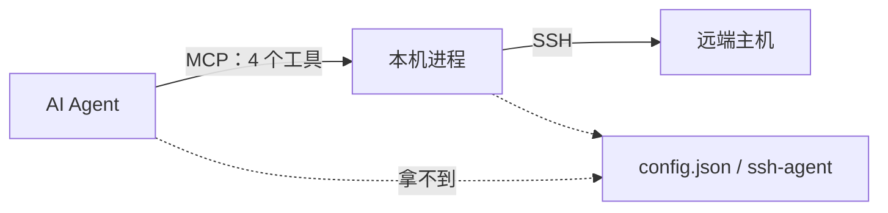

# 2native-ssh-mcp 复盘：一条边界和几个模块设计
------
> 这个 SSH MCP server 8 月底动手，09-11 发到 42 个 commit，Go 实现，单二进制。所有设计决策围绕同一个问题：模型和远端主机之间，边界画在哪。这篇一半讲边界怎么定的，一半讲三个我觉得做得比较有意思的模块——远端进程收割、后台任务协议、输出处理流水线，都带真实代码。

## 边界：凭据和信任材料不经过模型



Agent 只看到 4 个工具（`list-servers` / `execute-command` / `session` / `file-transfer`），SSH 连接、密钥、密码都在本机进程里。工具面刻意收敛：后台长任务不是第五个工具，是 `execute-command` 的 `background: true` 模式；文件传输合成一个 `file-transfer`。模型要记的 schema 越少，工具目录占的上下文越少，选错概率也越低。

## 模块一：远端进程收割
超时命令的清理是个容易被想简单的问题。杀掉 SSH channel 是没用的——channel 断了，远端命令还在跑，下次连接会看到一堆孤儿进程。而且 in-band 的 `Signal` 请求 OpenSSH 经常忽略。我的做法分两步，`internal/manager/kill.go`：

第一步，执行时给命令包一层 pidfile 写入，远端 shell 把自己的 PID 记下来，正常退出时 trap 自动清理：

```go
// The remote shell of an exec channel is its session leader (sshd calls
// setsid per session), so kill -PID targets the entire group including all
// children of the command.
func buildPIDWrapperScript(command, pidFile string) string {
	return fmt.Sprintf("echo $$ > %s 2>/dev/null; trap 'rm -f %s' EXIT 2>/dev/null; %s",
		shellQuote(pidFile), shellQuote(pidFile), command)
}
```

第二步，超时（或输出超限中止）时，开一条 secondary exec channel 发收割脚本——不依赖那条可能已经僵死的命令通道：

```go
func remoteKillScript(signal, pidFile string) string {
	return fmt.Sprintf("pid=$(cat %s 2>/dev/null); [ -n \"$pid\" ] && { kill -%s -- -\"$pid\" 2>/dev/null; kill -%s \"$pid\" 2>/dev/null; }; exit 0",
		shellQuote(pidFile), signal, signal)
}
```

两个细节：sshd 每个会话都 setsid，所以远端 shell 就是 session leader，`kill -- -PID` 连子进程整组收掉；`kill -PID` 后面跟一个裸 PID kill，兜住个别不做 group leader 的 sshd 变体。SIGTERM 之后留 2 秒 grace 再升 SIGKILL，收割脚本本身有硬超时，连接快死也不能把 kill 路径卡住。

## 模块二：后台任务的三文件协议
`background: true` 的任务要断连存活、可重附着。实现是一套跑在远端的文件协议，`internal/manager/background.go` 生成启动脚本：

```sh
setsid sh -c '
  trap "" HUP
  exec </dev/null
  exec >>"$1" 2>&1      # LOG
  eval "$2"
  echo $? > "$3"        # EXITF
' _ "$LOG" "$body" "$EXITF" &
echo $! > "$PIDF"       # PIDF
sleep 1
PID=$(cat "$PIDF" 2>/dev/null)
[ -n "$PID" ] && kill -0 "$PID" 2>/dev/null && printf '__MCP_BG_STARTED__ pid=%s\n' "$PID"
```

设计要点：

1. `setsid` + `trap "" HUP` + `exec </dev/null` 三件套，SSH 连接断开时 SIGHUP 杀不掉它，真正脱离会话
2. LOG / PIDF / EXITF 三个文件就是任务的全部状态：输出追到 LOG，PID 用于后续 stop，退出码写 EXITF。之后随时可以重附着——`ReadSessionOutput` 带 offset 读 LOG 增量，退出码从 EXITF 补
3. 启动握手：`sleep 1` 后 `kill -0` 验活，活着才回 `__MCP_BG_STARTED__ pid=...`，没起来明确报 `__MCP_BG_FAILED__`。agent 拿到的是确定性的启动结果，不是"应该启动了"

对比把任务状态放在服务端内存的方案，这个协议让状态天然持久（文件在远端）、天然可恢复（断线重连照读），服务端重启都不影响任务。

## 模块三：输出三段流水线
所有命令输出在返回给模型前过三段，每段都为"默认开着也不心疼"做过性能设计：

第一段 ANSI 剥离。转义序列对模型是纯噪声。实现是线性扫描 + 锚点预扫，不是上来就跑全套正则——大部分输出根本没有转义序列，一次扫描就能短路。

第二段脱敏（`redactSecrets` 开启时）。secret 正则扫描很贵（每 MiB 约 200ms），做法是用锚点类别做预门控：任何脱敏 pattern 的匹配必然包含自己类别的锚点词，输出里连锚点都没有就整类跳过；最热的 `keyword=value` 类 pattern 再换成一个逐字节等价但快约 30 倍的字节扫描器：

```go
// Anchor classes. Any match of a redaction pattern must contain the class
// anchor (compared ASCII-case-insensitively — a superset of the case-sensitive
// PEM pattern), so output that trips no anchor cannot hold a secret.
const (
	anchorBearer = 1 << iota
	anchorPEM
	anchorKV
	anchorAny = anchorBearer | anchorPEM | anchorKV
)
```

第三段大输出落盘（`spill.go`）。超过 `outputSpillThreshold` 的输出写本地 `.ssh-mcp-out/`（目录 0700、文件 0600），工具结果里只留路径、字节数、行数和开头预览，agent 用 Read/Grep 查全文——想看末尾 100 行不用远程重跑命令。落盘目录有 `trimSpillDir` 保底只留最新 N 个文件；落盘失败（磁盘问题等）降级为压缩返回，不丢结果。

## 边界上的门：破坏性命令审批
有些命令必须穿过边界。`approvalMode: "ask-destructive"` 时，命令命中分类器（内置规则 + `approvalPatterns` 扩展 + 豁免名单）就通过 MCP elicitation 弹窗向人确认。两个决策：

1. **fail-open**：客户端不支持 elicitation 就照跑，结果里附提示。能力缺口不能把用户锁在门外，锁死比放行代价大
2. **弹窗超时 5 分钟**：声明支持但永远不回答的客户端，不能把工具调用卡死

时间点上的巧合：做完没多久，MCP 2026-07-28 修订把 elicitation 送进弃用名单（保留 12 个月），替代的 MRTR 语义是返回 `input_required` 带上问题、客户端把答案放进 `inputResponses` 重试原请求。对审批场景 MRTR 反而更合适：每次审批是可重放、可审计的完整请求；fail-open 的直觉在新语义下退化成"客户端不重试，请求就停在边界上"，错误进不了后端。

## 状态放哪：会话几乎不装东西
HTTP daemon 模式（常驻 + 多客户端）的代价是并发——加固轮修的 data race、引用计数不收敛、输出预算被并发写穿全是它带来的。daemon 非 loopback 监听强制要求 token，没有直接拒绝启动。

但 transport 层的 session 几乎不承载状态：SSH 连接在进程内 manager 里，后台任务状态在远端三文件里，重附着靠模型把 session id 当参数传回来。MCP 2026-07-28 把会话从协议里砍掉，对这个工具迁移成本约等于零。

## 两个坑
1. **sftpChunkSize 超过 32KB 是地雷**（`6355520`）。SFTP 协议对包尺寸有 32KB 上限，块大小配置超过会莫名传输失败。默认值钉死，配置范围做钳制
2. **传输和命令执行不该共用连接**。大文件传输长时间占用 SSH 通道，和命令互相干扰，后来把传输挪到独立连接（`221cf27` sftpDedicatedConn）

## 小结
回收成一条检验标准：新功能进这个项目前，先问这个状态或材料放边界的哪一侧——凭据放进程里（模型看不见），任务状态放远端三文件（模型按需读），大输出放本地磁盘（agent 自己 Grep），危险操作交给人（穿边界走门）。凭据隔离是安全上的边界，输出处理是 token 上的边界，两条线共用同一套思路。
