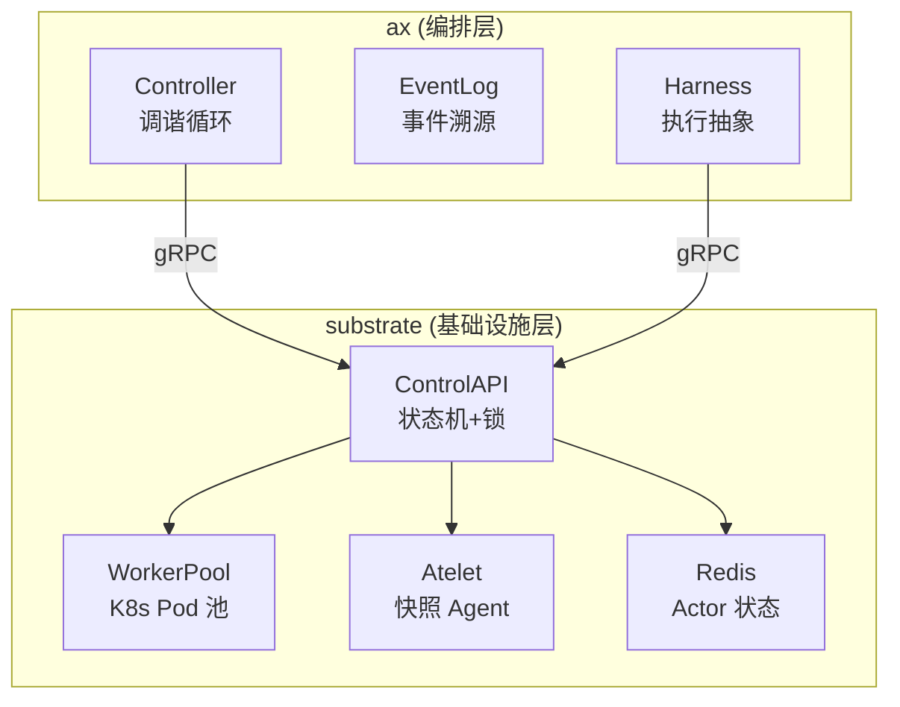
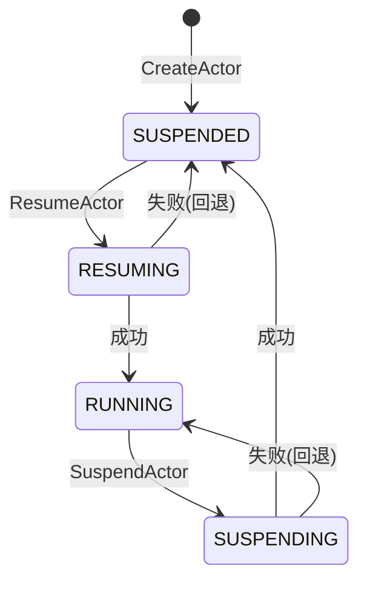

# Google ax + substrate：智能体运行时调度架构分析
------
> Google 开源了两套用于运行长时间智能体（Agent）的组件：**ax** 和 **substrate**。ax 负责业务编排和会话管理，substrate 负责沙箱实例的生命周期调度。两者组合解决了 LLM 智能体运行时的核心问题：**一个有状态的 Agent 进程，在空闲时如何保存全部状态并释放计算资源，新请求来了怎么快速恢复。**

## 架构总览：两层设计



> 两层的职责边界很清晰：ax 知道"做什么"（业务逻辑），substrate 知道"怎么跑"（沙箱调度）。ax 通过 gRPC 调用 substrate 的 ControlAPI 来管理 Actor 的创建、恢复和挂起。

## 核心概念：Actor 模型
------
> 每个 Agent 会话对应一个 **Actor**，这是整个系统的核心抽象。Actor 不是一个 Go 对象，而是一个**分布式状态机**，状态存在 Redis 里，实际的沙箱进程跑在 K8s Worker Pod 上。

**Actor 状态流转：**



每个状态转换都是**幂等**的，失败时回退到前一个稳定状态。状态字段定义在 Redis 里，用 `version` 字段做乐观并发控制（WATCH 事务）。

**Actor 核心字段（Redis 存储）：**
```go
// substrate/pkg/proto/ateapipb/ateapi.proto
message Actor {
    string id = 1;
    ActorStatus status = 2;       // UNSPECIFIED/RESUMING/RUNNING/SUSPENDING/SUSPENDED
    int64 version = 3;            // 乐观并发版本号
    string last_snapshot = 4;     // 最近完成的快照路径（GCS）
    string in_progress_snapshot = 5; // 正在写入的快照路径
    string ateom_pod_name = 6;    // 绑定的 K8s Pod
    string ateom_pod_ip = 7;      // Pod IP
    string ateom_pod_node = 8;    // Pod 所在 Node
}
```

> 这里的关键设计是：**Actor 状态和 Worker 节点是解耦的**。Redis 里只存"这个 Actor 应该在哪"，实际的沙箱进程可以漂移到任何有空闲资源的 Worker 上。

## WorkerPool：K8s 原生的 Worker 管理
------
> substrate 用 K8s CRD 来管理 Worker 节点池，而不是自建调度器。这样可以复用 K8s 的 HPA、PDB 等能力。

```go
// substrate/pkg/api/v1alpha1/workerpool_types.go
type WorkerPoolSpec struct {
    Replicas    int32  `json:"replicas"`     // Worker Pod 数量
    AteomImage  string `json:"ateomImage"`   // gVisor 沙箱镜像
}
```

WorkerPoolSyncer 是一个 K8s Controller，监听 `ate.dev/worker-pool` 标签的 Pod：
```go
// substrate/cmd/ateapi/internal/controlapi/syncer.go
// 核心逻辑：watch Pod 变更，同步到 Redis Worker 集合
func (s *WorkerPoolSyncer) syncPods(ctx context.Context) error {
    pods, _ := s.kubeClient.CoreV1().Pods(s.namespace).List(ctx, metav1.ListOptions{
        LabelSelector: "ate.dev/worker-pool=" + s.poolName,
    })
    // 用 Redis SET 维护活跃 Worker 列表
    // Pod 删除时，尝试释放该节点上的 Actor（best-effort）
}
```

> 有一个值得注意的点：Pod 意外死亡时，`releaseActorOnDeadWorker` 是 **best-effort** 的。如果此时恰好有并发操作导致乐观锁冲突，Actor 可能卡在 RUNNING 状态——这是一个已知问题。

## 挂起与恢复：4 步幂等工作流
------
> 这是整个系统最精妙的部分。挂起和恢复都不是单次操作，而是拆成 4 个幂等步骤的工作流，每一步都可以安全重试。

**通用工作流引擎：**
```go
// substrate/cmd/ateapi/internal/controlapi/workflow.go
func RunWorkflow[Params, Context any](
    ctx context.Context,
    params Params,
    steps []WorkflowStep[Params, Context],
) error {
    for _, step := range steps {
        // 1. 先检查这步是否已经完成（幂等快进）
        done, _ := step.IsComplete(ctx, params, context)
        if done {
            continue // 已完成，跳过
        }
        // 2. 执行步骤，带指数退避重试
        retry.Retry(step.Action, retry.WithBackoff(retry.NewExponentialBackoff()))
    }
}
```

> 每一步先调 `IsComplete` 检查是否已完成——这就是幂等的核心。如果系统在步骤 3 崩溃了，重启后从步骤 1 开始，步骤 1 和 2 的 `IsComplete` 会返回 true，直接跳到步骤 3 继续。

**挂起工作流（4 步）：**
```go
// substrate/cmd/ateapi/internal/controlapi/workflow_suspend.go
steps := []WorkflowStep[SuspendActorParams, SuspendActorContext]{
    {Name: "LoadActorForSuspend", Action: loadActorForSuspend},
    {Name: "MarkSuspending",      Action: markSuspending},      // RUNNING→SUSPENDING, 生成快照路径
    {Name: "CallAteletSuspend",   Action: callAteletSuspend},   // gRPC 调用 Atelet 做 checkpoint
    {Name: "FinalizeSuspended",   Action: finalizeSuspended},   // 释放 Worker, 更新 LastSnapshot
}
```

快照路径生成用时间戳+随机数避免冲突：
```go
func markSuspending(ctx context.Context, params SuspendActorParams, sCtx *SuspendActorContext) error {
    snapshotPath := fmt.Sprintf("gs://bucket/actors/%s/snapshots/%d-%s",
        params.ActorID, time.Now().UnixNano(), rand.String(8))
    // Redis: status SUSPENDED→SUSPENDING, in_progress_snapshot = snapshotPath
}
```

**恢复工作流（4 步）：**
```go
// substrate/cmd/ateapi/internal/controlapi/workflow_resume.go
steps := []WorkflowStep[ResumeActorParams, ResumeActorContext]{
    {Name: "LoadActorForResume", Action: loadActorForResume},
    {Name: "AssignWorker",       Action: assignWorker},       // 从 WorkerPool 选空闲 Pod
    {Name: "CallAteletRestore",  Action: callAteletRestore},  // 3条路径: 快照恢复/黄金快照/冷启动
    {Name: "FinalizeRunning",    Action: finalizeRunning},    // SUSPENDING→RUNNING
}
```

> assignWorker 的逻辑是：shuffle 所有 Worker，找到第一个没有绑定 Actor 的 Pod。如果所有 Pod 都满了，直接失败——**WorkerPool 不会自动扩容**，需要外部 HPA 或手动调整 replicas。

恢复时有 3 条路径：
```go
func callAteletRestore(ctx context.Context, params ResumeActorParams, rCtx *ResumeActorContext) error {
    switch {
    case rCtx.Actor.LastSnapshot != "":
        // 路径1: 有个人快照，从 GCS 下载 + runsc restore
    case rCtx.Template != nil && rCtx.Template.Snapshot != "":
        // 路径2: 黄金快照（ActorTemplate 预制），快速冷启动
    default:
        // 路径3: 纯冷启动，无状态恢复
    }
}
```

## 快照机制：gVisor checkpoint/restore
------
> 这是整个系统的"魔法"所在。gVisor 的 checkpoint/restore 能把整个沙箱进程的内存状态序列化到文件，恢复时从文件加载回内存，实现毫秒级的状态恢复。

**Atelet（DaemonSet，每节点一个）负责实际的快照操作：**
```go
// substrate/cmd/ateom-gvisor/runsc.go
// checkpoint: 把容器进程的全部内存页 + sentry 状态写到磁盘
func (r *Runsc) Checkpoint(ctx context.Context, containerID, imagePath string) error {
    args := []string{"checkpoint", "--image-path", imagePath, containerID}
    // 注意：没有 --parent 参数，不支持增量快照
    return r.runsc.Run(ctx, args...)
}

// restore: 从磁盘加载内存页，重建容器进程
func (r *Runsc) Restore(ctx context.Context, containerID, imagePath, bundlePath string) error {
    args := []string{"restore", "--image-path", imagePath,
        "--background", "--direct", "--detach", "--bundle", bundlePath, containerID}
    return r.runsc.Run(ctx, args...)
}
```

**快照上传/下载用 zstd 压缩：**
```go
// substrate/cmd/atelet/internal/ategcs/objects.go
func (s *ObjectStorage) SendLocalFileToGCSWithZstd(ctx, bucket, object, localPath) error {
    // 本地文件 → zstd 压缩 → GCS PUT
    // 没有合并、没有增量、没有去重
}

func (s *ObjectStorage) FetchLocalFileFromGCSWithZstd(ctx, bucket, object, localPath) error {
    // GCS GET → zstd 解压 → 写本地文件
}
```

> 一个很大的设计局限：**每次挂起都是全量快照**。gVisor 的 `runsc checkpoint` 支持 `--parent` 增量模式，但 substrate 没有用。这意味着一个 2GB 内存的 Agent，每次挂起都会写 2GB（压缩后可能 500MB）。没有快照合并、没有增量、没有去重。

## ax 编排层：事件溯源与调谐循环
------
> ax 的设计哲学是 **event-sourcing**：所有状态变更都记录为事件，系统状态可以从事件日志完全重建。

**双事件日志：**
```go
// ax/internal/controller/executor/sqlite.go
// 两张表：
// conversation_log: 客户端消息（通过 lastSeq 实现增量同步）
// execution_log:    执行记录（用于崩溃恢复时重放）

type EventLog interface {
    Append(ctx, conversationID string, event *ConversationEvent) (int64, error)       // 追加会话事件
    AppendExec(ctx, conversationID string, event *ExecutionEvent) error               // 追加执行事件
    Events(ctx, conversationID string, afterSeq int64) ([]*ConversationEvent, error)  // 读取会话事件
    ExecEvents(ctx, conversationID string) ([]*ExecutionEvent, error)                 // 读取执行事件
}
```

**v1 Controller 的调谐循环：**
```go
// ax/internal/controller/controller.go
func (c *Controller) tryResuming(ctx, req) error {
    events := c.eventLog.Events(req.ConversationID)
    lastSeq := req.LastSeq

    // 1. 快进：跳过客户端已知的事件
    for _, ev := range events {
        if ev.Seq <= lastSeq { continue }
        // 客户端需要这些事件，先推送给它
    }

    // 2. 查找未完成的执行（崩溃恢复）
    pending := findPendingExecutions(events)
    if len(pending) > 0 {
        // 重放历史，恢复执行
        replayHistory(pending)
    }

    // 3. 驱动新的执行
    executor.Execute(ctx, req)
}
```

> 这里的 `lastSeq` 机制很巧妙：客户端告诉服务端"我已知到第 N 条事件"，服务端只推送 N 之后的事件。这样即使中间服务端重启了，客户端也不会丢消息。

**Harness 抽象（v2 重构）：**
```go
// ax/internal/harness/harness.go
type Harness interface {
    Start(ctx context.Context, conversationID string) (Execution, error)
}

type Execution interface {
    Run(ctx, input) error
    Queue(ctx, input) error
    ID() string
    Close(ctx) error
}
```

v1 直接用 `agent.Agent` 接口，v2 引入 `Harness` 抽象，`SubstrateHarness` 桥接到 substrate：
```go
// ax/internal/harness/substrate.go
func (h *SubstrateHarness) Start(ctx, conversationID) (Execution, error) {
    // 1. CreateActor（幂等）
    h.client.CreateActor(ctx, &CreateActorRequest{Id: conversationID})
    // 2. ResumeActor
    h.client.ResumeActor(ctx, &ResumeActorRequest{Id: conversationID})
    // 3. gRPC 连接到 Worker Pod
    actor := h.client.GetActor(ctx, &GetActorRequest{Id: conversationID})
    conn, _ := grpc.Dial(actor.AteomPodIp + ":50051")
    // 4. 开始执行
    return &substrateExecution{conn: conn, actor: actor}, nil
}

func (e *substrateExecution) Close(ctx) error {
    // 5. 关闭 gRPC 连接
    e.conn.Close()
    // 6. Fire-and-forget 挂起！
    go suspendActor(e.actor.Id)  // ⚠️ 结果没人检查
    return nil
}
```

## 针对 Agent 业务的特殊设计
------
> 通用的容器编排（K8s）解决不了智能体的需求，因为 Agent 进程的内存状态就是业务状态本身。下面这些设计都是为这个特点服务的。

### 1. 进程级快照而非应用级序列化
传统微服务用数据库/Redis 持久化状态，重启后从存储加载。但 LLM Agent 的状态太复杂：
- LLM 对话历史（可能几 MB）
- Python/Node 运行时的完整堆栈
- 工具调用的中间状态
- 向量数据库的内存索引

gVisor checkpoint 直接序列化整个进程的内存页，**不需要应用层做任何适配**。代价是快照体积大、无法增量。

### 2. 黄金快照（Golden Snapshot）
```go
// ActorTemplate Controller 预制一个初始快照
// 比如：已安装依赖、已加载模型权重、已初始化运行时
// 新 Actor 恢复时如果有黄金快照，跳过冷启动
type ActorTemplate struct {
    Spec ActorTemplateSpec
    Status struct {
        Snapshot string // 预制快照的 GCS 路径
    }
}
```

> 这个设计很聪明。Agent 运行时（比如 Python + langchain + 向量库）冷启动可能要 30s+，但如果有黄金快照，恢复只需要几秒。

### 3. 分布式锁保证单点写入
```go
// Redis SETNX + TTL = 30 秒
func acquireActorLock(ctx, actorID string) (bool, error) {
    key := "actor:lock:" + actorID
    acquired, _ := rdb.SetNX(ctx, key, "1", 30*time.Second).Result()
    return acquired, nil
}
```

> 一个 Actor 同一时刻只能有一个挂起/恢复操作。锁的 TTL 是 30 秒——如果操作超过 30 秒没完成，锁自动释放，其他操作可以介入。这比 K8s 的 resourceVersion 乐观锁更适合长时间操作。

## 存在的问题
------
> 坦率说，这两个项目还在早期阶段（v1alpha1），有不少明显的架构缺陷。

### 1. 没有空闲检测和冷却期
**最严重的问题**。当前逻辑是每次请求结束就立刻挂起：
```go
// ax/internal/server/server_ate.go
func (s *Server) Execute(ctx, req) {
    s.inFlight[req.ConversationId] = struct{}{}
    defer delete(s.inFlight, req.ConversationId)
    
    exec, _ := s.harness.Start(ctx, req.ConversationId)
    defer exec.Close(ctx) // ← 立刻触发挂起
    
    exec.Run(ctx, req)    // ← 执行完就挂起
}
// 挂起只有 50ms 的延迟：
func suspendActor(conversationID string) {
    time.Sleep(50 * time.Millisecond) // ⚠️ 几乎等于立刻挂起
    client.SuspendActor(...)
}
```

**后果：** 高频请求的 Agent 会疯狂抖动——每次请求都触发一次全量 checkpoint + restore。一个 1GB 内存的 Agent，每秒 1 次请求 = 每秒写 1GB 快照到 GCS。

**缺少的机制：**
- 没有 idle timeout（空闲 N 秒后才挂起）
- 没有 cooldown（挂起后 N 秒内不允许再挂起）
- 没有活跃度判断（看最近 N 分钟的请求频率）

### 2. 挂起是 Fire-and-Forget
```go
// ax/internal/server/server_ate.go
go suspendActor(req.ConversationId)  // 结果没人检查
```

```go
func suspendActor(conversationID string) {
    ctx := context.Background()
    client := getATEClient()
    _, err := client.SuspendActor(ctx, &pb.SuspendActorRequest{Id: conversationID})
    if err != nil {
        log.Error(err) // 只记日志，不重试，不回退
    }
}
```

> 挂起失败了怎么办？Actor 卡在 RUNNING 状态，Worker Pod 不会被释放，资源一直占用。没有重试、没有告警、没有补偿。而且 SuspendActor 的 gRPC 超时只有 30 秒，如果 checkpoint 大一点（比如 2GB），可能超时失败。

### 3. 没有快照 GC
```go
// substrate 只跟踪最近一个快照
type Actor struct {
    LastSnapshot        string // 最近完成的快照
    InProgressSnapshot  string // 正在写的快照
}
```

> 每次挂起都往 GCS 写一个新快照，但**从不删除旧快照**。一个月下来，一个 Actor 可能积累上百个快照文件。没有 GC 策略、没有 TTL、没有存储配额。

### 4. 没有自动扩缩容
WorkerPool 是静态的 Replicas，Actor 绑定满了就拒绝新请求：
```go
func assignWorker(ctx, params, rCtx) error {
    workers := shuffle(allWorkers)
    for _, w := range workers {
        if !isOccupied(w) {
            // 分配成功
            return nil
        }
    }
    return errors.New("no available worker") // ← 所有 Worker 都满了
}
```

> 没有 HPA 集成、没有 pending 队列、没有抢占机制。生产环境需要自己搭扩缩容逻辑。

### 5. Worker 死亡时的状态恢复有竞态
```go
// substrate/cmd/ateapi/internal/controlapi/syncer.go
func releaseActorOnDeadWorker(ctx, podName string) {
    actor := findActorByPod(podName)
    if actor == nil { return }
    // best-effort：用乐观锁重置状态
    // 但如果有并发操作（比如正在 Resume），可能冲突
    // 冲突后 Actor 卡在 RUNNING，Pod 已死 → 资源泄漏
}
```

> 这个问题在 GitHub issue #23 有讨论。核心矛盾是：K8s 的 Pod 删除是异步的，substrate 的 Actor 状态更新也是异步的，两个异步事件之间没有原子性保证。

### 6. v2 Controller 缺少执行恢复
```go
// ax/internal/controller2/controller.go
func (c *Controller) reconcile(ctx, req) {
    // TODO: tryResuming 没有实现
    // 崩溃后的执行恢复靠谁做？不清楚。
}
```

### 7. 没有增量快照
gVisor 的 `runsc checkpoint` 原生支持 `--parent` 增量模式（只写和上次快照相比变化的内存页），但 substrate 没用。每次都是全量写。对于内存较大的 Agent 进程（比如加载了大模型的推理服务），这是一个很大的存储和性能瓶颈。

## 总结
------
> ax + substrate 的设计思路是对的：用 gVisor 的进程级快照解决 Agent 状态持久化，用 K8s CRD 管理 Worker 池，用幂等工作流保证挂起/恢复的可靠性。但作为一个还在 v1alpha1 阶段的项目，它离生产可用还有不少距离——最核心的短板是没有空闲检测（每次请求结束就挂起）、没有快照 GC、挂起失败不重试。

**如果要在生产中用这套架构，需要自己补的东西：**
1. **suspendScheduler**：带 debounce 的挂起调度器，空闲 N 秒后才触发挂起，活跃期间不挂起
2. **Substrate 层 cooldown**：Redis 里记录 last_suspend_time，挂起后 M 秒内拒绝再次挂起
3. **快照 GC**：只保留最近 K 个快照，用 GCS lifecycle policy 或自定义 controller 清理
4. **LRU 淘汰**：Worker 满时，淘汰最久未使用的 Actor，为新请求腾位置
5. **挂起结果确认**：从 fire-and-forget 改为同步等待 + 重试 + 告警
6. **增量快照**：启用 gVisor 的 `--parent` 参数，减少快照体积

> 作为一个学习对象，这套架构的幂等工作流设计（`RunWorkflow` + `IsComplete` 快进）、双层事件日志（Conversation + Execution）、分布式锁 + 乐观并发控制，都值得借鉴。但直接用到生产环境还需要大量的工程补齐。
