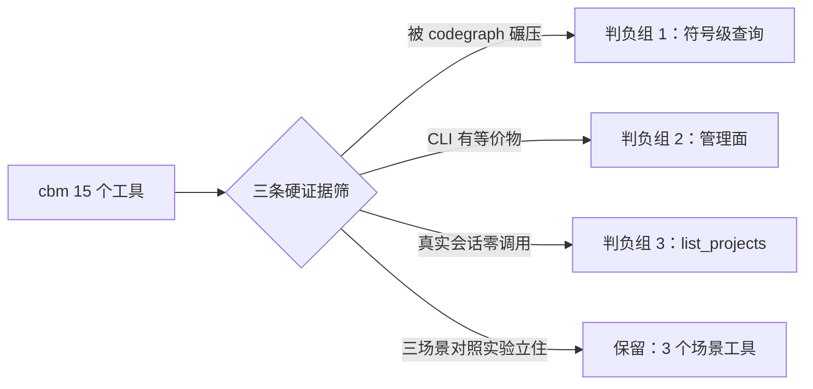

# 给 MCP 服务器做减法（一）：实测判负的工具与裁剪依据
------
> 我深度用了两周 codebase-memory-mcp（下称 cbm），一个把代码库索引成知识图谱的 MCP 服务器，15 个工具。结论是：15 个里只有 3 个场景真正立住了，其余全部判负——要么被 codegraph 同类工具碾压，要么 CLI 里一行命令就有等价物，不值得在每轮对话里交定义层税。这篇记录判负的证据和方法，不记录情绪。

## 先算账：15 个工具的定义层税单
------
> 判负之前先量化"养着这些工具要花多少钱"。MCP 的成本模型里有个容易被忽略的项：工具定义不是调用时才付费，而是**每个会话每轮对话都常驻在上下文里**。

cbm 是 stdio server，我就以 MCP 客户端身份把它拉起来，抓 `tools/list` 的真实载荷。探针是个几十行的 Node 脚本（简化版）：

```js
// mcp_probe.cjs：拉起 stdio server，抓 initialize + tools/list 全量载荷
const child = spawn(cmd, args, { stdio: ["pipe", "pipe", "inherit"] });

send({ jsonrpc: "2.0", id: 1, method: "initialize",
       params: { protocolVersion: "2024-11-05", capabilities: {}, clientInfo: { name: "probe" } } });
send({ jsonrpc: "2.0", method: "notifications/initialized" });
send({ jsonrpc: "2.0", id: 2, method: "tools/list" });

child.stdout.on("data", buf => {
  // 按 Content-Length 拆帧，落盘每个响应的原始字节数
  frames.push({ id: msg.id, bytes: buf.length, payload: msg });
});
```

初版只量了 tools/list，后来发现漏了两项：MCP initialize 响应里的 `instructions` 字段（规范客户端会注入系统提示词）和 prompts 列表。补齐后的完整账单：

| 定义层 | codegraph | cbm 全量 |
|---|---|---|
| tools/list（描述+schema） | 6,762B ≈ 1,691 tok | 22,441B ≈ 5,610 tok（**15 个工具**） |
| instructions 字段 | 4,226B ≈ 1,057 tok | 808B ≈ 202 tok |
| prompts 列表 | 无 | 2 个 ≈ 37 tok |
| **定义层小计** | **≈ 2,748 tok** | **≈ 5,850 tok** |

payload 字节数到手后换算 token。这里有个容易自欺的地方：用 bytes/4 估是乐观值，对 schema 这种标点密集的 JSON，真实分词更接近 bytes/3~3.5：

```js
// 估算口径：两档一起报，给区间不给单点
const tokensOptimistic = bytes / 4;   // 乐观下界
const tokensRealistic  = bytes / 3.5; // 标点密集 JSON 的经验档
```

两个 server 一起挂着，定义层合计 **≈ 8,600 tokens/会话**，乐观估算下真实体感可能到 10-11K。

> 最扎眼的是 codegraph 那行 4.2KB 的 instructions：一整套行为指令（"直接回答别委派子 agent""先于 Read/Grep 调用"）。这是把工具用法写死进系统提示词，替模型做工作方式决策。cbm 反过来，instructions 很短，但用 15 个工具的长描述把复杂性全堆在 tools/list 里。两种路线，交的税一样。

调用时的开销另算，而且更隐蔽：cbm 每个结果是**双份返回**——tree 文本和 structuredContent JSON 是同一份数据给两遍，结果侧直接 ×2。codegraph 单份但载荷密，官方自己承认常驻上下文 +80%。

结果侧的浪费也顺手写进了探针：同一个结果，`content` 里是 tree 文本，`structuredContent` 里是同数据的 JSON 序列化。对模型来说信息为零增益，token 直接翻倍。

## 判负的标准：三条硬证据
------
> "我感觉没用"不是裁剪依据，MCP 工具面的每一次删减都要能回答：删了之后工作流会不会退化？

我的判负标准是三条，全部可复测：

1. **真实调用率**：回看若干个真实会话的调用记录，哪些工具被 agent 主动调过；
2. **结果质量**：调了之后，是否真的省掉了后续的 grep/Read 次数，还是拿到结果还得回原始文件验证；
3. **CLI 等价性**：这个工具在 `cbm cli` 里有没有一行等价命令——有的话，退出 MCP 只损失"agent 自主发现"这一点，能力不丢。

第 1 条有个陷阱要说明：agent 不调 ≠ 工具差。可能是 schema 写得糊、描述太长模型没读进去。但对裁剪来说结论一样成立——**一个 agent 不会主动调的工具，挂在工具面里就是纯税**。

> 这三条里第 3 条最关键，它把"裁剪"从减法变成了搬家：MCP 定义层省下的 token 是确定的，能力通过 CLI 随时可取回。没有等价物的工具才需要真正纠结去留。

还有一个反向的佐证：实测里 agent 对工具的**误用**集中出现在少数几个工具上——schema 越长、描述越糊，模型越容易拿错误的参数组合去撞。工具面越长这个问题越严重，15 个工具互相干扰，单个工具的描述再精准也救不回来。

## 逐个判负：砍掉的、留下的、可惜的
------
> 15 个工具过一遍筛子。判负名单按"被谁替代"分组，证据都来自实测记录和上游 issue。



**判负组 1：符号级查询，被 codegraph 碾压。** 这是最大的一组。符号搜索、取源码、调用链——这些是 codegraph 的基本盘，而且强得多：

| 能力 | cbm 工具 | codegraph 对应 | 判负理由 |
|---|---|---|---|
| 符号搜索 | search_graph | search | codegraph 一次返回限定元数据，够用且轻 |
| 取源码 | get_code_snippet | node / **explore** | explore 一次拉一组符号的完整源码，cbm 做不到 |
| 调用链 | trace_path | callers / callees / trace | cbm 有 #1991：每请求固定 ~12ms 地板（0.9.0 时代是亚毫秒），codegraph 无此税 |

`trace_path` 的判负最干脆：调用链分析 codegraph 的 `callers`/`callees`/`trace` 全覆盖，cbm 这边还背着 12ms/请求的进程间协调地板。同一次查询，没有理由选慢的那个。

**判负组 2：管理面，全走 CLI。** 索引、同步、daemon 控制（`index_repository`、`daemon stop`、config 类）占了好几个工具位，但它们的调用者是**人**，不是 agent——我从来没需要让模型自主决定"什么时候重建索引"。这类工具留在 MCP 工具面里，等于让每轮对话为低频管理操作付常驻税。

**判负组 3：`list_projects`。** T1-T3 对照实验里，三个真实场景（架构概览、图查询、变更影响）它一次都没进过调用路径，而 CLI 里一行就有。典型的"挂在那显得功能全"的工具。

**唯一可惜的舍弃：`semantic_query`。** 概念级查找（"找处理重试的逻辑"这类不精确匹配符号名的需求）是符号搜索真覆盖不了的。但它依赖向量语义边——而语义边恰恰是素材里判定"贬值最快"的那类增值插件。如果哪天真需要，方案是把它做成搜索工具的可选参数挂 vector 索引，不单开工具。

**留下的：3 个场景。** 对照实验里立住的三个，恰好都是 codegraph 没有的能力：

```
get_architecture    # 架构概览：Leiden 社区划分、复杂度热点、循环依赖
query_graph         # 图查询：写 Cypher 做"谁调了 X"、跨模块模式确认
detect_changes      # 变更影响：git diff → 受影响符号的传递集（提交前自检）

# 另有两个排查辅助留在 CLI 侧，不进 MCP：
index_status            # 索引新鲜度——结果失真前先看这个
check_index_coverage    # 覆盖度审计——parse_partial 区域的图结果不可信
```

> 这 3 个能立住不是偶然：get_architecture 的 Leiden 社区和 detect_changes 的传递影响集是**图算法**，tree-sitter 解析完之后的加工增值；而符号级查询本质是"更贵的 grep"，模型演进越快这类工具越容易被原生搜索追平。不贬值的是图算法、覆盖度审计、跨会话索引资产——裁剪就是留下不贬值的。

## 中间档：scout 和 arch，为什么不选
------
> 裁剪不是只有"全留"和"全退"两个选项。cbm 官方有 tool-profile，自编译还能加自定义档，我在这两档之间停留过，最后还是走了 CLI。

scout 档是零改动方案，一行配置：

```json
{
  "mcpServers": {
    "codebase-memory-mcp": {
      "command": "codebase-memory-mcp",
      "args": ["--tool-profile=scout"]
    }
  }
}
```

arch 档官方没给，要自己编译——在 `src/mcp/mcp.c` 的 `mcp_tool_allowed()` 里加一组工具名，约 20 行：

```c
// 思路示意：在白名单函数里加一个档位判断
if (strcmp(profile, "arch") == 0) {
    return tool_in(tool, "get_architecture", "query_graph", "detect_changes",
                   "index_status", "check_index_coverage", "list_projects", NULL);
}
```

三档的省幅：

| 档位 | 动作 | 定义层 token | 相对现状 |
|---|---|---|---|
| 现状两件套 | — | ~8,600 | — |
| scout 档 | 一行配置 | ~5,840 | 省 ~32% |
| arch 档 | 自编译补丁 | ~4,550 | 省 ~48% |
| 退出 MCP | CLI + skill | ~2,750 | 省 68% |

> scout/arch 档对"还想留在 MCP 里"的人是合理阶梯。但它们有个共同问题：**判负的工具只是被藏起来了，定义层的判断负担还在**——我要持续维护"哪些该露出来"的清单，而 CLI 路线把这个维护成本一次性归零。既然判负证据已经够了，中间档只是延迟同一个结论，我没有停在那。

## 保留集的工作流：CLI + skill 配方
------
> 退出 MCP 之后，cbm 的形态从"server 常驻"变成"按需起进程"。三个场景各自有固定配方：

```bash
# 场景 1：架构概览——大仓库第一刀，先看事实上的模块切分
cbm cli get_architecture --aspects clusters

# 场景 2：跨模块确认——Cypher 直查
cbm cli query_graph --query "..." 

# 场景 3：commit 影响半径——提交前跑一次当自检
cbm cli detect_changes --since HEAD~1
```

和 CLI 配套的是把配方烧进一个 skill：skill 里写死"什么信号出现时调哪个 CLI 命令、结果为空怎么排查"。这相当于把"MCP 工具描述"的引导职能从定义层搬到了 skill 文本——区别是 skill 文本只在需要时加载，不占每轮对话。

> 说白了这是一笔交换：放弃 agent 的**自主发现**（模型自己看到工具描述决定调用），换成**确定性调度**（skill 规则触发）。实测下来 agent 自主发现 15 个工具的成功率并不高——schema 太长，描述互相干扰，误用和空转不少。确定性调度反而准。

两个 server 的分工随之定型，索引也分成两层：

```
codegraph = 活层（always-on，保存后 ~0.3s 增量，喂日常符号工作）
cbm       = 深层（milestone/按需全量，喂架构分析与影响面，用完 daemon stop）
```

裁剪后的定义层税单：8,600 → 只剩 codegraph ≈ 2,750 tok，**省 68%**，且 cbm 的结果侧双份开销也一并消失。

## 反向参照：如果只留 8 个工具，理想长什么样
------
> 判负做完，我把两个 server 的能力摊在桌面上重新排列了一次：假如从零设计一个最小工具面，它应该是什么形状。这张表也是裁剪依据的一部分——它划出了"该留的"和"增值插件"的边界。

六个能力层、8 个工具，管理面全部走 CLI 不占 MCP 定义层：

| 层 | 工具 | 接口要点 | 对应物 |
|---|---|---|---|
| L1 定位 | search | 名称/正则/BM25，返回限定元数据 | codegraph search |
| L2 读取 | source | 符号 → 源码+签名+紧邻调用 | codegraph node / explore |
| L3 关系 | relations | 方向(in/out/path)+边类型，游标分页 | codegraph callers/callees/trace |
| L4 变更 | impact / diff_impact | 符号级影响；git diff → 传递影响集 | codegraph impact / cbm detect_changes |
| L5 导览 | architecture | modules(社区)/cycles/hotspots | cbm get_architecture（独有） |
| L6 信任 | coverage | 逐文件解析覆盖+索引新鲜度 | cbm check_index_coverage（独有） |

按短描述+精简 schema 算，8 工具的定义层预算约 3-4KB ≈ 900 tok。对比现状 8,600，省幅在 70% 以上。

同样重要的是**明确排除**的清单——这些是调研里判定"贬值最快"的增值插件：

```
向量语义边、相似度边、跨仓 intelligence、运行时轨迹注入、
ADR 存图、graph UI、常驻 daemon/协调层
```

> 这张表给我的最大启发是"成本前置 vs 成本后置"的分野：cbm 是成本前置 + 捆绑销售（耐用品和易耗品强制一起买），codegraph 是成本后置 + 行为导演。模型演进越快，为弱模型设计的补偿性智能贬值越快——L1 到 L3 那几层本质是"更贵的 grep"，而 L5/L6 依赖的图算法和覆盖度审计不会贬值。裁剪清单和这张表是同一个判断的两个投影。

## 代价核对：判负清单之外的理由
------
> 工具面裁剪解决 token，但 cbm 的账不止这一页。记录性能侧的实测，作为"为什么不留着试试"的补充证据。

2026-09-04 的一次普通会话里抓到的数字（本机 Windows 11，~1900 文件的 C 项目）：

| 指标 | 实测值 | 对应上游 issue |
|---|---|---|
| index worker 内存 | **2.7GB**（预算 2.8GB 几乎打满） | #1973：预算是 advisory，宁可 OOM 不降级 |
| MCP stdio server | 空闲时段 ~30% 单核 | #1764：每个空闲客户端烧 ~0.7 核 |
| 二进制体积 | 282MB 单个 exe | — |
| watcher | 每 3~5 秒一轮自触发重索引 | #1953：git 策略对 untracked 文件敏感，工具产物喂它死循环 |
| 失败 worker | 无退避无限重 fork | #2015：4h43m 内 2233 个 worker |

触发链已经实锤：会话工具在仓库里写 `.codegraph/` 这类产物目录 → git-strategy watcher 判定 changed → daemon 反复 fork worker。解法之一是把产物目录 gitignore，但更根本的是——**一个"高性能"卖点著称的索引服务，默认配置下会和客户端工具互相喂出死循环**，这本身就是工具面之外的设计债。

> cbm 的深度（LSP 类型解析 + 语义边）是用内存和常驻进程换的，codegraph 的增量快是用磁盘和 WAL 换的，没有免费午餐。但"深度"大部分在判负清单里已经卖不出去了——剩下 3 个场景恰恰不依赖常驻 daemon，按需起进程跑完就停，反而是对它资源模型最友好的用法。

------
> 裁剪的尽头是一个朴素的判断：MCP 工具面应该只放"agent 每轮都可能自主用到"的东西，低频能力、管理面、被更强工具覆盖的能力，都该退到 CLI。15 个工具筛完剩 3 个场景，token 省 68%，误用率归零（没有可误用的了）——这个比例让我怀疑大部分 MCP 服务器都超配了一倍以上。下一篇写从 MCP 退到 CLI 的过程中暴露的另一类问题：CLI 静默失败——空结果和真失败不可区分，agent 拿着空输出继续推理，比误用工具更危险。所以下一步是给 CLI 做 fail-loud 改造：非法参数报错、空结果带原因、退出码讲真话。
