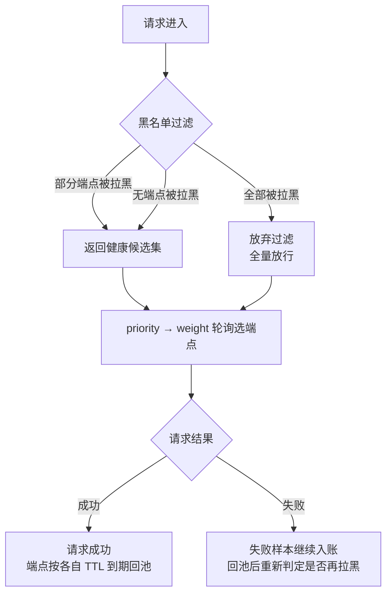

# Higress 端点级断路器（二）：全拉黑放行——最反直觉的设计决策
------

> 系列第二篇。上一篇写了慢故障的统计口径——5s 去重窗口、70s 阈值拉黑、TTL 惰性恢复，这一篇只讲一个分支：**当所有端点都被拉黑时，插件选择放行、不做屏蔽**，让请求继续打到所有节点上。第一次推演到这个 case 时，我的直觉答案是"该 503"；把时间轴往下多推一步，就改了主意。

## 从一次"差点全拉黑"的推演讲起
------

先把这个最坏场景摆出来。假设网关后面挂着一个 provider 的三个端点，上游网络抖动 30 秒：

```text
t=0s   抖动开始，请求陆续失败
t=8s   端点 A 失败率过阈值，拉黑 → 流量集中到 B、C
t=15s  B 被集中流量压垮，拉黑 → 流量全压 C
t=22s  C 独木难支，也拉黑
t=23s  候选集为空 —— 此刻屏蔽过滤要不要生效？
t=35s  上游抖动结束，实际已恢复
```

前三步都是正常的断路器行为，问题出在 `t=23s`。候选集为空时最自然的写法是返回 503，但注意时间轴上还有 `t=35s`：抖动结束了，上游恢复了，然后呢？

黑名单的解除靠什么？靠 TTL 到期的惰性恢复——端点在 `blockUntil` 过期后自动回池。503 方案的问题不是永久锁死（TTL 终究会到期），而是**恢复时刻被 TTL 绑架**：t=35s 上游已经恢复，可每个端点要等各自的 `blockUntil` 过期才回池，这段时间网关在主动 503，白瞎已经恢复的容量。TTL 是按"最坏故障时长"配的，通常远长于一次真实抖动——为了防误判把 TTL 配长，结果真故障短了也要多陪等一整段。而放行的代价只是请求继续打到（可能已恢复的）节点上：打成功就是赚的，打失败也只是维持本来的坏状态。上游明明恢复了，网关却握着屏蔽名单不放，故障没扩散，是屏蔽逻辑替它完成了最后一击。

> 推演到这一步我才意识到，"全拉黑"根本不是一个正常的状态转换，而是一个危险信号：它要么说明故障大面积爆发，要么说明统计在误判。两种情况的处理方式殊途同归，下面分开说。

## 放行的分支设计
------

先交代状态结构，这段来自我的 failover 设计文档（Go filter 方案那一层；统计形态在不同落地载体上有差异——wasm 里是 SharedData 分片，Go filter 里是进程内全局——这里按设计文档的形态讲），端点级统计就挂在这个全局结构上：

```go
var healthState = struct {
    sync.Mutex
    failures map[string]*slidingWindow   // 每 provider 失败滑动窗口（被动健康）
    probes   map[string]*probeResult     // 主动探测结果（goroutine ticker 维护）
    quota    map[string]*tokenBucket     // 配额余量（rate_limiting 降级）
}{}
```

屏蔽过滤发生在选端点阶段，分支逻辑用伪代码表达（实现细节从略）：

```go
// 候选端点过滤：拉黑名单的放行分支
func filterEndpoints(eps []Endpoint) []Endpoint {
    healthy := make([]Endpoint, 0, len(eps))
    for _, ep := range eps {
        if !blacklisted(ep) {          // 黑名单来自慢阈值判定（70s + 5s 去重确认）
            healthy = append(healthy, ep)
        }
    }
    if len(healthy) == 0 {
        return eps                     // ← 全拉黑：放弃过滤，全量放行
    }
    return healthy
}
```

用流程图看这个分支在整体调度里的位置：



注意 `t=23s` 之后发生了什么：放行意味着请求继续打到这些端点上，上游一恢复请求就直接成功；屏蔽名单里的端点则在各自 TTL 到期后惰性回池——恢复路径上没有任何额外的状态转换。而 503 方案里，恢复时刻被 `blockUntil` 绑死，TTL 配多长就白等多久。放行不是妥协，是让"上游恢复"这个事实能立刻传导到流量上。

有一个容易混淆的边界要划清。我的设计文档初稿里，provider 级选择循环的兜底是这样写的：

```go
p := pickProvider(providers)   // priority → weight 轮询 → 健康/配额过滤
if p == nil { SendLocalReply(503, "all providers failed"); return }
```

这行 503 我保留，而且认为它是对的——因为它的前提是**每个 provider 都真实尝试过且失败**。端点级拉黑放行针对的是另一种情况：请求还没发出去，就被统计先验判死了。两者的区别一句话：**试出来的全失败可以 503，统计出来的全失败必须放行**。

> 这个设计不是我拍脑袋拍出来的。APISIX 的 `ai-proxy-multi` 在实例健康过滤上做了完全相同的选择：所有实例均无健康节点时返回 `{all_unhealthy=true}`，回退为"全量可用"，不直接 503。它的设计取舍表里写得很直白，理由是"避免误判把实例永久打死；宁可试错"。机制有差异——APISIX 的 fail-open 建立在 active health check 判死之上，我的拉黑来自被动耗时统计（5s 去重 + 70s 阈值）——但兜底语义一致，说明这是这一类系统共同交过学费换来的结论。

## 误判从哪来
------

放行的合理性取决于一个概率判断：全拉黑里有多少是真故障、多少是误判。把误判来源列全：

| 误判来源 | 机制 | 为什么会被当成端点故障 |
|----------|------|------------------------|
| 网络抖动 | 网关到 provider 的链路瞬断/丢包 | 多端点往往共享同一条出口链路，抖动会"同时"打挂所有端点的统计——这恰恰说明故障在链路不在端点，逐端点拉黑是错误归因 |
| provider GC 停顿 / 冷启动 | 服务端扩容、发布、JVM GC 导致延迟飙升触发超时 | 超时被计入失败样本，但停顿结束即恢复，端点本身没坏 |
| 样本量小 | 低峰期单端点分钟级请求个位数 | 两三个失败就能把失败率顶过阈值，统计噪声被放大成"故障" |
| 5s 去重窗口的局限 | 窗口内同端点失败去重计数，防单次抖动被放大 | 但窗口一过同一场故障重新起算——30 秒的抖动会被切成 6 段逐段入账，去重防的是重复计数，防不了跨窗口的持续误判 |

两个分支分别看：

- **真的大面积故障**：屏蔽已经无意义。屏蔽的价值是"把流量从坏节点挪到好节点"，前提是还有健康节点可分流量。全坏时无处可挪，打了也白打——但不打更糟，不打就是主动放弃恢复窗口。
- **统计误判**：放行是唯一的自愈通道，理由上面已经推演过，不重复。

有意思的是第二个观察：**全端点同时"故障"，大概率意味着问题不在端点层**。真正每端点独立坏掉且坏的时间完全同步，本身就是小概率事件；同步失败更常见的解释是共享层出问题——出口链路、账号配额、provider 整体。这时候逐端点拉黑不但无用，还在用屏蔽逻辑制造第二层故障。

## 和经典断路器的 half-open 对照
------

经典 circuit breaker 是三态机：closed → open（熔断）→ 冷却后进入 half-open → 放少量探测请求 → 成功则回到 closed。对照下来会发现，全拉黑放行相当于跳过 half-open，直接退化成"无熔断直通"：

| | 经典 half-open | 全拉黑放行 |
|---|----------------|------------|
| 探测流量 | 限量（如每周期 1 个请求） | 全量，所有请求都是探测 |
| 恢复判定 | 探测成功 N 次才闭合 | TTL 到期惰性解封，真实流量重新判定 |
| 额外状态 | 需要 per-endpoint 状态机 + 冷却计时器 | 零，复用已有的滑动窗口 |
| 上游真死时的代价 | 只有探测请求打到死节点 | 所有请求都打到死节点，错误率/延迟全暴露 |

第三行是我选后者的现实原因：滑动窗口里已经有一份跨请求的失败统计了，再为 half-open 维护一套状态机和计时器是重复建设。但更本质的是前两行——**half-open 解决的问题是"探测风暴打死正在恢复的上游"，而 LLM 网关的场景里探测流量就是正常流量本身，不存在额外风暴**；反过来，"探测不足导致恢复延迟"才是主要矛盾。

还有一个领域差异值得记下：LLM 上游的故障很少是"瞬间全好或全坏"，更多是逐渐恢复、部分恢复（限流解除一部分、扩容落了一半实例）。half-open 的"限量探测 + N 次成功闭合"假设恢复是离散事件，跟这种渐变恢复对不上；全量放行 + 持续统计天然形成软探测，每一分钟都在试探上游，恢复到什么程度，流量就自然分过去多少。

> 所以这里的结论是：不是 half-open 不好，是它的适用前提（探测流量需要被限制、恢复是离散事件）在这个场景不成立。设计模式照搬之前先核对前提，这个 case 给我上了一课。

## 反思：宁可慢、不可全断
------

全拉黑放行是有代价的，我不打算把它说得像免费午餐：全拉黑期间客户端会真实感受到高延迟和错误率，因为请求确实在打坏节点。但这个代价是**有界的**——上游一恢复，放行路径上的请求直接成功；拉黑的端点按各自 TTL 到期回池，最坏也只多等一个 TTL 周期。而 503 的代价是**无界的**——恢复时刻被 `blockUntil` 绑死，TTL 配多长就白瞎多久，还可能伴随客户端的 503 重试风暴。

为网关类组件做设计时，我现在的判断标准就一条：**宁可慢，不可全断**。慢是上游的病传导过来，断是网关自己在病上加了病。屏蔽、熔断、拉黑这些手段全都只有一个合法目标——在还有健康容量时保护性地挪流量；一旦健康容量归零，它们的使命就结束了，继续执行只会从保护变成伤害。

还有一条线值得单独展开：流式（SSE）请求的取舍——响应头之前可以换端点重试，流中失败只能截断，APISIX 和我的方案在这做了相同的让步。这篇先不展开。

------

> 一个还没想清楚的问题留在这里：放行分支要不要加一个"全拉黑持续时间"的告警钩子？放行是运行时自愈，但如果全拉黑状态持续几分钟不解除，多半说明真故障或者统计参数需要调了——这个信号现在只落在日志里，值不值得升格成独立指标，我还在犹豫。
