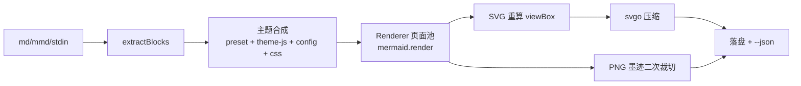

# mmdx：给 AI agent 用的 Mermaid 渲染器怎么设计
------
> 上一篇《Mermaid 主题定制暗坑大全》把 mermaid 主题系统里的坑挨个盘了一遍，这篇讲我把那些教训固化成的东西：mmdx，一个给 AI agent 用的 Mermaid → SVG/PNG 导出 CLI。重点写它的主题系统组织和全覆盖颜色检测——后者是我认为这个项目里最值钱的设计。

## 痛点：agent 写得动 mermaid，交不出图
------

LLM 写 mermaid 语法的准确率已经很高了，但"写得出"和"交得出图"之间隔着一条鸿沟。我在 agent 工作流里要一张架构图时，实际发生的事情是：

- agent 产出的 ```mermaid 块只能靠渲染器活着——聊天窗口里凑合看，发博客、贴 issue、放幻灯片就露馅
- 现有工具要么是 VSCode 插件手动导出（默认紫黄 #ECECFF 主题，上一篇吐槽过的那套），要么是 MCP 渲染服务——每个都重造一遍管线基础
- agent 在别人的机器上跑，没有 Node、没有字体、主题不可控，渲染结果不可复现

所以 mmdx 的定位很明确：agent 拿着一段 markdown 就能出一个带主题的 SVG/PNG，不装 Node、不下 Chromium（复用系统 Edge/Chrome）、中文字体内置。package.json 里的一句话定位：

```json
{
  "name": "mmdx",
  "description": "Mermaid → SVG/PNG exporter with tech-doc themes, bundled CJK font and ELK layout, built for AI agents"
}
```

> "built for AI agents" 不是营销词，它决定了后面一堆设计取舍：CLI 契约要机器可读、输出要确定性、失败要响亮不能挂住。

## 主链路：五个模块，一条管线
------

整个 src/ 目录不到 2000 行，模块划分：

```
cli.ts     入口：参数解析、围栏块提取、主题叠加、输出契约（462 行）
render.ts  渲染核：单 Chromium + 页面池 + 截图裁切（520 行）
themes.ts  七套主题预设 + deepMerge（667 行）
blocks.ts  table/list/card 扩展块转 HTML（193 行）
embed.ts   内嵌资产：mermaid UMD、ELK、字体、svgo（编译期生成）
```

主链路一句话：**提取围栏块 → 主题配置合成 → 页面池渲染 → SVG/PNG 落盘**。



块提取是纯正则，`FENCE_RE` 扫所有围栏语言，认识的才收（src/cli.ts:161）：

```ts
// any fenced block with a recognized language (mermaid / table / list)
const FENCE_RE = /^[ \t]*```([A-Za-z0-9_-]+)[^\n]*\n([\s\S]*?)^[ \t]*```\s*$/gm;

function extractBlocks(input: string, raw: string): Block[] {
  // ... kind = fenceKind(m[1]); kind === 'unknown' 就跳过
  // 记录 line（块在原文的行号，报错时 agent 能定位回源文件）
  blocks.push({ input, base, index: blocks.length + 1, line, code, kind });
}
```

渲染核 `Renderer` 是一个类，单浏览器实例 + 页面池。每个页面初始化一次就反复渲染很多图（src/render.ts:145 的 `initPage`）：注入 mermaid UMD、把 ELK 的 7MB bundle 以 base64 塞进 `window.__elkB64` **但不解析**、注入 Noto Sans SC 子集字体并强制 `document.fonts.load`：

```ts
// src/render.ts:154 — ELK 懒加载的关键
if (this.opts.layout === 'elk' && this.assets.elkJs) {
  // stash the payload; ELK is parsed lazily on the first flowchart render
  // (its 7MB bundle costs ~0.8s of parse per page and only flowchart/
  // graph diagrams ever use it)
  await page.evaluate((b) => {
    (window as any).__elkB64 = b;
  }, b64);
}
```

真正渲染发生在页面里（src/render.ts:260 的 `page.evaluate`），几个值得说的点：

```ts
mermaid.initialize({
  ...config,
  layoutAlgorithm: wantElk ? 'elk' : 'dagre',
  startOnLoad: false,
  suppressErrorRendering: true,   // ← 语法错误必须 throw，不能返回"错误炸弹"SVG
});
```

`suppressErrorRendering: true` 是给 agent 的：mermaid 默认把语法错误渲染成一张带错误文字的 SVG 图，agent 拿到文件看不出问题。这里强制它 throw，错误进 `--json` 的 `errors` 数组。

SVG 拿到手后 mermaid 给的 viewBox 不能信（上一篇写过：under-measures wrapped CJK labels），所以整棵树重新量一遍。量法有个坐标系陷阱——每个叶子的 `getBBox()` 在自己的局部坐标系，必须经过 `getCTM()` 矩阵换算到根 svg 的 user space 再 union（src/render.ts:326 的 `toRootRect`）：

```ts
// getCTM maps into VIEWPORT space, which includes the (stale)
// root viewBox scale; divide it out so all leaves land in the
// root's own user space, the space the viewBox is written in.
const m = root.inverse().multiply(mRaw);
```

PNG 则走两遍截图：第一遍按几何 bounds 截，然后 `inkBBox`（src/render.ts:72）逐像素找墨迹包围盒，第二遍按墨迹裁——因为几何 bounds 会漏掉箭头 marker 和字形 overshoot。四边留白对称是这么构造出来的，不是靠猜：

```ts
// geometric bounds miss marker arrowheads and glyph overshoot; a
// second capture clipped to the actual ink gives pixel-exact,
// symmetric file margins
const ink = inkBBox(first);
if (!ink) return first;
const mx = Math.max(1, padX * sc - 2);
const clip = {
  x: Math.max(0, (ink.x0 - mx) / sc),
  // ... y / width / height 同理
};
return (await page.screenshot({ clip, omitBackground: transparent })) as Buffer;
```

> 这个二次截图是我最满意的实现细节之一：留白对称性从"调参调出来的"变成"构造保证的"，测试里断言 L/R 边距差就够了，不用碰玄学。

## 主题系统：themeVariables 集中 + themeCSS 补刀
------

七套预设：`tech`（默认）、`openai` / `openai-dark`、`minimal`、`latte` / `mocha`、`sketch`。每个预设是一个 `ThemePreset`（src/themes.ts:6）：

```ts
export interface ThemePreset {
  config: Record<string, unknown>;   // 直接喂 mermaid.initialize
  background: string;                // 页面背景，也是 edgeLabelBackground
  dark?: boolean;                    // 预设是否深色页
  remap?: Record<string, string>;    // 渲染后 hex→hex 重着色（mermaid 写死的色）
}
```

组织原则一：**颜色尽量收敛进 themeVariables，走官方派生链**。tech 主题的 themeVariables 有 100 多个键，按图型分组注释，核心派生键放最前面（src/themes.ts:167）：

```ts
themeVariables: {
  // ---- core derivation chain: every diagram inherits from these.
  // primaryColor in particular must be set — its default (#fff4dd cream)
  // is the "native mermaid" look leaking through every unset corner.
  primaryColor: '#E8F3FF',
  primaryTextColor: '#1D2129',
  primaryBorderColor: '#4098FC',
  // ...
  // ---- pie: AntV G2 default categorical palette
  pie1: '#5B8FF9', pie2: '#5AD8A6', /* ... pie12 */
  // ---- xyChart: plotColorPalette (defaults start with mermaid purple #ECECFF)
  xyChart: { plotColorPalette: '#5B8FF9,#F6BD16,#5AD8A6,...', /* ... */ },
},
```

组织原则二：**themeVariables 覆盖不到的用 themeCSS 补**。最典型的是 flowchart 形状分色——mermaid 只给一个 `primaryColor`，想要"矩形=流程、菱形=判定、圆=状态、圆柱=存储"四色语义，只能 CSS 按形状选择器上色（src/themes.ts:82）：

```css
/* shape-coding: mermaid variables only offer a single primaryColor for node
   shapes, so the rect=process / diamond=decision / circle=state / store=purple
   colour roles are painted here */
.node rect    { fill: #E8F3FF; stroke: #4098FC; }
.node polygon { fill: #FFF7E6; stroke: #FF9A2E; }
.node circle, .node ellipse { fill: #E8FFEA; stroke: #23C343; }
.node path    { fill: #F5E8FF; stroke: #722ED1; }
```

组织原则三：**mermaid 写死在渲染产物的颜色，用渲染后 remap 兜底**。sankey 的 tableau10 色板和 journey 的表情底色没有 themeVariables 通道，tech 预设带一张 remap 表，在 SVG 字符串进 DOM 之前做 hex 替换（src/themes.ts:359、src/render.ts:296）：

```ts
remap: {
  // sankey nodes/links default to the tableau10 set (no theme variables)
  '#4e79a7': '#6E94BB', '#f28e2c': '#D2A36C', /* ... */
},
```

```
在 render() 里：svg 字符串 → remap 逐条 replace → 才 innerHTML 进 DOM
```

这样 SVG 和 PNG 拿到的是同一份颜色，不会出现"PNG 对了 SVG 错了"的精神分裂。

三层的覆盖关系在 cli.ts:298 串起来，顺序是固定的：

```ts
let config = JSON.parse(JSON.stringify(preset.config));  // 1. 预设
if (o.themeJs) config = applyThemeJs(..., config, ...);  // 2. --theme-js 整体改写
if (o.config)  config = deepMerge(config, JSON.parse(...)); // 3. --config 深合并
if (o.css)     config.themeCSS += '\n' + css;            // 4. --css 追加
```

> 上一篇写过的"assignWithDepth 对数组是追加不是替换"的坑，在这里的对策就是 remap + CSS 钉死（journey actor 圆点的注释直接写在 TECH_CSS 里：`config.journey.actorColours is useless — mermaid's assignWithDepth APPENDS arrays`）。把踩坑结论固化成代码注释和默认行为，比写博客本身更重要——博客是给人看的，注释是给三个月后的自己看的。

## 全覆盖检测：像素级颜色普查
------

主题系统最大的风险不是"某个变量设错了值"，而是"某个角落根本没被任何变量覆盖"。20 种图型 × 100 多个主题变量，人眼看不过来——改一个变量得把 20 张图全渲染一遍肉眼扫，而且人眼对"这个蓝和那个蓝差了 5%"毫无办法。

所以检测必须系统化，分两步。

**第一步：全图型渲染筛查**（tests/run.ts）。tests/diagrams/ 下每图型一个 fixture——block、c4、class、er、flowchart、gantt、gitgraph、journey、kanban、mindmap、pie、quadrant、radar、requirement、sankey、sequence、state、timeline、treemap、xychart，正好 20 个。全部渲染成 PNG 后做像素分析：

```ts
// tests/run.ts:95 — 库级筛查的三个断言
const lr = Math.abs(a.margins.l - a.margins.r);   // 左右边距差
const tb = Math.abs(a.margins.t - a.margins.b);   // 上下边距差
if (lr > 16) problems.push(`L/R margins ${a.margins.l}/${a.margins.r}`);
if (a.ink < 0.005) problems.push('near-blank');   // 白图检测
if (a.ink > 0.85 && name !== 'treemap') problems.push('overfull');
```

这一层只筛"结构性坏了"（边距不对称、空白、糊满），颜色对不对它管不了。

**第二步：颜色普查**（scripts/theme-census.ts），这才是全覆盖的核心。思路：渲染出的 PNG 里每个像素都应该能溯源到主题调色板——溯源不了的就是漏网之鱼。

**坏值清单必须有定义来源**。检测的"合法色集合"不是手工罗列的，而是从 themes.ts 源码里正则抽出来的全部 hex 字面量（theme-census.ts:16）：

```ts
// 1. allowed palette = every hex literal in themes.ts + black/white
const themeSrc = fs.readFileSync(path.join(ROOT, 'src', 'themes.ts'), 'utf8');
const allowed = new Set<string>(['#000000', '#FFFFFF']);
for (const m of themeSrc.matchAll(/#([0-9a-fA-F]{6})\b/g)) allowed.add('#' + m[1].toUpperCase());
```

这一步是整个设计的命门。如果合法集合只写"已知踩过的坑"（比如 #ECECFF），那换个没踩过的默认色漏出来就漏报了。从主题源码抽取，等于声明：**凡是主题作者没写进源码的颜色，都是非法的**——新增图型用了新默认色、主题改版引入漂移，都会被同一张网捞住。

然后逐像素统计，跳过半透明抗锯齿边缘（theme-census.ts:38）：

```ts
for (let i = 0; i < data.length; i += 4) {
  if (data[i + 3] < 250) continue; // AA fringe
  const key = '#' + [data[i], data[i+1], data[i+2]]
    .map((v) => v.toString(16).padStart(2, '0').toUpperCase()).join('');
  counts.set(key, (counts.get(key) ?? 0) + 1);
}
```

问题来了：抗锯齿和半透明填充会产生**调色板色的合成产物**——比如 35% 透明度的雷达曲线叠在白底上，逐像素值不在调色板里，但它是合法的。硬把抗锯齿当坏值，工具会误报到没法用。所以有个合成容差判定 `isDerived`：某颜色 c 合法，当且仅当存在调色板色 P 和 alpha a，使 `P*a + 255*(1-a)` 在每通道 ±3 内还原出 c（theme-census.ts:48）：

```ts
const isDerived = (hex: string): boolean => {
  const c = [r, g, b];
  for (const p of pal) {
    // 反解三个通道各自的 alpha，要求自洽（差 < 0.06）且在合理范围
    const alphas = [0, 1, 2].map((i) => (255 - c[i]) / (255 - p[i] || 1));
    const a = alphas[0];
    if (a < 0.08 || a > 1) continue;
    if (alphas.every((x) => Math.abs(x - a) < 0.06) &&
        [0,1,2].every((i) => Math.abs(Math.round(p[i]*a + 255*(1-a)) - c[i]) <= 3)) return true;
  }
  return false;
};
```

> 这个反解 alpha 的写法有点取巧：假设合成发生在白底上（`255*(1-a)`）。页面背景不是白色时（比如 mocha 的 #1E1E2E）它会误判——目前的普查脚本只跑默认 tech 主题所以没事，这是个已知的边界，见文末。

最后一层是**刺眼默认色黑名单**：有些 mermaid 默认色面积很小（journey 的 actor 圆点、单条错误的连线），按面积阈值会漏掉，但它们恰恰是最扎眼的。黑名单里的颜色**任何覆盖率都报**（theme-census.ts:61）：

```ts
// known garish mermaid defaults — flag at ANY coverage (tiny elements
// like journey actor dots fall below the area threshold)
const loud = ['#7CFC00', '#00FFFF', '#8FBC8F', '#ECECFF', '#9370DB',
              '#191970', '#8B008B', '#FF0000', '#00BFFF', '#FF8888'];
const off = [...counts.entries()].filter(([c, n]) =>
  !allowed.has(c) && !isDerived(c) &&
  (n / total > 0.0015 || (loud.includes(c) && n > total * 0.0001)));
```

注意黑名单的角色和 allowed 集合不同：allowed 是**定义合法性**（源头是 themes.ts），loud 是**提高灵敏度**（源头是已知刺眼色的经验清单）。前者漏报新形态，后者只是让小面积的已知坏值更早暴露——两层缺一不可，但只有第一层是完备的。

这套检测的真实战绩：xyChart 的 `plotColorPalette` 默认以 mermaid 紫 #ECECFF 打头、radar 曲线的 cScale 粉彩在网格线上几乎隐形、treemap 各分区色几乎不可区分——全是普查跑出来的，不是肉眼。另外一个隐蔽案例印证了上一篇"配置嵌套层级"的教训：批量补丁曾把 `todayLineColor`、`quadrant*Fill` 等键错误地插进 `themeVariables.xyChart` 内部，键还在、值也对，就是层级错了导致静默失效——这类错误肉眼 review 配置文件根本看不出来，但普查会直接报"pie 图出现了 off-palette 默认色"，因为变量没生效、默认色就漏出来了。

> **变量"不生效"的头号症状就是嵌套位置错，而像素普查是唯一能兜住这种静默失效的网**——它不检查你写了什么配置，它检查渲染结果长什么样。配置对不对是手段，像素对不对才是目的。

## agent 友好性：CLI 契约的取舍
------

给 agent 用的 CLI 和给人用的差别很大，几个明确的取舍：

**1. stdout 只有一份 JSON，进度全走 stderr。** `--json` 打开时人类可读的进度行全部静默，stdout 是单个 JSON（cli.ts:432）：

```ts
console.log(JSON.stringify({
  theme: o.theme, layout: o.layout, format: o.format, background,
  blocks: blocks.length, rendered: results.length - failed.length,
  failed: failed.length, files: written,
  errors: failed.map((f) => ({ input: f.input, index: f.index, error: f.error })),
  ...(o.profile ? { profile: profileSummary() } : {}),
}, null, 2));
```

agent 解析 `files` 数组核对产物、解析 `errors[].input/index/error` 定位坏块，不用猜输出格式。

**2. 失败隔离 + 确定性退出码。** 一个块渲染失败不拖垮整批，`--json` 里如实记录；退出码三档：`0` 全成、`1` 有渲染失败（其余照常出图）、`2` 用法错误。agent 看到 1 就读 errors 数组，看到 2 就改命令行。

**3. 挂死必须响亮。** 每次渲染包一层 `Promise.race`，60 秒必报错（render.ts:505）：

```ts
// a wedged renderer (bad diagram, crashed tab) must fail loud, never hang
return await Promise.race([
  fn(page),
  new Promise<never>((_, rej) => {
    timer = setTimeout(() => rej(new Error('render timed out after 60s')), 60_000);
  }),
]);
```

并发下浏览器的瞬时抽风（截图超时之类）则由外层自动重试一次（cli.ts:400）——agent 不该为这类抖动买单，但真正的语法错误重试也没用，两次都失败才进 errors。

**4. 确定性输出命名。** 同一输入永远产出同名文件：`README-m1.svg`、`README-m2.svg`……`--index 2` 筛选后仍保留 `-m2` 后缀（cli.ts:292 的注释：`keep the -m<n> suffix ... so blocks don't masquerade as the whole file's diagram`），agent 引用文件名不会漂移。

**5. 观测性。** `--profile` 输出各阶段耗时（browser-launch / page-init / mermaid-render / screenshot / svgo），典型单图 95ms 渲染 + 90ms 截图。agent 调优 `--jobs` 或怀疑卡顿时有数据可依。

**6. 不下载任何东西。** 浏览器按 Edge → Chrome 常见路径探测（render.ts:36 的 `detectBrowser`），找不到快速报错并列出搜索路径——绝不拉 Chromium。icon 包从 unpkg 拉一次就缓存到临时目录。agent 在别人机器上跑，网络行为必须可预期。

> 这几条里最费心思的是"响亮失败"和"重试"的边界：重试 absorb 的只该是瞬时故障，语法错误重试是浪费。现在的实现是简单粗暴的无差别重试一次——够用但不精致，理想情况应该按错误类型分流，比如超时重试、语法错误不重试。

## 结语
------

回头看，这个项目一半的代码在渲染，另一半在"证明渲染是对的"。主题系统的三层结构（themeVariables 派生链 / themeCSS 形状语义 / remap 兜底）本质上是在跟 mermaid 的历史包袱做分层妥协；而像素普查则是把"主题改完了没漏"从人眼工程变成可回归的断言。

还有几块明显欠账：普查脚本只覆盖默认 tech 主题、没有接进 CI 自动跑、合成容差假设白底、--theme-js 用 `new Function` 执行用户代码没做任何沙箱。这些都不影响它作为一个 agent 工具完成本职，但离"可以放心让别人依赖的渲染服务"还有距离。

> 我现在的判断是：给 agent 造工具，最难的不是功能，是**让失败的路径和成功的路径一样被设计过**——JSON 契约、退出码、超时、坏块隔离这些东西写起来毫无乐趣，但 agent 每天 80% 的时间活在这些路径上。接下来值得想的问题是：像素普查这套思路能不能反哺给 agent 本身——agent 自己产图、自己跑一遍普查、自己修，直到 ALL CLEAN？那才是"built for AI agents"的完全体。
