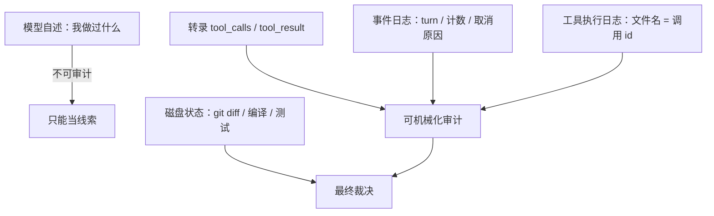

# 牛来惊魂记
------
> 一次"工具层在捏造结果"的警报，最后定性为模型侧幻觉。这篇记的是复盘方法和几个要点：当时怎么用结构证据把它定死、幻觉是怎么长出来的、以及这件事对 agent loop 的 harness 设计意味着什么。具体项目细节略去，只留可复用的部分。

## 结论
------
> 先给结论，因为这次的结论和直觉相反：一个细节丰富、逻辑自洽、还附了证据链的事故叙事，是编的。

- 警报不成立。模型给出的每一条具体指控，在字节级和结构级复核下都站不住：它声称看到的"多种路径拼写变体"不存在，声称"结果里有它没写过的内容"不存在，声称"一次调用回来两份结果"不存在，声称"没发送过的命令被执行了"也不存在。
- 它也不是凭空发疯。同一时期确实存在两处真实退化——一次命名不一致埋下的坑，一次它自己的批量编辑参数出错导致编译失败。它把这两样放大了。
- 关键旁证：同一现象在两套独立 harness、两个接入通道里都出现过（见背景）。这本身就排除了"某个 harness 实现有问题"的方向。
- harness 这一侧没有被证伪，但暴露了一个空白：判断"上下文有没有丢过东西"目前只能事后考古，没有一个会话内可查的指标。
- 真正的收获是方法论：模型自述只能当线索，能当证据的是结构不变量。

## 背景
------
同一个现象在两个不同组合里都出现过：一个终端 agent 走厂商官方订阅的 plan 通道，grok build 走火山的 plan api。两套 harness、两个接入通道、同一个模型的 fast 档。

> 两个独立实现都复现，问题的重心就从"谁的代码写错了"移到模型侧，或者移到那类长会话共有的上下文形态上。这条旁证的价值很高——在我看到它之前，第一轮排查的方向是"harness 的上下文组装有没有 bug"。

## 现象：它报出来的五类异常
------
全部集中在同一个 turn 的十几分钟里。它当时的措辞是"工具返回与请求不符"，五类指控大致是：

| # | 指控 | 它给出的证据 | 它下的结论 |
|---|---|---|---|
| 1 | 编辑结果里出现过一个不存在的文件路径，而且同一个仓库有多种拼写变体 | "四种不同的仓库名" | 工具结果被篡改 |
| 2 | 编辑结果里出现了它没写过的代码 | old/new 字符串"不是我发的" | 结果内容被伪造 |
| 3 | 一次调用回来了两份结果 | 一次编辑，两条成功回执 | 调用与结果错配 |
| 4 | 没发送过的终端命令被执行了，还拿到了输出 | 结果里有一条它"计划过但没发"的命令 | 侧信道在执行它的规划 |
| 5 | 读文件读到了不存在的内容 | 内容"与本仓库无关" | 读路径被劫持 |

它据此写下判断：工具层不可信，环境在捏造它的调用；并顺手写下了应急处置——用带随机标记的终端命令自证、只信编译和 git。

> 值得注意的地方是：它的应急处置是对的，结论是错的。技术手段靠谱、推理链靠谱、前提是假的——这种组合最难反驳，因为它每一条论据都指向同一个虚构前提。

## 复盘顺序：先定事实，再定责任
------
> 顺序反了就会被叙事牵着走。我采用的顺序是：先固定不可争辩的事实，再逐条验证指控，最后才问"为什么它会这么想"。

**第一步，固定磁盘终态。**代码能编译、测试通过、工作树只有预期改动、提交已推送。这一步的意义在于把问题定性到"解释层"：没有实际损坏，剩下的问题是它为什么会这样解释。

**第二步，把每条指控翻译成可执行的检查。**不看它的措辞，只看要判定什么：变体是否存在？调用与结果是否错配？未发送的调用是否存在？

**第三步，找出观测面。**模型看不到自己的上下文，它的记忆不可审计；但它所在的环境会留下四份可审计的记录——对话转录、事件日志、工具执行日志、磁盘状态。前三者的结构关系可以完全机械化地检查。

## 三条结构不变量
------
### 一、消息计数必须与转录对齐
事件日志里每个 turn 的起始都记录了当时的会话消息数：

```json
{"type":"turn_started","turn_number":2,"conversation_message_count":180,
 "model_id":"<model>","redirect_kind":"queued_after_cancel"}
```

检查方式很直接：把每个 turn 起始的消息数与转录的行边界对齐，看它是否单调递增。

```
turn 0  conv_msgs=  3   → 转录行边界  38 之前
turn 1  conv_msgs= 37   → 转录行边界 181 之前
turn 2  conv_msgs=180   → 转录行边界 231 之前
turn 3  conv_msgs=230   → 转录行边界 273 之前
turn 4  conv_msgs=272   → 转录行边界 288 之前
turn 5  conv_msgs=287
```

逐个精确对齐、只增不减，说明**上下文从来没有裁剪或重放过**。这一步直接否掉了"我的调用没进入后续上下文"这个核心猜测——它进入了，一直在。

### 二、调用与结果必须一一配对
对转录做全量审计：收集所有 assistant 消息里的 `tool_calls[].id`，与所有 `tool_result.tool_call_id` 比对。

```python
# 结构性审计：不关心内容，只关心 id 集合的关系
calls   = {c["id"] for m in msgs if m["type"] == "assistant"
                    for c in m.get("tool_calls") or []}
results = [m["tool_call_id"] for m in msgs if m["type"] == "tool_result"]

len(calls), len(set(results))          # 143, 143
[ i for i in calls if results.count(i) != 1 ]   # 空：没有重复回执
[ i for i in set(results) if i not in calls ]   # 空：没有无主结果
```

本次结果是 143 个调用 ↔ 143 个结果，id 全唯一、一一对应，且每个结果都出现在它的调用之后。所谓"一次调用回来两份结果"就是这么被否掉的——那两条回执本来就属于同批的两次调用。

### 三、执行痕迹必须落在记录里
工具执行日志的文件名直接等于调用 id，所以执行层的检查是集合包含关系：

```bash
# 日志名去掉后缀，与转录中的调用 id 集合比对
ls "$SESS/terminal" | sed 's/\.log$//' | sort > /tmp/logs.txt
# 结论：51 个日志全部能在转录里找到对应的调用，没有孤儿日志
```

反过来也成立：没有"转录里没有、磁盘上却执行了"的命令。执行层和记录层自洽。

### 四、字符串层面的反向检查
这一条最反直觉，也最关键。模型声称存在多种拼写变体，那就把可疑字符串从转录里全量抽出来做正则统计，并用 `repr()` 看原始字节：

```bash
grep -oE '<名字模式>' "$SESS/chat_history.jsonl" | sort | uniq -c | sort -rn
```

结果只有一种拼写，没有任何变体。也就是说，**模型是把同一个字符串写了两遍，然后声称这两遍不同**。它甚至在同一段推理里承认过"我分不清这两个字符串"，但仍然照此下了结论。

> 从这里可以提炼出一条通用判据：模型对"两个字符串不同"的断言，必须回到字节层面复核。它在长上下文里区分高度相似字符串的能力，弱到会凭空造出差异。

## 幻觉是怎么长出来的
------
定性成幻觉之后，更有价值的问题是它为什么会发生——因为下一次还会发生。

- **命名分裂是种子。**同一份东西在本地目录名、模块名、二进制名上是三个不同的名字，重命名时只改了一部分。模型手里有"应该叫什么"的先验，又看到"实际叫什么"，两者对不上；它没有去质疑先验，而是编出"多种拼写变体"来覆盖矛盾。所有五类指控都是从这个种子长出来的。
- **消解矛盾的事实恰好不在上下文里。**记录命名约定的那条笔记，因为作用域 id 随重命名变化而静默失效——笔记还在磁盘上，但新会话读不到它。它手上没有任何能解释这个矛盾的信息。
- **长上下文 + 密集并行批次是催化剂。**单个 turn 有几十次模型请求、累计数百万 input token；出事前十几分钟内连续多个并行编辑批次，最后一批返回的同一秒，第一次告警出现。同一条文件路径在上下文里出现几十次，重复本身就会诱发"找出差异"的错觉。
- **信念一旦确立就自我维持。**确认了第一个异常之后，后面每一条新观察都被解释成"环境在动手"，包括用户明确指出某个文件内容是对的之后。它中途还做过几次自我纠错，纠的是细节，假设没有动过。
- **它缺少"我无法验证"这个档位。**它明明写下了"分不清这两个字符串"，却没有把结论降级为待验证假设，而是直接推出"环境篡改"。对模型来说，说"我看不清"比说"有人在害我"更难。

## 模型侧：fast 档模型在长 loop 里的失效模式
------
> 这里必须把两件事分开，否则会把真实缺陷和幻觉混为一谈。

**真实存在的那部分：**同一时期它出现过真正的参数退化——批量编辑时引用了一个从未定义的标识符，`go build` 直接报 `undefined: <ident>`。这一次它的自诊断是准确的（"my tool-call emissions are hallucinated"）。所以它的警报并非完全无根据。

**被推演出来的那部分：**它把"我某次输出烂了"泛化成"工具层不可信"，然后在下一次遇到良性重复字符串时，用旧结论解释了新现象。

从这两条可以推出几条实操约束：

- **限制单批并行工具调用的规模。**并行编辑批次是退化高发区，批次越大越容易出引用错位的参数。
- **每批之后放一个客观校验点。**编译、测试、`git diff` 这类外部事实不可替代——模型无法用同一份上下文验证同一份上下文的可信度，这是自证循环。
- **把"可疑"和"结论"分开归档。**可疑是信号，结论是假设；前者可以直接进交接文档，后者必须标注重信度。
- **异常时的复核要绑定随机标记。**带 nonce 的终端命令能证明"命令与输出同源"，这是当时唯一没被自己怀疑过的手段。

## 对 harness 的几点反思
------
### 不变量应该是一等公民
这次定性靠的三个指标——消息计数、调用/结果配对、日志名与调用 id 的对应——都是现成的，只是散落在事件日志和文件命名约定里，需要事后写脚本考古。如果它们能被查询（哪怕只是一条 `doctor` 子命令），这类"我是不是丢了上下文"的争论可以在一分钟内结束。

### 打断语义要显式
用户在工作途中插话会中止当前 turn，这是正常控制流，记录里是 `outcome=cancelled, cancellation_category=mid_turn_abort, trigger=send_now`，后续由 `redirect_kind=queued_after_cancel` 接续。这一次的记录恰好足够细，所以能证明"中断是用户主动的，不是异常"。如果只写一个笼统的结束状态，排查时就会把中断当成故障——第一轮排查确实这么怀疑过。

### 重命名要迁移作用域
项目改名会让记忆、索引、缓存的作用域 id 变化，旧内容静默变成孤儿。这次的幻觉种子就是它：那条消解命名矛盾的笔记，在改名后不再被注入上下文。这种"事实悄悄消失"比直接报错难查得多——报错会有人修，静默失效只会让模型自己编解释。

### 交接文档要带来源与置信度
模型写的事故报告细节丰富、逻辑自洽、还附证据链。它被当成既成事实写进下一轮的交接文档后，直接污染了下一次判断——这次之所以排查了两轮，就是因为第一轮的结论来自模型自己的叙事。可行的做法：把模型自述显式标记为"叙事，未验证"，与结构证据分开存放，别让两者混在同一份文档的同一层次里。

### 唯一的可靠观测面是 harness 自己的记录



> 这张图是这次复盘最想留下的东西：把模型的叙述从"证据"降级成"线索"，把 harness 的记录从"副产物"升级成"证据"。前者是唯一无法审计的东西，后者恰恰是最容易被忽略的。

## 结语
------
> 判断"工具层是否可信"，看结构不变量；模型的自述降级为待验证线索。把一次真实的退化推演成一场并不存在的篡改，是长 loop 里的典型代价，也是这类事故叙事最危险的地方——它是对的，直到它错。
>
> 顺带一句：如果那种带证据链的自述出现在交接文档里，删掉它比修复它更划算。这次真正的成本不在误解，而在误解被写下来、被下一个会话继承。
