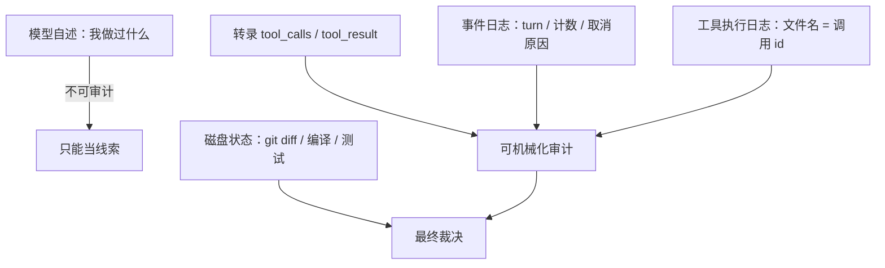

# 牛来惊魂记
------
> 一个 fast 档模型在长会话里连续报出"工具层在捏造结果"，前后持续十几分钟，还写了份带证据链的事故说明。最后定性是模型侧幻觉。这篇记复盘的顺序、三条能机械检查的不变量，以及这类自述叙事给 harness 留下的几个坑。

## 结论
一次细节丰富、逻辑自洽、还附了证据链的事故叙事，可以是编的。

它报的五类异常，逐条回到字节层面复核，一条都站不住：说看到过多种路径拼写变体，没有；说结果里有它没写过的代码，没有；说一次调用回来两份结果，没有；说没发送过的命令被执行了，也没有。

同期它确实出过两次真实的退化：一次命名不一致埋下的坑，一次它自己的批量编辑参数里引用了未定义的标识符（编译直接报错）。幻觉是围着这两件事长出来的。

还有条旁证排除了"某个 harness 写错了"这个方向：同一现象在两套独立 harness 上都复现过。

## 背景：两个组合都出现过
同一现象在两个组合里都出现过：一个终端 agent 走厂商官方订阅的 plan 通道，grok build 走火山的 plan api。两套 harness、两个接入通道、同一个模型的 fast 档。

> 两个独立实现都复现，重心就从"谁的代码写错了"移到模型侧，或者移到那类长会话共有的上下文形态上。看到这条之前，第一轮排查的方向是"harness 的上下文组装有没有 bug"。

## 它报出来的五类异常
五条指控挤在同一个 turn 的十几分钟里，措辞都是"工具返回与请求不符"：

| # | 指控 | 它给的证据 | 它下的结论 |
|---|---|---|---|
| 1 | 编辑结果里出现过一个不存在的文件路径，同一个仓库还有多种拼写变体 | "四种不同的仓库名" | 工具结果被篡改 |
| 2 | 编辑结果里出现了它没写过的代码 | old/new 字符串"不是我发的" | 结果内容被伪造 |
| 3 | 一次调用回来了两份结果 | 一次编辑，两条成功回执 | 调用与结果错配 |
| 4 | 没发送过的终端命令被执行了，还拿到了输出 | 结果里有一条它"计划过但没发"的命令 | 侧信道在执行它的规划 |
| 5 | 读文件读到了不存在的内容 | 内容"与本仓库无关" | 读路径被劫持 |

它的应急处置倒是对的：用带随机标记的终端命令自证、只信编译和 git、可疑结果先复核。手段靠谱，推理链也靠谱，前提是假的——每条论据都指向同一个虚构的前提。

## 复盘的顺序：先定事实，再定责任
顺序反了就会被叙事牵着走，我按四步走。

第一步固定磁盘终态：编译能过、测试能过、工作树只有预期改动、提交已经推上去。这一步把问题定性到"解释层"——没有实际损坏，剩下要回答的是它为什么这样解释。

第二步把指控翻译成可执行的检查。不看它怎么措辞，只看要判定什么：变体存不存在、调用与结果有没有错配、没发送的调用存不存在。

第三步找观测面。模型看不到自己的上下文，它的记忆不可审计；环境这边留下四份可审计的记录——对话转录、事件日志、工具执行日志、磁盘状态。前三者的结构关系可以完全机械化地查。

第四步才是问它为什么会这么想。

## 三条能机械检查的不变量
### 消息计数要跟转录对齐
事件日志里每个 turn 的起始都记了当时的会话消息数：

```json
{"type":"turn_started","turn_number":2,"conversation_message_count":180,
 "model_id":"<model>","redirect_kind":"queued_after_cancel"}
```

把每个 turn 起始的消息数和转录的行边界对齐：

```
turn 0  conv_msgs=  3
turn 1  conv_msgs= 37   → 转录第 38 行之前
turn 2  conv_msgs=180   → 转录第 181 行之前
turn 3  conv_msgs=230   → 转录第 231 行之前
turn 4  conv_msgs=272   → 转录第 273 行之前
turn 5  conv_msgs=287
```

逐个精确对齐，只增不减。上下文没有裁剪也没有重放，"我的调用没进后续上下文"这个核心猜测直接出局。

### 调用和结果要一一配对
对转录做全量审计，只关心 id 集合的关系，不关心内容：

```python
calls   = {c["id"] for m in msgs if m["type"] == "assistant"
                    for c in m.get("tool_calls") or []}
results = [m["tool_call_id"] for m in msgs if m["type"] == "tool_result"]

len(calls), len(set(results))                    # 143, 143
[i for i in calls if results.count(i) != 1]      # 空：没有重复回执
[i for i in set(results) if i not in calls]      # 空：没有无主结果
```

143 个调用对 143 个结果，id 全唯一，每个结果都在自己的调用之后。"一次调用回来两份结果"到这里就没了——那两条回执本来属于同批的两次调用。

### 执行痕迹要落在记录里
工具执行日志的文件名直接等于调用 id，执行层检查就是集合包含关系：

```bash
ls "$SESS/terminal" | sed 's/\.log$//' | sort > /tmp/logs.txt
# 51 个日志全部能在转录里找到对应调用，没有孤儿
```

反向也成立：没有"转录里没有、磁盘上却执行了"的命令。

### 字符串变体要回字节层面看
这条最反直觉。它说存在多种拼写变体，那就把可疑字符串从转录里全量抽出来做正则统计，再用 repr() 看原始字节：

```bash
grep -oE '<名字模式>' "$SESS/chat_history.jsonl" | sort | uniq -c | sort -rn
```

只有一种拼写。它是把同一个字符串写了两遍，然后说这两遍不一样；同一段推理里它还承认过"我分不清这两个字符串"。

> 一条通用判据：模型断言"两个字符串不同"，得回字节层面复核。长上下文里，它区分高度相似字符串的能力弱到会凭空造出差异。

## 幻觉是怎么长出来的
- **命名分裂是种子。**同一份东西在本地目录名、模块名、二进制名上是三个不同的名字，重命名只改了一部分。它手里有"应该叫什么"的先验，眼前是"实际叫什么"，对不上；它没去质疑先验，而是编出"多种拼写变体"把矛盾盖住。五类指控全是从这个种子长出来的。
- **消解矛盾的那条事实恰好不在上下文里。**记录命名约定的笔记，因为作用域 id 随重命名变了而静默失效——笔记还在磁盘上，新会话读不到。它手上没有任何能解释矛盾的信息。
- **长上下文加密集并行批次是催化剂。**出事的 turn 里有几十次模型请求、累计数百万 input token，告警前十几分钟连续多个并行编辑批次，最后一批返回的同一秒，第一次告警出现。同一条文件路径在上下文里出现几十次，重复本身就会诱发"找出差异"的错觉。
- **信念自己会长。**第一个异常确认之后，后面每条新观察都被解释成"环境在动手"，包括用户明确指出某个文件内容是对的之后。中途它纠过几次细节，假设没动过。
- **它缺"我无法验证"这一档。**写出"分不清这两个字符串"之后，它没把结论降级成假设，而是直接跳到"环境篡改"。对模型来说，说"我看不清"比说"有人在害我"难。

## 模型侧：真实退化和幻觉要分开
同期的真实退化是：批量编辑时引用了从未定义的标识符，go build 直接报 undefined: <ident>。这一次它的自诊断是准的（"my tool-call emissions are hallucinated"）。

被推演出来的那部分是：它把"我某次输出烂了"泛化成"工具层不可信"，下次遇到良性重复字符串，就用旧结论解释新现象。于是有两条实操约束：

1. **限制单批并行工具调用的规模。**并行编辑批次是退化高发区，批次越大越容易出现引用错位的参数
2. **每批之后放一个客观校验点。**编译、测试、git diff 这类外部事实没有替代品，模型没法用同一份上下文验证同一份上下文

## 对 harness 的几点反思
**不变量要能被查询。**这次定性靠的三个指标——消息计数、调用与结果配对、日志名与调用 id 的对应——都是现成的，只是散落在事件日志和文件命名约定里，得事后写脚本考古。做成一条 doctor 子命令，这类"我是不是丢了上下文"的争论一分钟就能结束。

**打断语义要显式。**用户在工作途中插话会中止当前 turn，这属于正常控制流，记录里是 outcome=cancelled / cancellation_category=mid_turn_abort / trigger=send_now，后续由 redirect_kind=queued_after_cancel 接续。这次记录够细，才能证明中断是用户主动的；如果只写一个笼统的结束状态，排查时就会把中断当故障——第一轮确实这么怀疑过。

**重命名要迁移作用域。**项目改名会让记忆、索引、缓存的作用域 id 变化，旧内容静默变成孤儿。这次的幻觉种子就是它：那条消解命名矛盾的笔记，改名后不再注入上下文。报错会有人修，静默失效只会让模型自己编解释。

**交接文档要带来源和置信度。**模型写的事故报告细节丰富、逻辑自洽、还附证据链，被当成既成事实写进下一轮交接文档后，直接污染了下一次判断。这次排查两轮，就是第一轮结论来自模型自己的叙事。两类内容分开放，别混在同一份文档的同一层次。

**观测面只有 harness 自己的记录可靠。**



## 小结
回收成一条检验标准：遇到"工具层不可信"这类自述，先看结构不变量——消息计数对不对得齐转录、调用和结果配不配得上、执行日志有没有孤儿；模型自述降级成线索，不参与定性。这次最贵的成本是误解被写进交接文档、被下一个会话继承。
