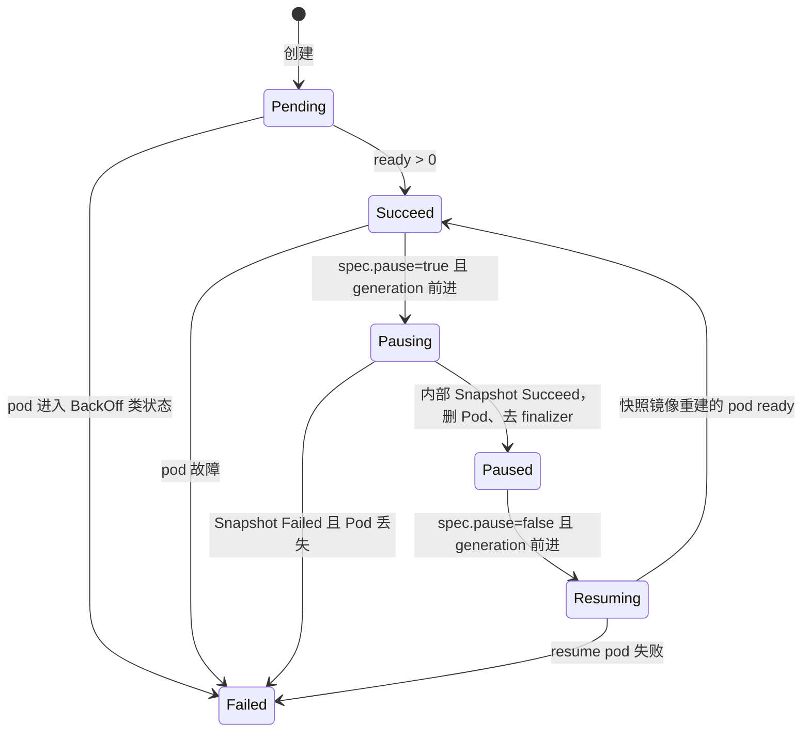

# OpenSandbox 源码走读（一）：CRD Controller 与 Reconcile 循环
------
> 最近在看 OpenSandbox（阿里的沙箱开源项目）的控制面实现。它把"沙箱"建模成 K8s CRD，用一个 controller-runtime 算子驱动整个生命周期。这篇是我对自己 fork 里 `kubernetes/` 目录的走读笔记：从 `POST /sandboxes` 的参数怎么落进 BatchSandbox spec，到 Reconcile 每一步在干什么，再到失败之后靠什么重试。代码都来自本地 clone（controller-runtime v0.21.0）。

## 全景：三个 CRD，两条回路
------

算子一共定义了 3 个 CRD（API 组 `sandbox.opensandbox.io/v1alpha1`），对应 3 个 Reconciler：

| CRD | Reconciler | 并发默认 | 干什么 |
|---|---|---|---|
| BatchSandbox（`bsbx`） | BatchSandboxReconciler | 32 | 沙箱本体：建 Pod、跑任务、pause/resume |
| Pool | PoolReconciler | 16 | 预热 Pod 池：分配/回收/滚动更新/驱逐 |
| SandboxSnapshot（`sbxsnap`） | SandboxSnapshotReconciler | 1 | rootfs 快照提交（pause/resume 的底层依赖） |

整个控制面就两条互相咬合的回路：

```
任务回路：BatchSandbox reconcile → TaskScheduler → HTTP 推任务到 pod 内 task-executor(:5758)
         → 轮询任务状态 → 写回 status
分配回路：Pool reconcile → Allocator → 写 alloc-status 注解 + 内存 store
         → 注解变化经 watch 触发对方 reconcile → 闭环
```

> 注意第二条回路的关键设计：**分配状态的持久化真相源是 BatchSandbox 上的注解，不是 Pool 的 status**。Pool 的内存 store 只是个可重建的缓存。这个设计后面还会反复出现——很多"奇怪"的代码都是在为注解契约服务。

## create 请求怎么变成 BatchSandbox
------

业务侧调 `POST /sandboxes`，server（Python）把它翻译成一个 BatchSandbox CR。池化模式的核心在 `server/opensandbox_server/services/k8s/batchsandbox_provider.py` 的 `_create_workload_from_pool`：

```python
def _create_workload_from_pool(self, batchsandbox_name, namespace, labels, pool_ref, expires_at, entrypoint, env, ...):
    entrypoint = entrypoint or DEFAULT_ENTRYPOINT
    spec = {
        "replicas": 1,
        "poolRef": pool_ref,          # ← 池化模式的开关，指向预热池
    }
    if env or entrypoint != DEFAULT_ENTRYPOINT or self.execd_run_as_init:   # needs_task_template
        spec["taskTemplate"] = self._build_task_template(entrypoint, env, batchsandbox_name)
    if expires_at is not None:
        spec["expireTime"] = expires_at.isoformat()   # ← timeout 参数的归宿
    # 再包一层 apiVersion/kind/metadata，create_custom_object 直接落一个 BatchSandbox CR
```

几个 create 参数的映射关系值得记一下：

| API 参数 | 落到 CR 的哪里 | 备注 |
|---|---|---|
| `extensions.poolRef` | `spec.poolRef` | 特殊值 `*` = 让控制器自动选池 |
| `env` / `entrypoint` | `spec.taskTemplate` | **非空即触发** taskTemplate 生成 |
| `timeout` | `spec.expireTime` | 不传 = 不自动到期，靠手动 delete |
| `metadata` | `metadata.labels` | 用于 `GET /sandboxes?metadata=...` 过滤 |
| `image` / `resourceLimits` | **被忽略** | 池化 pod 预创建，模板锁死在 Pool 上 |

`env` 这条最有意思：server 会把 env 包进一个 shell 包装命令（`_build_task_template` 里 `shlex.quote` 转义后拼进 `/bin/sh -c "/opt/opensandbox/bootstrap.sh <entrypoint> &"`），再把 `OPENSANDBOX_ID` 追加进 env 列表，最终挂到 `taskTemplate.spec.process`。

> 这里有个容易踩的坑：**不传 env 也不传 entrypoint 时走"快路径"**，不生成 taskTemplate——池 pod 继续跑自己的 warm entrypoint，代价是任何分配时的 env 都注入不进去。所以"为什么我的环境变量没生效"十有八九是这个分支判断没过。

最终生成的 CR 大概长这样：

```yaml
kind: BatchSandbox            # apiVersion: sandbox.opensandbox.io/v1alpha1
spec:
  replicas: 1
  poolRef: my-pool            # 二选一：poolRef（池化）或 template（直建）
  taskTemplate:               # 可选；决定要不要走任务调度
    spec:
      process:
        command: ["/bin/sh", "-c", "/opt/opensandbox/bootstrap.sh python /app/main.py &"]
        env: [{name: OSB_USER_ID, value: user-12345}]
  expireTime: "2026-09-06T12:00:00Z"   # timeout 的归宿
```

> 注意 spec 里 `template` 和 `poolRef` 互斥：直建模式自己带 PodTemplateSpec，池化模式只有 poolRef，Pod 的长相完全由 Pool 的模板决定。server 还会把一批参数（volumes、networkPolicy、snapshotId+poolRef 组合等）直接 400 拒掉，因为池化 pod 是预创建的，事后没法改。

## BatchSandbox 的 spec/status 长什么样
------

`apis/sandbox/v1alpha1/batchsandbox_types.go`，关键字段摘出来：

```go
type BatchSandboxSpec struct {
    Replicas    *int32                // 默认 1
    PoolRef     string                // 与 Template 互斥
    Template    *corev1.PodTemplateSpec
    ShardPatches []runtime.RawExtension  // 按 index 给每个 pod 打 strategic merge patch
    ExpireTime  *metav1.Time          // 到了就删，控制器负责执行
    TaskTemplate *TaskTemplateSpec    // 非 nil = 需要 TaskScheduler
    Pause       *bool                 // pause/resume 意图，Server 写、Controller 执行
}

// +kubebuilder:validation:Enum=Pending;Succeed;Pausing;Paused;Resuming;Failed
type BatchSandboxPhase string
```

phase 一共 6 个：`Pending / Succeed` 是稳态，`Pausing / Paused / Resuming` 是暂停链路，`Failed` 是终态。status 侧除了 replicas/ready 计数，还有一组任务计数和两个特殊字段：

```go
type BatchSandboxStatus struct {
    ObservedGeneration int64
    Replicas, Allocated, Ready int32
    TaskRunning, TaskSucceed, TaskFailed, TaskPending, TaskUnknown int32
    Phase BatchSandboxPhase
    PauseObservedGeneration int64       // pause/resume 幂等闸门：最近一次 ACK 的 generation
    Conditions []BatchSandboxCondition  // Ready/Progressing/Paused/PauseFailed/ResumeFailed/PodFailed
}
```

> `PauseObservedGeneration` 这个设计我第一次看有点绕：spec.pause 只是个布尔意图，Controller 靠"generation 是否前进 + 我 ACK 到哪个 generation 了"来判断这是不是一次新请求。这是把 K8s 原生的 observedGeneration 惯例复用到了 pause/resume 这条命令通道上，避免了额外的 ACK 子资源。

## Reconcile 主循环：一轮到底干了什么
------

核心在 `internal/controller/batchsandbox_controller.go` 的 `Reconcile`，按执行顺序拆开：

```go
func (r *BatchSandboxReconciler) Reconcile(ctx context.Context, req ctrl.Request) (ctrl.Result, error) {
    batchSbx := &sandboxv1alpha1.BatchSandbox{}
    if err := r.Get(ctx, client.ObjectKey{...}, batchSbx); err != nil {
        if errors.IsNotFound(err) {
            return ctrl.Result{}, nil   // 对象没了，不用管
        }
        return ctrl.Result{}, err       // 其他错误 → 交给退避重试
    }

    // 1. ExpireTime：过期就删，没过期把剩余时间记进 requeue 计划
    if expireAt := batchSbx.Spec.ExpireTime; expireAt != nil {
        if expireAt.Time.Before(now) && batchSbx.DeletionTimestamp == nil {
            r.Delete(ctx, batchSbx)
        } else if !expireAt.Time.Before(now) {
            DurationStore.Push(key, expireAt.Time.Sub(now))
        }
    }

    // 2. poolRef="*"：自动选池，List 全 namespace 的 Pool 挑一个 patch 回 spec.poolRef
    if updated, err := r.assignPool(ctx, batchSbx, profileName); updated {
        return ctrl.Result{}, nil   // ← spec 变了，generation 前进，等下一轮
    }

    // 3. finalizer：有 taskTemplate 才挂 task-cleanup，防删除时残留任务
    // 4. pause/resume 分发：优先级最高的命令通道
    if result, handled, err := r.dispatchPauseResume(ctx, batchSbx); handled {
        return result, err
    }

    // 5. 列出 pod（两种模式实现完全不同，见下）
    pods, err := r.listPods(ctx, poolStrategy, batchSbx)
    // 池化模式下分配的 pod 消失了 → failClosedOnMissingAllocatedPods：fail-closed 标 Failed

    // 6. 扩容（池化和 Paused 状态跳过；只有扩没有缩）
    if !poolStrategy.IsPooledMode() && batchSbx.Status.Phase != Paused {
        r.scaleBatchSandbox(ctx, batchSbx, batchSbx.Spec.Template, pods)
    }

    // 7. 从 pod 现状推 phase
    runtimeView := buildRuntimeView(batchSbx, pods)

    // 8. 任务调度（taskTemplate != nil 才进），结果写进 status 任务计数
    if taskStrategy.NeedTaskScheduling() && batchSbx.Status.Phase != Paused {
        ts, err := r.reconcileTasks(ctx, batchSbx, pods)
        ...
    }

    // 9. 落盘：endpoints/runtime-id 注解 + status patch
    requeue, persistErrors := r.persistRuntimeView(ctx, batchSbx, runtimeView)

    // 10. requeue：多来源取最短（Pop 返回各处 Push 的最短值，再与 persist 阶段合并）
    requeueAfter := DurationStore.Pop(req.String())
    return reconcile.Result{RequeueAfter: requeueAfter}, gerrors.Join(aggErrors...)
}
```

> 第 6 步的 guard 值得细品：池化模式直接跳过 scale——池化 sandbox 没有 template，pod 的生死由 Pool 的分配/回收决定，控制器自己建删只会打架。`Paused` 跳过是因为暂停后的沙箱 pod 应该保持不存在，等 resume 重写镜像再拉起来。

`listPods` 在两种模式下的实现完全不同：直建模式按 ownerRefUID 的 field index 一次 `List` 拿齐；池化模式先解析 `alloc-status` 和 `alloc-released` 两个注解做差集，再对剩下的 pod **逐个 `Get`**——代码里就带着 `// TODO maybe performance is problem` 的原话注释。池化 sandbox 的 replicas 一大，这每轮 R 次深拷贝 Get 的成本就线性往上叠。

## 状态机：phase 不是存的，是算的
------

走读里印象最深的设计：**phase 没有独立的状态存储，每轮 reconcile 都从 pod 现状重新推导**（`batchsandbox_status.go` 的 `buildRuntimeView`）：

```go
func buildRuntimeView(batchSbx, pods) runtimeView {
    newStatus := batchSbx.Status.DeepCopy()
    for _, pod := range pods {
        newStatus.Replicas++
        if utils.IsAssigned(pod) {
            newStatus.Allocated++       // 池化模式下"分配了"的 pod
        }
        if podReady(pod) {
            newStatus.Ready++           // Running + Ready 且未在删除
        }
    }
    switch batchSbx.Status.Phase {
    case Pausing, Paused:
        // 生命周期稳态，不动
    case Resuming:
        applyResumingRuntimePhase(newStatus, pods)
    default:
        applySteadyRuntimePhase(batchSbx, newStatus, pods)
    }
}

func applySteadyRuntimePhase(...) {
    if summary, hasFailures := summarizePodFailures(pods); hasFailures {
        // CrashLoopBackOff / ImagePullBackOff / ErrImagePull / CreateContainerConfigError → Failed
        status.Phase = sandboxv1alpha1.BatchSandboxPhaseFailed
        return
    }
    if status.Ready > 0 {
        status.Phase = sandboxv1alpha1.BatchSandboxPhaseSucceed
        return
    }
    status.Phase = sandboxv1alpha1.BatchSandboxPhasePending
}
```

状态流转画出来：



> "状态是推导出来的而不是记录下来的"，这是 K8s 控制器的正统做法（level-triggered），好处是任何状态丢失都能自愈。代价是 `Failed` 这种"终态"必须靠条件分支保护——代码里到处是 `if phase != Failed` 的短路判断，不然一个 ready pod 的短暂波动就会把 Failed 翻回去。另外 `PauseFailed`/`ResumeFailed` 两个 condition 由 `mergeLifecycleConditions` 单独保护，不被运行时推导覆盖。

## 扩容：确定性命名 + 期望机制防重复
------

`scaleBatchSandbox` 是直建模式下 pod 的唯一出生点，两个细节都值得学：

```go
func (r *BatchSandboxReconciler) scaleBatchSandbox(ctx, batchSandbox, podTemplateSpec, pods) error {
    // 1. 对现有 pod 做 ObserveScale，然后查期望是否满足
    if satisfied, unsatisfiedDuration, _ := BatchSandboxScaleExpectations.SatisfiedExpectations(key); !satisfied {
        // 上一轮的 Create 还没被 informer 观察到 → 跳过本轮扩容，防重复建 pod
        DurationStore.Push(key, expectations.ExpectationTimeout-unsatisfiedDuration)
        return nil
    }
    // 2. 算缺哪些 index
    var needCreateIndex []int
    // TODO var needDeleteIndex []int   ← 缩容压根没实现，只留了个空注释
    for i := 0; i < int(*batchSandbox.Spec.Replicas); i++ {
        if _, ok := indexedPodMap[i]; !ok {
            needCreateIndex = append(needCreateIndex, i)
        }
    }
    for _, idx := range needCreateIndex {
        pod, _ := utils.GetPodFromTemplate(podTemplateSpec, batchSandbox, controllerRef)
        // 3. 按 index 打 shard patch（每个副本可以不一样）
        podBytes, _ := json.Marshal(pod)
        modifiedPodBytes, _ := strategicpatch.StrategicMergePatch(podBytes, batchSandbox.Spec.ShardPatches[idx].Raw, &corev1.Pod{})
        pod.Name = fmt.Sprintf("%s-%d", batchSandbox.Name, idx)   // 4. 确定性命名，天然幂等
        BatchSandboxScaleExpectations.ExpectScale(key, expectations.Create, pod.Name)
        r.Create(ctx, pod)   // 失败则 ObserveScale 回滚期望 + 记 Warning Event
    }
}
```

> 确定性命名 + ScaleExpectations 是一对组合拳：名字确定让"建了又看不见"（informer 滞后）不会变成重复创建，期望机制让这个等待变得显式。但缩容那句 `TODO var needDeleteIndex []int` 很扎眼——`spec.replicas` 调小不会删任何 pod，这可是 ReplicaSet 十年前的基本功。想缩副本只能删整个 sandbox，或者走 Pool 模式。

## 与 K8s 原生机制的耦合点
------

这个控制器重度依赖 K8s 原生设施，汇总成一张表：

| 机制 | 用法 |
|---|---|
| ownerReference + Owns | Pod/Snapshot 挂 BatchSandbox 为 owner，`Owns(Pod)` watch 级联 |
| Finalizer | `task-cleanup`（停任务）/ `pool-allocation`（等 pod 归还池）/ `cleanup`（清 commit Job） |
| Annotation | alloc-status / alloc-release / alloc-released / endpoints / runtime-id，五条内部契约 |
| Generation | spec 变更自增，配合 observedGeneration / pauseObservedGeneration 做幂等 |
| Subresource status | `Status().Patch` 单独写状态，与 spec 写路径隔离 |

注解契约里最容易混淆的是池化三件套，语义上有时序：

```
alloc-status    (Pool 写)："这些 pod 分给这个 sandbox 了" —— 已生效
alloc-release   (BatchSandbox 写)："我请求释放这些 pod"   —— 释放请求
alloc-released  (Pool 写)："确认已回收"                  —— 释放完成
```

`releasePods` 的实现就是把释放请求 MergePatch 到 BatchSandbox 的 `alloc-release` 注解上（`batchsandbox_controller.go`），然后靠 Pool 侧的 watch 谓词感知这次变化。Pool 侧的 watch 装配（`pool_controller.go` 的 `SetupWithManager`）：

```go
return ctrl.NewControllerManagedBy(mgr).
    For(&sandboxv1alpha1.Pool{}, builder.WithPredicates(predicate.GenerationChangedPredicate{})).
    Owns(&corev1.Pod{}).                        // ← 无谓词，任何 pod 事件都全量 reconcile
    Watches(&sandboxv1alpha1.BatchSandbox{}, handler.EnqueueRequestsFromMapFunc(findPoolForBatchSandbox),
        builder.WithPredicates(filterBatchSandbox)).  // 只放行 release 注解变化/replicas 变化/进入删除
    Watches(&sandboxv1alpha1.BatchSandbox{}, enqueueOldPoolForDetachedBatchSandbox,
        builder.WithPredicates(filterBatchSandboxDetached)).  // poolRef 非空→空：通知旧池重新平衡
    Complete(r)
```

> 这个谓词设计其实很精细：普通 `alloc-status` 变化不会惊动 Pool（不然分配回路就是死循环），只有 release/replicas/删除这三类"需要 Pool 动手"的信号才入队。对比之下 `For(BatchSandbox)` 连谓词都没有——status 更新会自己触发自己的 reconcile，每笔状态变更约等于两次 reconcile。一边抠得极细，一边完全裸奔，观感有点割裂。

## 失败怎么重试：三层 requeue 机制
------

控制器里的重试其实分三层。**第一层：返回 error，走 controller-runtime 默认指数退避。** 任何 `return ctrl.Result{}, err` 都进 workqueue 的 rate limiter。最省事但也最不可控——网络抖动和业务逻辑失败在这里没有区别。

**第二层：RequeueAfter 定时轮询，多来源取最短。** 这是最重的一层，配套了一个小工具 `DurationStore`：

```go
// internal/utils/requeueduration —— 多个来源都往里 Push，取最短值
func (rd *Duration) Update(newDuration time.Duration) {
    if newDuration > 0 && (rd.duration <= 0 || newDuration < rd.duration) {
        rd.duration = newDuration
    }
}
```

往里 Push 的来源我数了一下，至少有这几类：| 场景 | 间隔 | 出处 |
|---|---|---|
| 任务调度轮询 | **3s，无条件** | `reconcileTasks` |
| ExpireTime 到期兜底 | 剩余时间 | `Reconcile` 开头 |
| ScaleExpectations 未满足 | 剩余超时窗口 | `scaleBatchSandbox` |
| pause/resume 各阶段推进 | 1s | `batchsandbox_pause_resume.go` |
| Snapshot 状态轮询 | 100ms / 1s / 5s | `sandboxsnapshot_controller.go` |
| Pool 缺 pod 补货 | 5s | `pool_controller.go` |

其中 3s 任务轮询是这个设计的命门：

```go
func (r *BatchSandboxReconciler) reconcileTasks(...) (*taskScheduleResult, error) {
    ...
    // Because tasks are in-memory and there is no event mechanism, periodic reconciliation is required.
    DurationStore.Push(key, 3*time.Second)   // ← 注释写得明明白白：没事件机制，只能轮询
    ...
}
```

**第三层：RetryOnConflict，只管写冲突。** Pool 控制器把整个 reconcilePool 包在 `retry.RetryOnConflict(retry.DefaultBackoff, ...)` 里，冲突就整段重跑。

> 三层里最要命的是第二层的两个特性叠加：任务型 sandbox **不管有没有变化每 3s 必 reconcile 一次**，而 `RequeueAfter` 走 `AddAfter` 直接入队，**完全绕过 rate limiter**（默认指数退避只保护返回 error 的路径）。1000 个任务型 sandbox 就是稳态 333 次 reconcile/s，退避机制对它一筹莫展。任务状态纯内存、task-executor 又没有状态上报事件，这个 3s 是代码注释里自己承认的无奈之举。pause/resume 期间还有一堆 1s 轮询在推进中间态，控制器一过载这些中间态就会集体变慢——轮询式状态机的通病。

------

> 整体看下来，这个控制器的骨架是很标准的 controller-runtime 姿势，状态推导、finalizer、期望机制都用得中规中矩；真正让我犹豫的是它把注解当 IPC 用（五个注解键、JSON 整表覆盖式写入、跨控制器 watch 级联）和 3s 无条件轮询这两个选择——单机 demo 没问题，规模上去之后这两处就是最先崩的地方。下一篇拆 Pool 的分配/回收/滚动更新，那里能看到注解契约的完整写路径。（下一篇：Lease 与生命周期）
