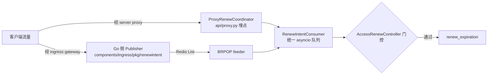

# OpenSandbox 源码走读（二）：Sandbox Lease 与生命周期管理
------
> 沙箱这类"按需创建、用完即弃"的资源，最怕的不是创建慢，而是没人回收——客户端崩了、网络断了，服务端还替它养着一个占 CPU 占内存的容器。这次把 OpenSandbox 的 lease（租约）机制翻了一遍：TTL 怎么算、到期谁去杀、续约有几条路、以及"伪永久"模式的清理边界。代码基于 main 分支（2026-08 核对）。

## 为什么需要 lease：没有它会出什么事故
------
先想清楚问题。沙箱不是无状态的 HTTP 请求，它是一个持续占用资源的容器/ Pod。调用方（比如一个 Agent 运行时）创建沙箱后，可能：

- 进程崩溃，永远不会再发"删除"请求；
- 网络分区，删除请求丢了；
- 业务 bug，for 循环里创建了 1000 个沙箱然后忘了。

没有租约机制，这些沙箱就变成孤儿——API 层面查得到，但没人对它们负责。Docker 里一个容器几百 MB 内存，K8s 里一个 Pod 还带 sidecar，泄漏速度远超普通连接池。

OpenSandbox 的解法是经典的 lease 模型：**创建时必须声明租期（或者明确声明不设租期），到期由服务端单方面回收**。入口在创建请求的 `timeout` 字段（秒，最小 60），服务端换算成绝对时间戳：

```python
# server/opensandbox_server/services/docker/docker_service.py
def _prepare_creation_context(
    self,
    request: CreateSandboxRequest,
) -> tuple[str, datetime, Optional[datetime]]:
    sandbox_id = self.generate_sandbox_id()
    created_at = datetime.now(timezone.utc)
    expires_at = None
    if request.timeout is not None:
        expires_at = calculate_expiration_or_raise(created_at, request.timeout)  # ← createdAt + timeout
    return sandbox_id, created_at, expires_at
```

注意 `timeout is None` 这个分支——它不是"忘了传"，而是一个正式模式（后面讲）。租期计算和上限校验都在 `services/validators.py`：

```python
# server/opensandbox_server/services/validators.py
def ensure_timeout_within_limit(timeout_seconds, max_timeout_seconds) -> None:
    if timeout_seconds is None:
        return                          # ← 伪永久模式，跳过校验
    calculate_expiration_or_raise(datetime.now(timezone.utc), timeout_seconds)
    if max_timeout_seconds is None:
        return                          # ← 服务端没配上限 = 不限
    if timeout_seconds > max_timeout_seconds:
        raise HTTPException(status_code=400, ...)
```

`max_sandbox_timeout_seconds` 是 `[server]` 配置里的 TTL 上限（`config.py`，默认 `None` 不限）。多租户部署建议配一个，否则调用方传个 `timeout=999999999` 也能过——虽然 `calculate_expiration_or_raise` 会把 datetime 溢出转成 400，但"合法地租一年"依然拦不住。

> lease 存的是绝对时间戳（`expiresAt`）而不是剩余秒数，这个选择是对的：服务端重启、时钟回拨、续约覆盖，都以一个不可变的时间点为准，不需要维护递减计数器。

## 到期执行：Docker 定时器 vs K8s 控制器
------
`expiresAt` 算出来了，谁来负责到期杀沙箱？Docker 和 K8s 两条运行时走了完全不同的实现路线。

Docker 路线是**进程内 Timer**。每个沙箱一个 `threading.Timer`，续约时直接替换旧 timer：

```python
# server/opensandbox_server/services/docker/docker_service.py
def _schedule_expiration(self, sandbox_id, expires_at, *, update_expiration=True, ...) -> None:
    delay = max(0.0, (expires_at - datetime.now(timezone.utc)).total_seconds())
    timer = Timer(delay, self._expire_sandbox, args=(sandbox_id,), kwargs=expire_kwargs or None)
    timer.daemon = True
    with self._expiration_lock:
        # Replace existing timer (if any) so renew operations take effect immediately
        existing = self._expiration_timers.pop(sandbox_id, None)
        if existing:
            existing.cancel()
        if update_expiration:
            self._sandbox_expirations[sandbox_id] = expires_at
        self._expiration_timers[sandbox_id] = timer
    timer.start()
```

进程内 Timer 有个致命问题：server 重启，内存里的 timer 全丢。所以启动时有一段 restore 逻辑，遍历所有容器 label 重建 timer，已过期的立即补杀：

```python
# docker_service.py（启动恢复，简化）
expires_at = self._get_tracked_expiration(sandbox_id, labels)
if expires_at is None:
    if self._has_manual_cleanup(labels):
        restored += 1
        continue                  # ← 伪永久沙箱跳过调度
    ...
if expires_at <= now:
    expired_entries.append((sandbox_id, mount_keys))   # 已过期，pass 2 补杀
    continue
self._schedule_expiration(sandbox_id, expires_at)
```

`_get_tracked_expiration` 的查找顺序是 内存缓存 → 文件元数据存储 → 容器 label，三层兜底保证重启后也能恢复租约。而 `_expire_sandbox` 的回调里还有个细节我挺喜欢——杀之前再查一次当前租约，**续约竞态时放弃删除**：

```python
# docker_service.py
current_expires = self._get_tracked_expiration(sandbox_id, labels)
if current_expires and current_expires > datetime.now(timezone.utc):
    self._schedule_expiration(sandbox_id, current_expires, update_expiration=False)
    logger.info("Sandbox %s was renewed (expires %s); aborting expiration.", ...)
```

没有这个检查，就会出现"用户刚续约，过期定时器还是把沙箱杀了"的灵异事件。另外定时器触发时如果暂时查不到容器（瞬时报错），会 30 秒后重试而不是放弃——lease 到期是确定性的，只是延迟，不会丢。

K8s 路线完全没有定时器这回事，靠的是**控制器 reconcile**。`expiresAt` 写进 BatchSandbox CR 的 `spec.expireTime`，控制器每次 reconcile 检查：

```go
// kubernetes/internal/controller/batchsandbox_controller.go
if expireAt := batchSbx.Spec.ExpireTime; expireAt != nil {
    now := time.Now()
    if expireAt.Time.Before(now) {
        if batchSbx.DeletionTimestamp == nil {
            log.Info("batch sandbox expired, delete", "expireAt", expireAt)
            if err := r.Delete(ctx, batchSbx); err != nil { ... }   // ← 到期直接删 CR
        }
    } else {
        DurationStore.Push(...)   // ← 未到期，把差值塞回去驱动下次 requeue
    }
}
```

两条路线对"到期后是删是留"还有一个共同的开关：`shutdown_policy: Delete|Retain`（`config.py:700`）。设成 `Retain` 时过期只终止不清理，用于调试或事后取证。

> Timer（推）vs reconcile（拉）是分布式系统里到期处理的两种基本形态。Timer 精确但要自己处理重启恢复；reconcile 天然幂等、重启免费，但精度受 requeue 间隔限制。OpenSandbox 两种都用了，各自贴合运行时特性，这个选择没毛病。

## 手动续约：renew-expiration 的三条约束
------
租约要能续，否则长任务都得把 `timeout` 估到最大。续约 API 只有一个端点：

```
POST /sandboxes/{id}/renew-expiration
{ "expiresAt": "2026-08-19T12:00:00Z" }   // 绝对时间，必填
```

路由是薄壳，直接委托 service 层（`api/lifecycle.py:344-384`）。真正有意思的是它背后的三条约束：

**约束一：只能延长，不能缩短。** spec 里写死 "Must be in the future and after the current expiresAt time"，服务端校验在 `validators.py`：

```python
def ensure_future_expiration(expires_at: datetime) -> datetime:
    if expires_at.tzinfo is None:
        normalized = expires_at.replace(tzinfo=timezone.utc)   # naive 时间按 UTC 处理
    else:
        normalized = expires_at.astimezone(timezone.utc)
    if normalized <= datetime.now(timezone.utc):
        raise HTTPException(status_code=400, detail={"code": "INVALID_EXPIRATION", ...})
    return normalized
```

这意味着你**不能通过续约来提前回收**一个沙箱，也不能给伪永久沙箱"补"一个过期时间——后者直接 409：

```python
# docker_service.py renew_expiration
if self._has_manual_cleanup(labels):
    raise HTTPException(
        status_code=status.HTTP_409_CONFLICT,
        detail={"code": SandboxErrorCodes.INVALID_EXPIRATION,
                "message": f"Sandbox {sandbox_id} does not have automatic expiration enabled."},
    )
if self._get_tracked_expiration(sandbox_id, labels) is None:
    raise HTTPException(status_code=409, ...)   # ← label 丢失也拒绝，宁可不续
```

**约束二：lease 状态要三处同步。** Docker 实现里，续约成功要同时改内存 timer、文件元数据、容器 label 三个地方：

```python
# docker_service.py renew_expiration（注释是原文）
# Persist the new timeout in memory; the file-backed override also keeps renewals correct across restarts
self._schedule_expiration(sandbox_id, new_expiration)
try:
    self._metadata_store.set_expiration(sandbox_id, new_expiration)
except OSError as exc:
    logger.warning("Failed to persist expiration override ...")   # ← 失败只记日志
labels[SANDBOX_EXPIRES_AT_LABEL] = new_expiration.isoformat()
try:
    with self._docker_operation("update sandbox labels", sandbox_id):
        self._update_container_labels(container, labels)
except (DockerException, TypeError) as exc:
    logger.warning("Failed to refresh labels ...")
```

三处里任何一处失败都是 warning 而不是报错——好在查找时有 fallback 链兜底，但严格说这不是事务性的。

**约束三：K8s 侧要同步 CR 和 label。** `kubernetes_service.py` 的 `renew_expiration` 同时更新 BatchSandbox 的 `spec.expireTime` 和对应 label，保证 reconcile 逻辑和 `kubectl` 排障看到的值一致。

> 409 的设计值得玩味：续约不能作用于伪永久沙箱，这是一个**用状态机拒绝而不是静默成功**的例子。如果这里静默返回 200，调用方会以为沙箱有了租约，实际永远不会过期——比 409 危险得多。

## 自动续约（OSEP-0009）：访问即续命
------
手动续约要求调用方自己记得续，OpenSandbox 在 OSEP-0009 里做了访问驱动的自动续约：**反向代理观测到流量，就替沙箱续一次命**。

用法上就两步：创建沙箱时在 `extensions` 里 opt-in，之后所有**经 server proxy 的调用**（exec/文件/健康检查，转发前有 `_schedule_proxy_renew` 埋点）自动续期；ingress 模式额外开 Redis。但整条链路有一个唯一的坑，先说在前面——**服务端开关**。`[renew_intent] enabled` 默认 `False`，而创建时对 extension 的校验只查值的格式（300~86400 的字符串十进制整数），**不查服务端开关**。也就是说客户端全做对了、proxy 调用一切正常，server 没开开关就一个字都不续——`proxy_renew.py` 第 38 行直接短路返回，无日志无报错，沙箱到点照样被杀。排查"自动续约不生效"，第一个要看的不是客户端配置，是 server config 里这个开关。

opt-in 的合法性在创建时校验的只有这个：

```python
# server/opensandbox_server/extensions/validation.py
ACCESS_RENEW_EXTEND_SECONDS_MIN = 300      # 5 分钟
ACCESS_RENEW_EXTEND_SECONDS_MAX = 86400    # 24 小时
```

```json
{
  "extensions": { "access.renew.extend.seconds": "3600" },
  "timeout": 600
}
```

注意传的是**字符串形式的十进制整数**，范围 300~86400，非法值创建即 400。每次访问触发的续约量就是 `now + extend.seconds`。

触发源有两条路：



所有路径最终汇到 `integrations/renew_intent/controller.py` 的门控，逻辑很收敛：

```python
def _try_renew_sync(self, sandbox_id: str, *, source: str) -> bool:
    try:
        sandbox = self._sandbox_service.get_sandbox(sandbox_id)
    except HTTPException:
        return False
    if sandbox.status.state.lower() != "running":
        return False          # ← 非 Running 不续
    if sandbox.expires_at is None:
        return False          # ← 伪永久沙箱不参与自动续约
    extend = self._extension_service.get_access_renew_extend_seconds(sandbox_id)
    if extend is None:
        return False          # ← 未 opt-in 不续
    candidate = now + timedelta(seconds=extend)
    new_expires = max(candidate, current)   # ← 单调不减，天然幂等
    ...
```

`max(candidate, current)` 这个写法保证了重复消费或乱序消费都不会把租约改小，配合每沙箱 `asyncio.Lock` 串行化，基本堵死了竞态。

坑都在外围。我对照实现把 OSEP 设计稿和代码过了一遍，这几个点值得记：

1. **Redis 启用时 proxy 路径没有冷却**。`consumer.py` 的 `_process_work` 里，`self._redis is not None` 时直接续约，完全跳过 `min_interval` 节流：

    ```python
    # consumer.py
    async with st.lock:
        if self._redis is not None:
            await self._controller.renew_after_gates(work.sandbox_id, source=work.source)
            return                                   # ← 无 min_interval 检查
        now = time.monotonic()
        if st.last_success_monotonic is not None and (now - st.last_success_monotonic) < self._min_interval:
            return
    ```

    高 QPS 访问同一个沙箱时，续约 API 调用会非常频繁。续约本身幂等所以不出错，纯属浪费。
2. **没有分布式锁**。OSEP 设计了 `opensandbox:renew:lock:{sandbox_id}`，实现只有进程内 `asyncio.Lock`。多副本部署 proxy 模式会重复续约——反正 `max()` 单调不减，影响有限；ingress 模式靠 BRPOP 竞争天然去重。
3. **best-effort 语义**。intent 无 ack，消费后进程崩了就丢；超过 `INTENT_MAX_AGE_SECONDS=300` 的 intent 直接丢弃；ingress 发布队列满（容量 8192）直接 drop。自动续约是"尽力而为"，不能当强保证用。
4. **Redis 不可用静默降级**。连接失败降级为 proxy-only 模式，只打日志。ingress 场景下自动续约整个失效，但没有任何告警指标——沙箱会悄悄开始过期。
5. **内存上限**。proxy 路径每沙箱状态的 LRU 上限是 `PROXY_RENEW_MAX_TRACKED_SANDBOXES = 8192`（`renew_intent/constants.py`），超了驱逐（持锁的除外）。规模再大就要靠 Redis 模式了。

还有一个最容易被忽略的：**SDK 默认不走 proxy**。Python SDK 的 `ConnectionConfig.use_server_proxy` 默认 `False`，工具调用（exec/文件操作）直连沙箱 IP:44772 的 execd 端口——这条路径 server 根本观测不到流量，自动续约完全不生效。业务想要"活跃即续命"，必须显式走 proxy 或 ingress。

> 自动续约有个隐含的哲学转变：TTL 从"调用方声明的租期"变成了"最后一次访问之后的空闲超时"。这更像 HTTP session 而不是传统 lease。但 best-effort 的投递语义意味着它只能做兜底，关键业务还是应该显式管理租约。

## 伪永久（manual cleanup）： lease 的另一个极端
------
创建时不传 `timeout`，`expiresAt` 就是 `None`，schema 里的原文是："When omitted or null, the sandbox will not auto-terminate and must be deleted explicitly"——**不自动终止，必须显式删除**。

实现上就是打一个 label / 不设字段，然后让所有过期逻辑绕行：

```python
# server/opensandbox_server/services/k8s/create_helpers.py
expires_at = None
if request.timeout is not None:
    expires_at = calculate_expiration_or_raise(created_at, request.timeout)

labels: Dict[str, str] = {SANDBOX_ID_LABEL: sandbox_id}
if expires_at is None:
    labels[SANDBOX_MANUAL_CLEANUP_LABEL] = "true"   # ← 唯一的区别就是一个 label
```

K8s 侧 `spec.expireTime` 不设置，控制器的 expire 分支直接跳过；Docker 侧过期扫描器看到 `manual-cleanup=true` 就 restore 后 continue（前面启动恢复那段代码里已经有了）。清理完全靠上层业务在会话结束时调 `DELETE /sandboxes/{id}`。

这个模式是为池化场景准备的：TTL 到期误杀正在使用的会话，比多养几个空闲沙箱的代价大得多。但它把回收责任完全推给了调用方，边界条件都得自己兜：

- **上层忘删 = 永久泄漏**。伪永久沙箱没有任何服务端兜底回收，必须业务侧自建清理（比如定期扫描 `expiresAt == null` 且长时间无访问的沙箱）。而 SDK 自带的 `releaseAllIdle` 是严格串行的，实测 500 个空闲沙箱要 ~480 秒（上游 issue #1472），批量清理根本指望不上，得自实现并发 kill。
- **单向门**。创建时没传 timeout，事后不能通过 renew-expiration 补上（409）。伪永久是一个创建时就必须做的决定。
- **Pool 模式下"删除"本身有坑**。这是风险清单里最扎心的部分：#954（分配到的 Pod 被外部删除后 `alloc-status` 注解残留，`supplement` 恒为 0，沙箱**永久不可用**）、#1433（`poolRef` 可变更导致 in-use Pod 被当孤儿回收 + 新池永不分配）、#1423（Pool 控制器六重缺陷复合成自维持的 Pod 创建/删除风暴，实测约一半创建请求失败）。这三个 issue 截至核对都没有修复 PR。
- **"挂了自动拉起"不存在**。上游明确 resume 只恢复有意的 Paused 状态，Terminated/Failed 不自动重启（#1127/#1328，SDK resume 报 409）。重建 = 新 sandbox ID + 内存和未持久化状态全丢。所以伪永久不是"永久可用"，只是"不会因为 TTL 被服务端杀掉"。

> 伪永久 + 上层主动删除，本质上是把 lease 的责任从服务端转移到了业务侧。服务端甩掉了误杀风险，但换来的是"业务必须自己靠谱"的前提。如果业务侧的清理兜底写得不靠谱，孤儿沙箱问题会以更隐蔽的方式回来——TTL 模式至少有个确定性的最后期限。

## config/env 注入链：一句话版
------
生命周期之外，把配置注入链也简单记一笔（详细展开值得单独一篇）。核心结论：**server 侧固定注入的 env 只有一个**——K8s 运行时的 `EXECD=/opt/opensandbox/execd`（`services/k8s/provider_common.py` 的 `_build_main_container`），其余全是 API 请求 `env` 字段透传。`sandbox_id` 不走 env，走 label `opensandbox.io/id`；egress/secure-access 的 token 走 annotation。

有一个和生命周期直接相关的注入条件要注意：创建请求里的 `env` 和 `entrypoint` 是通过 taskTemplate 生效的，**触发条件是 env 非空或 entrypoint 非默认值**，都没传就走快路径——env 注不进去。所以"创建时注入用户 token"这类操作必须确认 taskTemplate 真的被触发了，否则沙箱起来了但没有你要的变量，而且不会报错。

egress 是个例外支线：`OPENSANDBOX_EGRESS_*` 前缀的 key 会被 `split_egress_env` 拆出来进 sidecar，不在白名单（`ALLOWED_EGRESS_ENV_VARS`）直接 ValueError，创建失败——这是少数"配置错误会在创建时 fail-loud"的地方。

## 边界条件自查清单
------
把这次走读里值得在集成前确认的边界收拢一下：

| 边界 | 行为 | 出处 |
|---|---|---|
| timeout 传 0 / 负数 | 创建 400（最小 60） | `validators.py` |
| timeout 超服务端上限 | 创建 400 | `ensure_timeout_within_limit` |
| 续约时间早于现在 | 400 | `ensure_future_expiration` |
| 续约时间早于当前 expiresAt | spec 禁止（只能延长） | `sandbox-lifecycle.yml` |
| 伪永久沙箱调续约 | 409 | `docker_service.py:1199` |
| 自动续约对伪永久沙箱 | 静默跳过（门控 return False） | `controller.py:69` |
| server 未开 renew_intent.enabled | opt-in 照常创建、proxy 照常转发，但续约零次（开关默认 False） | `config.py` / `proxy_renew.py:38` |
| lease 状态 label 丢失 | 拒绝续约（409），但过期调度也可能 skip+warning | `docker_service.py` restore 逻辑 |
| Pod 被外部删除（Pool） | 沙箱永久不可用，无自愈 | #954 |
| TTL 过期自动删除（K8s） | PVC ownerReferences 可能缺失导致泄漏 | #1199 |
| server 长期运行 | httpx 连接池疑似泄漏，约 1 周耗尽 | #1386 |

最后一条单独说：#1386 不是沙箱的问题，是 server 自己的。续约、状态查询全走 server，server 挂了所有沙箱的 lease 管理瘫痪——Docker 模式下 timer 停摆但容器还在跑，K8s 模式下 reconcile 停摆 expireTime 形同虚设。**server 本身是这个 lease 系统的单点**，生产部署要按"它会挂"来设计：监控 httpx 连接池、周期性重启、 lease 到期查询别全压在一个实例上。

> 走读完整体判断：OpenSandbox 的 lease 设计在"单机/中小规模"上是完整的——绝对时间戳、续约单调性、重启恢复、竞态放弃删除，该有的细节都有。但规模化风险集中在 K8s Pool 一侧（#954/#1433/#1423 三个无 PR 的 P0），伪永久模式的回收责任又全压给业务方。如果要上生产，我会选 TTL + 自动续约组合而不是伪永久：让服务端兜底最后期限，业务侧只负责"保活"，这比"保活 + 回收"两个责任都自担要安全。

------
> 下一篇预告：沙箱池化设计——Pool CRD、alloc-status 注解协议、预热与分配路径，以及为什么池化模式在当前上游版本要先踩一遍 #1423 的坑再决定开不开。
