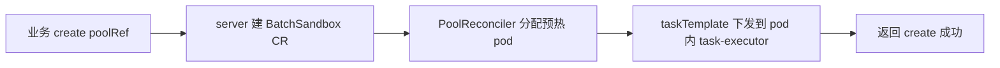

# OpenSandbox 源码走读（三）：池化设计——Template 更新、分配注入与 S3 会话同步
------
> 前两篇看了 CRD 模型和创建链路，这篇讲我觉得整套系统里工程含金量最高的部分：池化。AI agent 场景下沙箱创建动辄十几秒，用户等不了——所以要把 pod 提前建好捂热，create 时直接分配。但"复用已运行的 pod"这个约束会连锁引出一堆问题：模板更新了怎么办？用户身份怎么在分配时刻注进去？上一个用户的会话数据怎么保证不串到下一个用户？这篇沿着"模板 → 池 → 分配 → 会话同步"把这条线走完。

## 为什么要池化
------

非池化路径下，create 一个沙箱意味着：调度 pod → 拉镜像 → 启动容器 → execd 就绪，整个链路秒级起步、镜像大了奔着分钟去。agent 场景里这是不可接受的——用户发一条消息，agent 要在对话内频繁开沙箱跑代码，没人愿意等十几秒的"白屏"。

池化的思路很朴素：用 `Pool` CRD 预先按模板创建一批 pod 捂着，业务 create 时带 `extensions.poolRef`，server 不再建 pod，而是从池里挑一个已运行的分给这个 BatchSandbox：



pod 建好之后所有动作都发生在"已运行的容器"里，这就是池化一切设计的出发点。

## Template 更新：sha256 版本号 + 只换空闲 pod
------

Pool 的模板版本不是手填的，是控制器对 `spec.template` 做 sha256 算出来的：

```go
// kubernetes/internal/controller/pool_controller.go
func (r *PoolReconciler) calculateRevision(pool *sandboxv1alpha1.Pool) (string, error) {
    template, err := json.Marshal(pool.Spec.Template)
    if err != nil {
        return "", err
    }
    revision := sha256.Sum256(template)
    return hex.EncodeToString(revision[:8]), nil  // ← 取前 8 字节做版本号
}
```

新创建的 pod 会打上 `sandbox.opensandbox.io/pool-revision` 标签（`createPoolPod` 里 `pod.Labels[LabelPoolRevision] = updateRevision`），这样池子里每个 pod 属于哪个版本一目了然。

更新策略有个关键前提：**只处理 idle pod**。`scheduleSandbox` 里 idle 的定义是"Ready 且未被分配"：

```go
// kubernetes/internal/controller/pool_controller.go
latestAllocation, err := r.Allocator.GetPoolAllocation(ctx, pool)
idlePods := make([]string, 0)
for _, pod := range pods {
    if _, ok := latestAllocation[pod.Name]; !ok {  // ← 被分配的不算 idle
        idlePods = append(idlePods, pod.Name)
    }
}
```

`recreateUpdateStrategy.Compute`（`pool_update.go`）的签名直接把这一点写在了参数上：

```go
Compute(ctx context.Context, updateRevision string,
    pods []*corev1.Pod, idlePods []string) *UpdateResult
```

替换节奏受 `UpdateStrategy.MaxUnavailable`（默认 25%）预算控制，空闲 pod 分批删旧建新。`GenerationChangedPredicate` 保证只有 spec 变更才触发 reconcile，status 抖动不会引发无谓轮询。

> 只换 idle pod 是对的——已分配的 pod 背后有活着的沙箱，删了就是事故。但它带来一个容易被忽略的推论：如果池子里所有 pod 都被分配了，`updatePool` 算出 `SupplyUpdateRevision = 0`，一个新 pod 都不会建，整个池子停留在旧版本，而且没有任何告警。升级模板前得先看一眼分配率。

## 分配：先到先得，不认版本号
------

分配算法在 `algorithm/packed.go`，简单到值得整段贴出来：

```go
// kubernetes/internal/controller/algorithm/packed.go
type PackedSchedule struct{}

func (p *PackedSchedule) Schedule(availablePods []string, allRequest []*SandboxRequest) *AllocAction {
    action := &AllocAction{
        ToAllocate: make(map[string][]string),
        ToRelease:  make(map[string][]string),
        PodSupplement: int32(0),
    }
    for _, req := range allRequest {
        // ... 收集 release 请求 ...
        need := req.PodSupplement
        if need <= 0 { continue }
        if int32(len(availablePods)) >= need {
            action.ToAllocate[req.SandboxName] = availablePods[:need]  // ← 按列表顺序切
            availablePods = availablePods[need:]
        } else if len(availablePods) > 0 {
            action.ToAllocate[req.SandboxName] = availablePods
            action.PodSupplement += need - int32(len(availablePods))  // 不够就补建
            availablePods = nil
        } else {
            action.PodSupplement += need
        }
    }
    return action
}
```

`availablePods` 就是上一节的 idle 列表——注意它**不区分 revision**，新旧版本的 pod 混在一起先到先得。所以模板刚更新完，只要 idle 池里还剩旧 revision 的 pod，新沙箱就可能分到旧 pod。

分配关系的记录方式也值得注意：**pod 上没有任何指向 BatchSandbox 的所有权标记**。pod 只有 `pool-name` 和 `pool-revision` 两个标签，ownerReference 指向的是 Pool；分配关系单向记在 BatchSandbox 的注解上：

```go
// kubernetes/internal/controller/apis.go
AnnoAllocStatusKey   = "sandbox.opensandbox.io/alloc-status"   // {"pods":["pod-a"]}
AnnoAllocReleaseKey  = "sandbox.opensandbox.io/alloc-release"  // 待释放
AnnoAllocReleasedKey = "sandbox.opensandbox.io/alloc-released" // 已释放
```

> 没有 pod → sandbox 的正向索引，查"这个 pod 属于哪个沙箱"只能反向遍历所有 BatchSandbox 的注解。控制器的 `InMemoryAllocationStore` 也是从注解 Recover 出来的，没有独立持久化——好处是注解即真相、重启可恢复，坏处是规模化之后反向查询会很疼。

## 分配时刻注入：taskTemplate 就是现成的通道
------

池化 pod 是预热的，分配时**不能改 pod spec**——initContainer、ConfigMap 挂载、env 注入这些"创建时生效"的手段全部失效。分配时刻能做的只有往运行中的容器里执行动作。

server 的做法是把注入打包进 taskTemplate。看 `batchsandbox_provider.py` 的真实代码：

```python
# server/opensandbox_server/services/k8s/batchsandbox_provider.py
def _build_task_template(self, entrypoint, env, sandbox_id):
    escaped_entrypoint = ' '.join(shlex.quote(arg) for arg in entrypoint)
    if self.execd_run_as_init:
        user_process_cmd = f"exec /opt/opensandbox/bootstrap.sh {escaped_entrypoint}"
    else:
        user_process_cmd = f"/opt/opensandbox/bootstrap.sh {escaped_entrypoint} &"

    wrapped_command = ["/bin/sh", "-c", user_process_cmd]
    env_list = [{"name": k, "value": v} for k, v in env.items()] if env else []
    env_list.append({"name": "OPENSANDBOX_ID", "value": sandbox_id})
    return {"spec": {"process": {"command": wrapped_command, "env": env_list}}}
```

有个容易踩的坑藏在 `_create_workload_from_pool` 里：不传 entrypoint/env 时走**快路径**，直接不生成 taskTemplate：

```python
needs_task_template = (
    env
    or entrypoint != DEFAULT_ENTRYPOINT
    or self.execd_run_as_init
)
if needs_task_template:
    spec["taskTemplate"] = self._build_task_template(entrypoint, env, batchsandbox_name)
else:
    # Fast path: the pre-created pool pod keeps running its own warm
    # entrypoint, so no per-allocation env can reach execd.
```

快路径省一次任务下发，但代价是连 `OPENSANDBOX_ID` 都注入不了，注释里明说了这条路径上 eBPF 审计无法归属 sandbox_id。

"分配后注入"能成立，靠的是 controller 的 3 秒轮询链路：

```
server 创建 BatchSandbox（含 taskTemplate）
  → BatchSandboxReconciler 每 3s reconcile
  → taskTemplate 生成 task specs 下发到 pod 内 task-executor（:5758）
  → task-executor 先跑 preStart 钩子，再跑主命令
```

这引出一个关键的时序判断：**taskTemplate 是 server 每次分配时生成的，create 请求里的动态参数（user_id、token）在生成那一刻就已知**，所以可以直接渲染进命令——命令里 `cat > file <<'EOF'` 写文件、`sh file` 调脚本，注入和调用一次完成。执行天然发生在分配后，不需要新开 k8s exec 接口。exec 只在需要"分配后才知道的信息"（pod IP、运行时探测）时才值得引入。

> token 这类敏感凭证注入时要小心：taskTemplate 的命令会进日志，`user_auth_token` 千万别拼进命令行，走 env 注入更稳。而且 Pool 模式下 Secret 挂载必须预挂进模板，分配时加不了——所以分配时刻注入 token 实际只有 env 和文件两条路。

## S3 会话同步：固定 postStop + 中间层静默 exec
------

池化还有个更麻烦的问题：pod 是复用的，用户 A 用完回池，用户 B 分到同一个 pod 时绝不能看到 A 的文件。解法是把会话状态放 S3，按前缀隔离：

```text
s3://<bucket>/tenants/<tenantId>/users/<userId>/sessions/<sessionId>/
```

架构上分三层，各管各的：

| 层 | 职责 | 时机 |
|---|---|---|
| Pool 模板 | 共享 emptyDir `/shared-workspace`、task-executor 侧 S3 CLI + 凭证（IRSA） | 一次配置 |
| BatchSandbox | 固定 postStop（与用户无关，所有沙箱一样） | 建 CR 时带上 |
| 中间层 | 按用户渲染并注入 sync 脚本、触发 restore | 分配后 exec |

固定 postStop 长这样：

```yaml
lifecycle:
  postStop:
    execMode: Local          # 在 task-executor 侧执行
    timeoutSeconds: 180
    exec:
      command: ["/bin/sh", "-c"]
      args:
      - |
        set -eu
        HOOK=/shared-workspace/.osb-sync-out.sh
        if [ -x "$HOOK" ]; then "$HOOK"; fi   # ← 存在才跑，注入的回写脚本
        find /shared-workspace -mindepth 1 -delete  # 清盘防串台
```

中间层的 create 流程对外仍然是一次普通的 create：

```text
1. 解析身份 → S3_USER_PREFIX
2. 创建 BatchSandbox（poolRef + 固定 postStop 的 taskTemplate）
3. 等待分配的 pod Ready
4. 内部 pods/exec 到 task-executor 容器：
     a. 写入并 chmod +x /shared-workspace/.osb-sync-out.sh
     b. 后台启动 inbound restore（aws s3 sync ... || true），不等 CLI 结束
5. 标记会话已 prepare
6. 返回 create 成功
```

delete 时（主动删或 expireTime 到期）走同一条路：删 CR → finalizer → StopTask → postStop 跑 `.osb-sync-out.sh` 回写 S3 + 清盘 → pod 回池。到期删除也能回写，这是把回写放进 postStop 而不是让业务在 delete 前自己 sync 的核心理由。

为什么脚本要靠 exec 注入、而不是让固定钩子去读用户 env？我查了 task-executor 的实现，Local 钩子的环境是这么构造的：

```go
// kubernetes/internal/task-executor/runtime/process.go
cmd.Env = os.Environ()  // ← 只继承 task-executor 进程自身环境
```

钩子**不继承** task 的 `process.env`，所以"create 时塞个 `S3_USER_PREFIX` env、固定 sync 脚本去读"这条路在当前实现下走不通——注入脚本把前缀写进文件，就是在绕这个限制。postStop 钩子在任务终态（成功/失败/超时/删除）时必执行，倒是销毁前持久化产物的可靠挂点。

> 这套设计里我最欣赏的是"动态与静态分离"：用户相关的东西（S3 前缀、脚本内容）由中间层运行时注入，用户无关的骨架（postStop 逻辑、清盘）固化在 CR 模板里。业务 SDK 全程只看到 `create → 使用 → delete`，pods/exec、S3 命令、脚本路径全都不出中间层。代价是链路变长了：中间层挂了恢复逻辑、postStop 失败是否阻塞回池、restore 还在跑就回池的竞态，这些都是要靠运维约定兜底的模糊地带。

## shardTaskPatches：批量创建时的差异化补丁
------

最后补一个和 taskTemplate 配套的机制。`BatchSandbox` 支持一次创建 N 个沙箱，`shardTaskPatches[i]` 按下标对第 i 个副本的任务做覆盖，实现"批量创建、各跑各的"：

```yaml
spec:
  replicas: 3
  taskTemplate:
    spec:
      process:
        command: ["python", "train.py"]
        args: ["--epochs", "10"]
  shardTaskPatches:
  - spec: { process: { args: ["--epochs", "10", "--lr", "1e-3"] } }
  - spec: { process: { args: ["--epochs", "10", "--lr", "1e-4"] } }
  # 副本 2 无 patch → 用默认 taskTemplate
```

合并逻辑在 `task_scheduling_strategy_default.go`，就是标准的 strategic merge patch：

```go
func (s *DefaultTaskSchedulingStrategy) getTaskSpec(idx int) (*api.Task, error) {
    task := &api.Task{Name: fmt.Sprintf("%s-%d", s.Name, idx)}
    if len(s.Spec.ShardTaskPatches) > 0 && idx < len(s.Spec.ShardTaskPatches) {
        taskTemplate := s.Spec.TaskTemplate.DeepCopy()   // ← 在深拷贝上合并，不动原模板
        cloneBytes, _ := json.Marshal(taskTemplate)
        patch := s.Spec.ShardTaskPatches[idx]
        modified, err := strategicpatch.StrategicMergePatch(
            cloneBytes, patch.Raw, &sandboxv1alpha1.TaskTemplateSpec{})
        if err != nil {
            return nil, fmt.Errorf("batchsandbox: failed to merge patch raw %s, idx %d, err %w", patch.Raw, idx, err)
        }
        // ...
        task.Process = convertProcessSpec(newTaskTemplate.Spec.Process,
            s.Spec.TaskTemplate.Spec.TimeoutSeconds)  // ← timeout 取基础模板
    } else if s.Spec.TaskTemplate != nil && s.Spec.TaskTemplate.Spec.Process != nil {
        task.Process = convertProcessSpec(s.Spec.TaskTemplate.Spec.Process,
            s.Spec.TaskTemplate.Spec.TimeoutSeconds)
    }
    return task, nil
}
```

几个容易记错的语义：env 数组按 `name` merge（同名覆盖、异名保留，patch 删不掉模板里的 env）；`timeoutSeconds` 永远取基础模板，patch 里改了不算数；patch 数量和 replicas 不匹配时静默兜底，多补丁忽略、少补丁用模板，没有告警。注意 server API 并不暴露 `shardTaskPatches`，只能直接操作 CR；server 的池化分配路径走的是单任务模板（`_build_task_template`），没有 shard 能力。 RL 训练/评测这类 "high-throughput agentic-RL" 场景是它的主场：配合 `taskResourcePolicyWhenCompleted: Release`，任务跑完 pod 立刻回池，批量沙箱用完即焚。

------
> 把这条链路串起来看，池化设计的精髓是"把不确定性往后推"：模板预热消灭冷启动，revision 机制管住模板演化，taskTemplate 把分配时刻的动态注入变成一次任务下发，postStop + S3 前缀把有状态会话塞进无状态池。每一环都不复杂，但约束传导得很干净——"复用已建 pod"这一条，决定了注入只能走任务下发、清理只能靠钩子、隔离只能靠外部存储。如果要说短板，我觉得是可观测性：快路径注入不了 ID、旧 revision 无告警、postStop 失败只记注解，这些都得自己补监控。

> 下一篇走读出口网络：沙箱的 egress 代理、token 鉴权和域名白名单是怎么做的。
