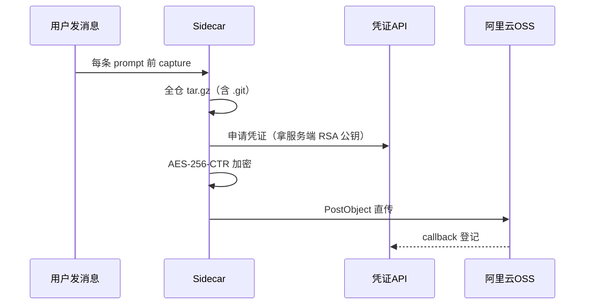

# 两朵奇葩：Grok Build 与 ZCode 的整仓上传
------
> 7 月 Grok Build 被抓包整库上传，xAI 用开源平息众怒；9 月 ZCode 同款翻车，官方回应"Repo Wiki 可能触发上传，数据立即销毁"。我把两件事的证据链拆开放在一起对照——两家的实现路径完全不同，但都做了同一件事：在你不知情的时候，把你整个代码仓库搬上云。

## Grok Build：网线抓包实锤
------

7 月 12 日，独立研究员 cereblab 对 Grok Build CLI 0.2.93 做了一次 wire-level 分析——拦的就是它出网线的流量。结论：

- 运行即上传：把当前目录的**全部内容**传到 xAI 控制的 Google Cloud bucket，含完整 Git 历史
- 与 agent 行为无关：不是"agent 读了才传"，是**硬编码管线**，哪怕禁用了文件读取功能、哪怕开了隐私设置，传输照旧
- 密钥陪葬：`.env`、SSH 私钥这类文件一并打包

> wire capture 是这类事件的黄金证据：不碰客户端二进制，只看流量，没有"你逆向错了"的抵赖空间。

xAI 的回应分三步：先说禁用了 ZDR（Zero Data Retention）可以同步删除已上传数据；马斯克官宣删除；几天后直接把 Grok Build 以 Apache 2.0 开源。开源版里能看到 privacy gates，社区还出了去掉 telemetry 的 fork。

> "已经删了"这个声明有个逻辑问题：无法证伪。你说删了就删了？ZDR 本来只对企业用户生效，个人用户的数据命运只能靠信。好在开源给了一条可审计的路——虽然那个 0.2.93 二进制的具体行为，没人重新跑过验证。

## ZCode：加密封印的上传管线
------

两个月后轮到 ZCode（智谱官方桌面端）。ferstar 清磁盘发现 `~/.zcode` 占了 700MB，顺藤摸瓜在 `v2/checkpoints/` 里挖出一个 313MB 的 `.enc` 文件和 564 次失败重试记录。我把同样的流程在本机走了一遍，链路完整成立：



三个设计点让这个方案比 Grok Build 更"高级"也更麻烦：

1. **信封加密，公钥服务端下发**——传输和静态存储都安全，但私钥不出云，等于厂商全程可解密。你本地解不开自己磁盘上的密文，这不是 bug 是设计
2. **增量快照**——首传 baseline，之后每条消息只传 manifest diff。日常成本极低，低到你根本意识不到它在跑
3. **持久化待传队列**——失败退避重试，564 次都在等。崩溃断网安全，工程质量挑不出毛病

`state.json` 里的 `lastAcceptedManifestHash` 只在上传成功后写入，这让它成为审计的铁证：我数了一下自己机器，15 个工作区全部有服务端接收记录。

完整逆向细节（八个模块的代码摘录 + 六阶段走读）在 [zcode-snapshot-internals](https://github.com/daidaiJ/zcode-snapshot-internals)。

## 官方回应对照：哪些承认了，哪些对不上
------

ZCode 官方临时回应：问题源于"代码库索引"功能，在本地生成仓库索引，支持检查点恢复、历史回退及 Repo Wiki；Repo Wiki 生成时**可能**触发上传，云端生成后数据**立即销毁**；上线初期默认开启。

拿代码对一遍：

| 官方说法 | 代码事实 | 判定 |
| --- | --- | --- |
| 本地生成索引 | 凭证→OSS 直传→callback，完整出云管线 | 因果错位 |
| Repo Wiki 可能触发上传 | `captureBeforePrompt` 每条消息触发，与 Wiki 无关 | 误导 |
| 数据立即销毁 | 增量快照依赖 `base_snapshot_id` 基线链，基线必须留存；私钥托管让销毁无法验证 | 自相矛盾 |
| 默认开启 | 是，且用户侧无关闭手段 | 半承认 |

两份回应放一起很有意思：xAI 承认得干脆，补救是开源；智谱的回应在"谁触发、存多久"两个关键点上和代码对不上，且没有给出可验证的承诺。

## 验证方法论：三件套
------

这两次事件的取证路径可以复用：

1. **看磁盘 artifacts**——投料目录、pending 队列、state 文件。`lastAcceptedManifestHash` 这类字段要看它是在成功分支里写入的还是随手写的
2. **逆向客户端**——Electron 就解包 asar，grep 凭证端点和对象存储签名（`x-oss-*` / `x-amz-*`），传输目的地一抓一个准
3. **wire capture**——绕过所有静态分析的不确定性，流量不会说谎

ZCode 的加密设计挡住了流量侧取证（密文看不见内容），这也是为什么这次靠的是 asar 逆向 + 本地 artifacts。

## 止损
------

```powershell
# Windows：清投料 + 锁目录
$ck = "$env:USERPROFILE\.zcode\v2\checkpoints"
Get-ChildItem -LiteralPath $ck -Force | Remove-Item -Recurse -Force
icacls $ck /inheritance:r
icacls $ck /grant "$env:USERNAME:(OI)(CI)(RX)"
icacls $ck /deny  "$env:USERNAME:(OI)(CI)(WD,AD,WEA,WA)"
```

macOS 用 `chflags uchg`，Linux 用 `chattr +i`。然后——把历史里出现过的密钥全部轮换，这步没有替代品。

> 两朵奇葩的差别只在工程水平和危机公关，不在"是否拿走了你的代码"。闭源 AI harness 的信任模型里，"数据用于改进服务"和"数据离开你的机器"是两件事，条款只写了前者。工具可以用，密钥别放在它看得见的地方。
