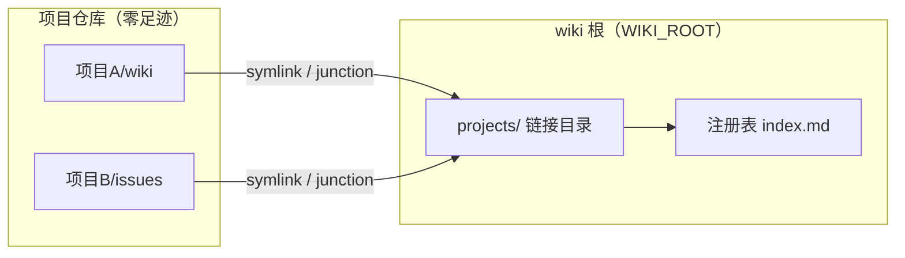
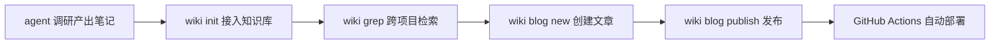
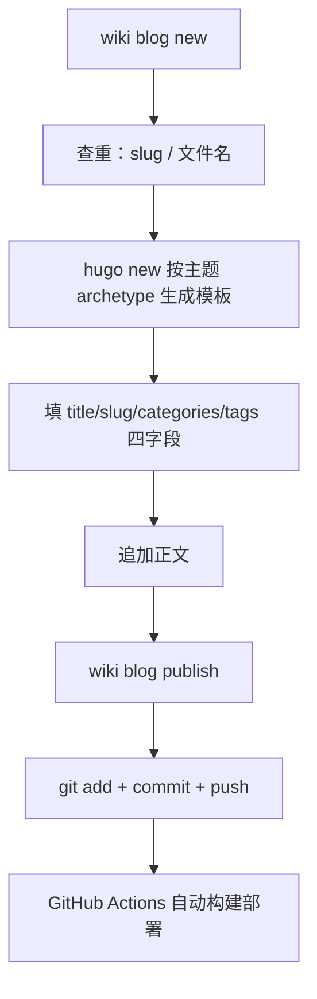

# wiki CLI 工具设计
------
> 一个把散落在各项目里的调研笔记统一管起来的命令行工具。核心思想就两条：数据面与控制流分离，知识管理与博客发布打通。

## 动机：笔记散落十几个仓库
------
让 agent 做源码调研和方案分析，产出物（调研 wiki、issue 分析、踩坑记录）散落在十几个仓库的角落里，格式不一、无人索引、想找的时候不知道在哪。为每个项目 fork 一个 wiki 仓库又太重。

my-wiki 的做法是**不动你的文档**：笔记继续留在各自项目里（单一事实源），工具只在统一目录下维护一组目录链接，再用一张本地注册表登记每个项目的位置和介绍。任何时刻 `grep` 一下就能跨项目检索，而各项目仓库保持零改动——不会把你的个人知识配置带上远程。

## 核心思想：数据面与控制流分离
------
wiki 把整个系统切成两层：

- **数据面**：知识数据本身。笔记留在各自项目里（单一事实源），注册表、发布记录、配置在 `WIKI_ROOT` 指向的本地目录，`projects/` 链接是机器本地的视图
- **控制流**：工具逻辑与 agent 工作流。命令契约、钩子、规约注入——这部分可以开源、可以复制、可以升级，和数据互不污染

分离的直接体现是 wiki 根解析：

```go
// config.go（简化）
func WikiRoot() string {
    if env := os.Getenv("WIKI_ROOT"); env != "" {
        return env
    }
    // 依次探测可执行文件目录、当前目录是否含 index.md 标记
    for _, dir := range []string{exeDir, cwd} {
        if _, err := os.Stat(filepath.Join(dir, "index.md")); err == nil {
            return dir
        }
    }
    return exeDir // 兜底
}
```

> 工具仓库可以开源（代码 + 规约），个人数据在 `WIKI_ROOT` 指向的目录，两者互不污染。换机器只要把数据目录拷过去，`projects/` 链接重建一次即可。

数据面还有一个更重要的原则：**项目仓库零足迹**。接入信息只存在 wiki 根的本地注册表，不会随项目 commit/push 泄漏到远程——你的个人知识配置永远不会出现在公开仓库里。

## 数据面实现：注册表 + 目录链接
------
注册表持久化为 `index.md` 顶部的隐藏 JSON 块，其余是渲染视图：

```go
// registry.go
func saveRegistry(root string, reg *Registry) error {
    var b strings.Builder
    b.WriteString("<!-- wiki-registry\n")
    b.Write(data)                 // ← JSON 数据块（机器读）
    b.WriteString("\n-->\n\n")
    b.WriteString("# 项目索引\n\n") // ← 以下是 Markdown 渲染视图（人读）
    for _, p := range reg.Projects {
        fmt.Fprintf(&b, "| %s | %s | %s |\n", p.Name, p.Root, p.Intro)
    }
    return os.WriteFile(registryPath(root), []byte(b.String()), 0o644)
}
```

> 一个文件同时是数据源和视图，agent 和人都能读。JSON 藏在 HTML 注释里，Markdown 渲染器不会显示它，`wiki grep` 也不会被它干扰。

链接层：`projects/<项目>/` 下建 symlink 指向项目的 wiki/issues 目录，Windows 无权限时自动降级 junction：

```go
func makeLink(target, link string) error {
    if err := os.Symlink(target, link); err == nil {
        return nil
    } else if runtime.GOOS == "windows" {
        out, jerr := exec.Command("cmd", "/c", "mklink", "/J", link, target).CombinedOutput()
        if jerr == nil {
            return nil // ← junction 降级成功
        }
        return fmt.Errorf("symlink 失败: %v；junction 降级也失败: %v: %s", err, jerr, out)
    }
    return err
}
```

整体关系：



## 控制流实现：为 agent 而生
------
控制流要回答一个问题：agent 怎么和这个工具协作？两个设计贯穿始终。

**幂等 check，为钩子而生。** `wiki check` 被设计为对任何钩子机制都安全：

- stdout 恒为空（部分工具会把 stdout 当 JSON 严格校验）
- 日志全部走 stderr，内部错误不改变退出码
- 不修改当前项目仓库的任何文件

```go
// EnsureRegistered 幂等地把项目接入知识库，init/register/check 共用
func EnsureRegistered(root, abs string, decl *WikiSyncDecl) (*EnsureResult, error) {
    // 1. 跳过健康链接（EvalSymlinks 比对目标）
    // 2. 修复失效链接
    // 3. 清理声明收缩后的孤儿链接（只删链接，绝不碰真实目录）
    // 4. upsert 注册表——无变化则不写盘
    ...
}
```

> 关键细节：注册表无变化则不写盘。否则每轮会话结束都触发一次文件写入，既制造噪音，也让 git 工作区永远不干净。

**宽容 flag 解析。** agent 调用 CLI 时经常把位置参数放在旗标前（`init <目录> --paths wiki`），标准库 flag 不接受这种顺序。`ParseWithPositionals` 内部重排为「旗标在前、位置参数在后」再交给标准 FlagSet：

```go
func ParseWithPositionals(fs *flag.FlagSet, args []string) error {
    var flags, pos []string
    for i := 0; i < len(args); i++ {
        a := args[i]
        if strings.HasPrefix(a, "-") && a != "-" {
            flags = append(flags, a)
            if f := fs.Lookup(strings.TrimLeft(a, "-")); f != nil {
                if bv, ok := f.Value.(interface{ IsBoolFlag() bool }); !ok || !bv.IsBoolFlag() {
                    if i+1 < len(args) { // 非 bool 旗标吞掉下一个 token
                        i++
                        flags = append(flags, args[i])
                    }
                }
            }
        } else {
            pos = append(pos, a)
        }
    }
    return fs.Parse(append(flags, pos...))
}
```

> 这个函数是 agent 友好设计的缩影：CLI 的调用方是 LLM，不是人。LLM 生成命令时不会严格遵守「旗标在前」的约定，宽容解析能显著减少失败重试。

## 打通知识管理和博客
------
wiki 的另一半：知识库的产出直接变成博客文章。调研笔记（wiki/issues）→ 知识库检索 → 沉淀成博客，一条链路：



`blog new` 的完整流程：



几个关键设计：

- **apply 时查重**：slug 罕见重复 + 文件名存在性，先于 `hugo new` 报错，避免生成一半才发现冲突
- **push 失败不重试**：原始错误透传，文章已本地提交，用户手动补一次 `git push` 即可
- **blog.json 懒维护**：发布成功后才更新四字段记录，`blog list` 据此统计分类复用频次

```go
// blogPublish 提交并推送；push 失败不重试
if out, _, err := run("push", "push"); err != nil {
    return fmt.Errorf("git push 失败（不重试，原始输出透传如下）:\n%s%v\n\n"+
        "GitHub 网络问题请用户手动处理：稍后在 %s 执行 git push 即可，文章已本地提交。",
        out, err, repo)
}
```

> 不重试是刻意的：push 失败几乎都是网络问题，自动重试只会放大 GitHub 的限流压力。把决定权交给人，比假装智能地重试更可靠。

知识管理对博客的反哺也在这里：`blog list` 统计已有分类的使用频次，新文章优先复用——分类不会碎片化，知识库的元数据直接指导博客的写作决策。

## 一些取舍
------
- **注册表是单机本地的**，没有多用户同步——团队共享知识库不适合
- **刻意本地优先**：要跨机器同步就用 git remote 管理数据目录，工具从不自动 push
- **Windows 支持**：symlink 失败自动降级 junction，无需管理员权限

> 坦率说，这个工具离"通用知识管理"还有距离，但它解决了我自己的核心痛点：跨项目检索 + 博客发布自动化。工具的价值不在于功能多，而在于和 agent 工作流的契合度——每个命令都是为 LLM 调用方设计的。

## 实践：接进 Obsidian 当仓库
------
> 知识库最终要给人看。Obsidian 是现成的阅读器，但把 wiki 根接进去当仓库，踩了几个设计文档里没写的坑。结论先行：符号链接从来不是问题，仓库根才是。

### 符号链接没问题，仓库根才是问题
------
先验证最担心的点：Obsidian 到底认不认 symlink。官方文档说支持，但有约束——目标必须和仓库根不相交、不能有循环。实测更直接，在仓库里建一个指向外部目录的临时链接，文件列表立刻出现：

```bash
ln -s /d/CODE/ai/higress/wiki "D:/wiki/pandawiki/test-link"   # 临时验证
obsidian vault=pandawiki folders   # 索引里立刻出现 test-link 和里面的 md
```

> 链接本身没问题。真正的坑是仓库根：vault 建在 `projects/wiki` 子目录时，打开只能看到欢迎.md——内容全在仓库根之外的 `projects/` 链接里。Obsidian 的仓库根必须包含所有内容，这是唯一硬约束。

### obsidian:// URI 不能注册仓库
------
想用 URI 把新目录注册成仓库，撞了墙：

```
Vault not found.
Unable to find a vault for the URL obsidian://open/?path=D%3A%5Cwiki%5Cprojects
```

`obsidian://open?path=` 只能解析**已注册**仓库里的文件路径，不能按路径注册新仓库。注册的正道只有两条：UI 里 Open folder as vault，或者直接改注册表：

```json
// %APPDATA%\obsidian\obsidian.json
{"vaults":{"c3d4bd2d547a9675":{"path":"D:\\wiki\\pandawiki","ts":1787470151204,"open":true}},"cli":true}
```

> 顺带发现 Obsidian 官方 CLI（`obsidian` 命令）很好用：`obsidian vault=pandawiki folders/files` 直接查仓库索引，验证迁移结果不用开界面。唯一提醒：CLI 会抱怨 installer 版本过旧，需要重新下载安装器。

### wikiRoot 标记解析的迁移陷阱
------
wiki 根靠 `index.md` 标记解析（环境变量 > exe 目录 > 当前目录）。数据目录从 `D:\wiki` 挪进仓库后，如果只搬文件不设环境变量，hook 会静默失效——解析兜底到 exe 目录，`wiki check` 变成空转：

```bash
setx WIKI_ROOT "D:\wiki\pandawiki"   # 用户级环境变量，新终端生效
```

hook 不能依赖终端环境，改成内联设置：

```bash
cmd /c "set WIKI_ROOT=D:\wiki\pandawiki&& D:/CODE/ai/my-wiki/wiki.exe check"
```

### 命名避坑：仓库目录别叫 wiki
------
仓库目录最初叫 `wiki`，和 `knowledgeDirs` 里的 `wiki` 类型名重合——自动发现知识目录时可能把仓库目录自己误认成项目知识目录，循环引用的隐患。改名 `pandawiki` 一劳永逸。

最终结构：

```
D:\wiki\pandawiki\            ← Obsidian 仓库根 = wiki 根
├── .obsidian/
├── index.md                  ← 注册表（标记）
├── config.json / blog.json
├── 欢迎.md
└── projects/                 ← 各项目知识目录链接
    ├── agentscope/wiki -> D:\CODE\ai\agentscope\wiki
    ├── higress/wiki   -> D:\CODE\ai\higress\wiki
    └── ...
```

> 这次实践最大的收获：设计里的"数据面"假设（链接、标记、环境变量）在真实阅读器面前都站得住，唯独仓库根层级这种"人怎么看"的问题，设计文档不会替你想到。Obsidian 仓库根 = wiki 根，一个目录两用，比维护两套结构省心。
