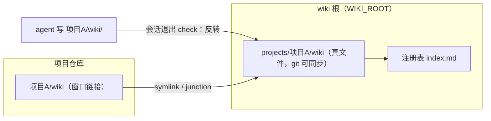
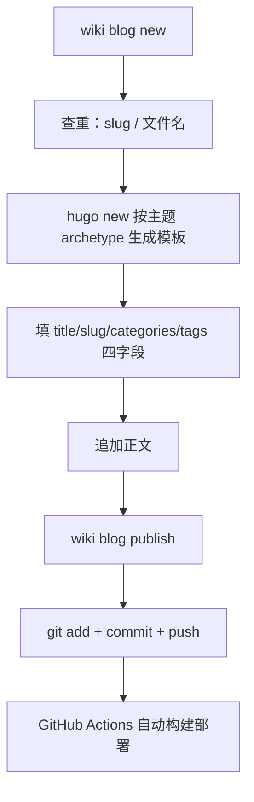
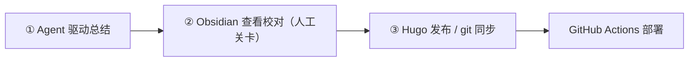
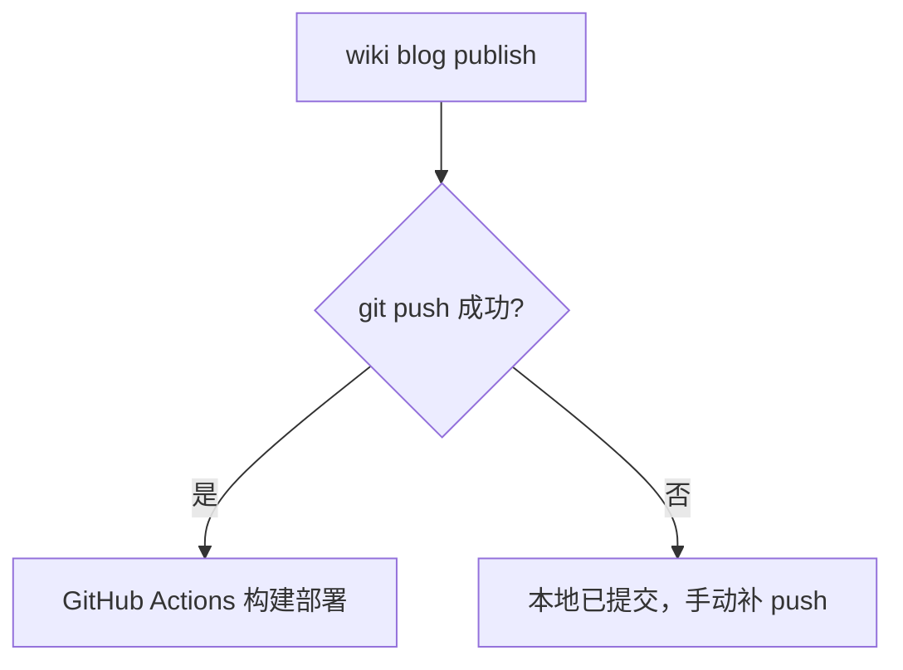

# wiki CLI 工具设计
------
> 一个基于 agent hook 设计的命令行工具：会话结束 hook 自动跑同步，把项目 wiki 知识、Obsidian 校对、Hugo 博客发布串成一条自动化流水线。核心思想：hook 驱动自动化，数据面与控制流分离。源码：[daidaiJ/my-wiki-repo](https://github.com/daidaiJ/my-wiki-repo)

## 动机：笔记散落十几个仓库
------
让 agent 做源码调研和方案分析，产出物（调研 wiki、issue 分析、踩坑记录）散落在十几个仓库的角落里，格式不一、无人索引、想找的时候不知道在哪。为每个项目 fork 一个 wiki 仓库又太重。

my-wiki 的做法是**正文进知识库、项目留窗口**：agent 仍往 `项目/wiki/` 里写笔记（路径不变，不必知道知识库在哪），收工 hook 把正文反转进 `WIKI_ROOT/projects/`——git 可同步的真文件，项目侧原位换成一条窗口链接；本地注册表登记每个项目的位置和介绍。任何时刻 `wiki grep` 跨项目检索，而你的个人知识配置永远不会出现在项目 remote 里。

这个布局不是一开始就想清楚的。第一版走的是"正向聚合"：笔记留在各项目里（单一事实源），知识库用符号链接聚合过来。用下来发现两个硬伤——git 只能提交链接本身，笔记永远进不了版本控制；换一台机器，链接全部悬空。于是把方向反过来：正文当真文件收进知识库（git 可同步、Obsidian 直读），项目侧才用链接。旧布局遇到时 `init` / `sync --fix` 会自动迁移，不再作为选项。**存储位置之争的裁判是 git 和换机场景，不是"哪个更像单一事实源"——链接聚合格局好看，但 git 提交不了链接指向的内容。**

## 核心思想：hook 驱动，自动化优先
------
wiki 的定位不是"又一个笔记工具"，而是 agent 工作流里的自动同步器。设计围绕唯一一个 hook 展开：会话退出时跑一次 `wiki check`——幂等、静默、非阻塞。已注册项目做窗口维护和正文反转迁移；没注册过的项目只要已经有了知识目录（说明 agent 写过东西），就自动接入——agent 写入后才触发，不预建空目录。人不需要记得"接入"这件事，agent 也不需要。

早期版本还有 `register` 子命令、会话开始的 `prepare` hook 等一串入口，后来发现它们的所有场景都被这一个 check 覆盖了，索性全部砍掉：register 删除，prepare 降级为换机后手动重建窗口的修复工具。**能被一个 hook 覆盖的维护逻辑，就不该让用户配置第二个 hook。**

hook 驱动的前提是架构分层，wiki 把整个系统切成两层：

- **数据面**：知识数据本身。知识正文是 `WIKI_ROOT/projects/` 下的真文件（git 可同步），注册表、发布记录、配置同在 wiki 根下——这个目录同时就是 Obsidian 仓库
- **控制流**：工具逻辑与 agent 工作流。命令契约、钩子、规约注入——这部分可以开源、可以复制、可以升级，和数据互不污染

分离的直接体现是 wiki 根解析：

```go
// config.go（简化）
func WikiRoot() string {
    if env := os.Getenv("WIKI_ROOT"); env != "" {
        return env
    }
    // 依次探测可执行文件目录、当前目录是否含 index.md 标记
    for _, dir := range []string{exeDir, cwd} {
        if _, err := os.Stat(filepath.Join(dir, "index.md")); err == nil {
            return dir
        }
    }
    return exeDir // 兜底
}
```

> 工具仓库可以开源（代码 + 规约），个人数据在 `WIKI_ROOT` 指向的目录，两者互不污染。换机器只要 clone 知识库数据目录，`wiki prepare` 重建一次窗口即可。

数据面还有一个更重要的原则：**项目仓库零足迹**。接入信息只存在 wiki 根的本地注册表，不会随项目 commit/push 泄漏到远程——你的个人知识配置永远不会出现在公开仓库里。

## 数据面实现：注册表 + 反转存储
------
注册表持久化为 `index.md` 顶部的隐藏 JSON 块，其余是渲染视图：

```go
// registry.go
func saveRegistry(root string, reg *Registry) error {
    var b strings.Builder
    b.WriteString("<!-- wiki-registry\n")
    b.Write(data)                 // ← JSON 数据块（机器读）
    b.WriteString("\n-->\n\n")
    b.WriteString("# 项目索引\n\n") // ← 以下是 Markdown 渲染视图（人读）
    for _, p := range reg.Projects {
        fmt.Fprintf(&b, "| %s | %s | %s |\n", p.Name, p.Root, p.Intro)
    }
    return os.WriteFile(registryPath(root), []byte(b.String()), 0o644)
}
```

> 一个文件同时是数据源和视图，agent 和人都能读。JSON 藏在 HTML 注释里，Markdown 渲染器不会显示它，`wiki grep` 也不会被它干扰。

链接层（窗口）：项目侧的 `wiki/` 是一条指向知识库正本的 symlink，Windows 无权限时自动降级 junction：

```go
func makeLink(target, link string) error {
    if err := os.Symlink(target, link); err == nil {
        return nil
    } else if runtime.GOOS == "windows" {
        out, jerr := exec.Command("cmd", "/c", "mklink", "/J", link, target).CombinedOutput()
        if jerr == nil {
            return nil // ← junction 降级成功
        }
        return fmt.Errorf("symlink 失败: %v；junction 降级也失败: %v: %s", err, jerr, out)
    }
    return err
}
```

整体关系（注意方向：链接从项目侧指向知识库，与正向聚合相反）：



### 项目侧怎么看见正文：link 还是 copy

反转存储里还剩一个二选一：项目侧用窗口链接（**link**，缺省）还是真目录（**copy**）。这是同一布局的两种形态，不是两套设计，接入时 `--mode` 选择，`wiki list` 可见每个项目的模式。

copy 模式下正文归项目 git 管，收工 hook 只做项目 → 知识库的增量合并拷贝——mtime 新者胜（rsync -u 语义）、**永不删文件**。永不删是有意设计：Obsidian 侧的校对修改不会被项目侧覆盖，代价是两侧各有一份拷贝、项目侧删掉的文件会残留在知识库。另外拷贝模式下遇到残留的链接布局会拒绝动手——防错误覆盖搬迁比自动化更重要。

**怎么选**：项目仓是自己的、希望知识随仓库走、或环境不便建符号链接 → copy；想避免两份拷贝、知识只归知识库管 → link（缺省）。已注册项目保留原模式，换模式需 `unlink` 后重新 `init`。

## 控制流实现：为 hook 而生
------
控制流要回答一个问题：hook 和 agent 怎么和这个工具协作？两个设计贯穿始终。

**幂等 check，为钩子而生。** `wiki check` 被设计为对任何钩子机制都安全：

- stdout 恒为空（部分工具会把 stdout 当 JSON 严格校验）
- 日志全部走 stderr，内部错误不改变退出码
- 不修改当前项目仓库的任何文件

```go
// EnsureRegistered 幂等地把项目接入知识库，init/check 共用
func EnsureRegistered(root, abs string, decl *WikiSyncDecl) (*EnsureResult, error) {
    // 1. 跳过健康链接（EvalSymlinks 比对目标）
    // 2. 修复失效链接
    // 3. 清理声明收缩后的孤儿链接（只删链接，绝不碰真实目录）
    // 4. upsert 注册表——无变化则不写盘
    ...
}
```

> 关键细节：注册表无变化则不写盘。否则每轮会话结束都触发一次文件写入，既制造噪音，也让 git 工作区永远不干净。

check 的**生效范围**也是可配置的（`hookMode`）：`forbiddenList`（缺省）全目录生效、按禁止名单排除；`whitelist` 只在白名单子孙目录生效（名单支持 `~` 前缀，跳过时 stderr 说明原因）。生效范围和静默契约是两件事：前者给"上游项目仓库、公司代码目录不想被收编"的环境差异留口子，后者保 hook 安全——范围可以宽松配置，stdout 契约一步不让。

还有一个不显眼但救命的设计：**中断迁移的恢复**。反转迁移是"项目侧真目录 ↔ 知识库真目录"两侧都是真文件的场面，做到一半被杀（Windows rename 锁、进程中断）会留下半迁移状态。恢复逻辑的原则是永不覆盖 vault 侧文件——多余的合并进知识库、冲突的逐子项搬运兜底。迁移类工具的第一守则：任何情况下不能弄丢用户数据，宁可留下待清理的残留。

**宽容 flag 解析。** agent 调用 CLI 时经常把位置参数放在旗标前（`init <目录> --paths wiki`），标准库 flag 不接受这种顺序。`ParseWithPositionals` 内部重排为「旗标在前、位置参数在后」再交给标准 FlagSet：

```go
func ParseWithPositionals(fs *flag.FlagSet, args []string) error {
    var flags, pos []string
    for i := 0; i < len(args); i++ {
        a := args[i]
        if strings.HasPrefix(a, "-") && a != "-" {
            flags = append(flags, a)
            if f := fs.Lookup(strings.TrimLeft(a, "-")); f != nil {
                if bv, ok := f.Value.(interface{ IsBoolFlag() bool }); !ok || !bv.IsBoolFlag() {
                    if i+1 < len(args) { // 非 bool 旗标吞掉下一个 token
                        i++
                        flags = append(flags, args[i])
                    }
                }
            }
        } else {
            pos = append(pos, a)
        }
    }
    return fs.Parse(append(flags, pos...))
}
```

> 这个函数是 agent 友好设计的缩影：CLI 的调用方是 LLM，不是人。LLM 生成命令时不会严格遵守「旗标在前」的约定，宽容解析能显著减少失败重试。

## 打通 Obsidian 和 Hugo 博客仓库
------
知识库有两个出口：Obsidian 仓库（人阅读校对）和 Hugo 博客仓库（对外发布）。Obsidian 仓库根就是 wiki 根（pandawiki），`projects/` 聚合各项目的知识正文（反转存储后的真文件），人在里面阅读校对；校对通过的笔记才进博客流水线。调研笔记（wiki/issues）→ 知识库检索 → Obsidian 校对 → 沉淀成博客，一条链路：


`blog new` 的完整流程：



几个关键设计：

- **apply 时查重**：slug 罕见重复 + 文件名存在性，先于 `hugo new` 报错，避免生成一半才发现冲突
- **push 失败不重试**：原始错误透传，文章已本地提交，用户手动补一次 `git push` 即可
- **blog.json 懒维护**：发布成功后才更新四字段记录，`blog list` 据此统计分类复用频次

```go
// blogPublish 提交并推送；push 失败不重试
if out, _, err := run("push", "push"); err != nil {
    return fmt.Errorf("git push 失败（不重试，原始输出透传如下）:\n%s%v\n\n"+
        "GitHub 网络问题请用户手动处理：稍后在 %s 执行 git push 即可，文章已本地提交。",
        out, err, repo)
}
```

> 不重试是刻意的：push 失败几乎都是网络问题，自动重试只会放大 GitHub 的限流压力。把决定权交给人，比假装智能地重试更可靠。

知识管理对博客的反哺也在这里：`blog list` 统计已有分类的使用频次，新文章优先复用——分类不会碎片化，知识库的元数据直接指导博客的写作决策。

## 工作流设计：从调研到发布
------
> 工具解决"怎么管"，工作流解决"怎么用"。整条链路三段：agent 驱动总结 → Obsidian 查看校对 → Hugo 发布 / git 同步。每段有明确的产出物和交接点，中间夹一道人工关卡。



### Agent 驱动总结
------
agent 调研/实践后把结论沉淀成笔记，写入项目自己的 wiki/ 目录——路径不变，agent 不必知道知识库在哪。文风由 tech-blog skill 规范，产出物直接可读。接入零足迹：`wiki init` 只写本地注册表 + 建窗口；Stop hook 每轮会话结束跑 `wiki check`——已注册项目反转迁移正文，没注册但已有知识目录的项目自动接入，新笔记自动进知识库，不需要任何手动步骤。

### Obsidian 查看校对
------
知识库最终要给人看。Obsidian 仓库根 = wiki 根（pandawiki），`projects/` 下是各项目的知识正文（反转存储后的真文件），人在 Obsidian 里阅读校对：链接通不通、结论站不站得住、有没有遗漏。这是整条链路唯一的人工关卡——agent 产出再快，发布前必须过一遍人眼。

反转存储之后这个环节反而变简单了：正本是真文件，不再依赖符号链接可见性。VSCode 侧也照顾到了——接入操作幂等补齐 `projects/.vscode/` 配置（`*.md` 默认打开内置 Markdown 预览 + 扩展推荐清单，仅缺失时写入、不覆盖用户改动），点开 `.md` 直接是渲染视图。校对通过，笔记才进入发布。

### Hugo 发布 / git 同步
------
发布走 `wiki blog new` → `wiki blog publish`（细节见上一节），push 成功即触发 GitHub Actions 的 hugo 构建部署。失败处理是刻意的：



push 失败不重试——几乎都是网络/代理问题，自动重试只会放大限流。git 同步管理是兜底：先查代理（本地代理没启动时 push 必挂），再手动补 push。

> 三段产出物：笔记（知识库 projects/ 正本）→ 校对结论（人脑）→ 已发布文章（博客仓库）。交接点清晰，每段可独立重跑：agent 反复改笔记、人在 Obsidian 反复看、发布随时重来。人工关卡放在发布前而不是发布后，是这条流水线最重要的设计决定。

## 同题对照：ai-memory 的另一种切法
------
> 开源这个工具两周后，我看到 [akitaonrails/ai-memory](https://github.com/akitaonrails/ai-memory)——Rust 写的 AI coding agent 长期记忆系统，核心链路和我殊途同归：lifecycle hooks 静默采集 → 会话结束 consolidate 成 markdown wiki 页 → 下一个会话检索续接。两个独立演化的方案最终在"markdown 正本 + hook 收工沉淀"上汇合，这件事本身比任何一方的设计都更有说服力。

| | my-wiki | ai-memory |
|---|---|---|
| 记忆载体 | `projects/` 下的普通 .md（反转存储） | git-backed wiki 的普通 .md，数据库只是可重建的派生索引 |
| 写入方式 | agent 直写 `项目/wiki/`，收工 hook 反转进知识库 | lifecycle hooks 全程静默采集，会话结束整理成页 |
| 检索 | `wiki grep` 全文检索，零索引 | 全文/实体/链接/(可选)向量融合排序，默认零 LLM 调用 |
| 跨 agent | 规约注入（`wiki inject`）+ 单 hook，命令契约对 LLM 友好 | 20+ harness 第一方接入，handoff 是显式协议（typed、owned、claimed exactly once） |
| 部署形态 | 单二进制 CLI，本地优先 | 自托管 server，跨机器、团队共享、审计日志 |

> 两边最有共识的一点：**记忆的正本必须是普通 markdown 文件**。ai-memory 的原话是 "No vector store to babysit, nothing held hostage in a binary blob"，我的版本是"任何时刻 grep 一下就能跨项目检索"。agent memory 赛道都在卷向量库，但真正高频的知识检索场景全文搜索就够——文件本身是最好的数据库，grep 是最低的维护成本。
>
> 分歧在共享边界：ai-memory 把"跨 agent、跨机器、跨人"当第一性需求，为此上了 server 和多用户认证；我把知识库锚在本地 git + Obsidian，团队共享是明确不支持的取舍。这是个人工具和团队基建的分野——我选择先保证单人链路足够顺滑，共享需求真出现了再说。另外它的 handoff 协议（交接物是 typed、owned、只能认领一次）值得借鉴，我的"交接"目前只靠知识库正文本身，没有显式的进行时状态。

## 演进复盘：两周里被改掉的三次
------
> 文章开头的设计是最终形态，但它是被提交史一路撞出来的。把 8 月 23 日开源到 9 月 6 日的演进拉出来看，比描述最终状态更有信息量：

| 时间 | 演进 | 内容 |
|---|---|---|
| 08-23 | 开源收尾 | 标准分包、MIT/CI/tag 发布；`blog new` 改由 hugo archetype 生成模板 |
| 09-03 | 反转存储落地 | 正文进 `projects/`，项目侧换窗口链接；`bundle` 归档出口 |
| 09-03 | copy 模式 | 增量合并拷贝（mtime 新者胜、永不删文件）；`injectFile` 可配置适配不同 agent 工具 |
| 09-04 | 崩溃恢复 | 中断迁移的恢复：永不覆盖 vault 侧文件，宁可留残留 |
| 09-05 | 单 hook 重构 | hookMode 生效范围 + 自动反转挪到会话退出；`register` 删除（Closes #2） |
| 09-06 | VSCode 预览 | init/check 幂等补齐 `projects/.vscode` 预览配置 |

三条反思：

**正向聚合败给物理约束，不是败给逻辑。** 第一版"笔记留项目、知识库链接聚合"在逻辑层完全自洽——单一事实源、项目零足迹，每一条都站得住。但它过不了两道物理约束：git 提交不了链接指向的内容，换机即断。教训是设计评审该先问"这个方案在 git / 换机 / 崩溃恢复这些物理现实下还成立吗"，自洽的方案太多了，能过物理约束的没几个。

**功能的寿命取决于它有没有独占场景。** `register`、会话开始的 `prepare` hook 都曾有自己的存在理由；自动反转挪到会话退出后，check 一个入口覆盖了全部场景，于是 register 删除、prepare 降级为手动修复工具。没有独占场景的入口是负债——文档、心智、测试三份维护成本，换不来任何不可替代性。

**自动化等信号，不抢跑。** 自动反转的触发条件是"未注册项目已经有了知识目录"——agent 写入之后才收编，绝不预建空目录。提前建好的自动化是猜，等信号的自动化是响应；猜错的自动化会产生一堆要清理的空壳。

## 一些取舍
------
- **注册表是单机本地的**，没有多用户同步——团队共享知识库不适合
- **刻意本地优先**：要跨机器同步就用 git remote 管理数据目录，工具从不自动 push
- **项目侧近零足迹**：link 模式下项目仓只多一条窗口链接和一个 `.gitignore` 条目（`projectGitignore` 可关），个人配置不进 remote；想要知识随项目仓公开走，copy 模式让正文随项目提交——可选项，不是默认
- **Windows 支持**：symlink 失败自动降级 junction，无需管理员权限

> 坦率说，这个工具离"通用知识管理"还有距离，但它解决了我自己的核心痛点：跨项目检索 + 博客发布自动化。工具的价值不在于功能多，而在于和 agent 工作流的契合度——每个命令都是为 LLM 调用方设计的。

## 实践：Obsidian 仓库接入 SOP
------
> 知识库最终要给人看。Obsidian 是现成的阅读器，把 wiki 根接进去当仓库有两条路：先建仓库再配 wiki CLI（推荐），或者顺序反了之后迁移。殊途同归：Obsidian 仓库根 = wiki 根，一个目录两用。

### 路线一：先建仓库，再配置 wiki CLI
------
正确顺序是先有仓库，再让 wiki CLI 的持久化目录落进仓库：

1. 建一个空的 Obsidian 仓库，目录名避开 `wiki`——和 `knowledgeDirs` 的类型名重合，自动发现时可能把仓库目录自己误认成项目知识目录
2. 把 wiki CLI 持久化目录配置到仓库：`setx WIKI_ROOT "D:\wiki\pandawiki"`（用户级环境变量，新终端生效）
3. `wiki init <项目>` 接入项目——注册表 `index.md`、`config.json`、`projects/` 链接全部落在仓库目录里，Obsidian 里立即可见
4. 验证：`wiki ls` 项目在册，`obsidian vault=pandawiki folders` 索引完整

### 路线二：顺序反了，迁移现有持久化目录
------
wiki CLI 数据已经存在（比如在 `D:\wiki`），迁移进 Obsidian 仓库分四步：

1. **迁数据**：`index.md`（注册表）、`config.json`、`blog.json`、`projects/` 整个目录移进仓库
2. **显式指定 WIKI_ROOT**：wiki 根靠 `index.md` 标记解析（环境变量 > exe 目录 > 当前目录），只搬文件不设环境变量，hook 会静默失效、`wiki check` 空转：

```bash
setx WIKI_ROOT "D:\wiki\pandawiki"   # 用户级环境变量
```

hook 不依赖终端环境，内联设置：

```bash
cmd /c "set WIKI_ROOT=D:\wiki\pandawiki&& D:/CODE/ai/my-wiki/wiki.exe check"
```

3. **注册仓库**：UI 里 Open folder as vault，或直接改注册表：

```json
// %APPDATA%\obsidian\obsidian.json
{"vaults":{"c3d4bd2d547a9675":{"path":"D:\\wiki\\pandawiki","ts":1787470151204,"open":true}},"cli":true}
```

> `obsidian://open?path=` 只能解析已注册仓库里的文件，不能注册新仓库——别在这上面浪费时间。

4. **验证清单**：

- `wiki ls`：项目全部在册
- `obsidian vault=pandawiki folders/files`：知识正文全部索引（`projects/` 下是真文件，不依赖符号链接可见性）
- 最终结构：

```
D:\wiki\pandawiki\            ← Obsidian 仓库根 = wiki 根
├── .obsidian/
├── index.md                  ← 注册表（标记）
├── config.json / blog.json
├── 欢迎.md
└── projects/                 ← 知识正文（真文件，git 可同步）
    ├── agentscope/wiki/
    ├── higress/wiki/
    └── ...
```

> 两条路线殊途同归：Obsidian 仓库根 = wiki 根，一个目录两用。推荐路线一，但路线二也不复杂——迁数据、设 WIKI_ROOT、注册、验证四步，十分钟收工。
