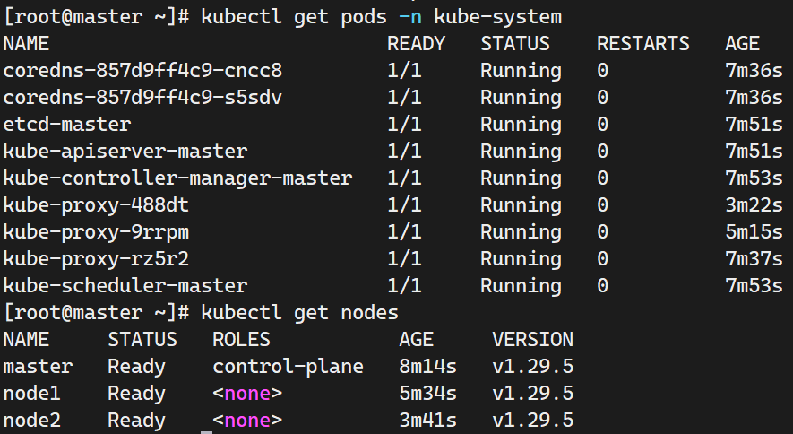

# 使用脚本部署k8s 虚机集群
------
## 部署流程
首先是物料准备，此脚本以centos8 为内核的虚机准备，理论上兼容**anolis,rocky,almalinux**；
> 尽量先将环境中的docker或者其他容器运行时给先清理干净。
1. [k8s基础环境脚本](./k8s_deploy.sh) 这个脚本需要在每个节点上执行
2. [cri_docker的预构建包](https://github.com/Mirantis/cri-dockerd/releases/download/v0.3.14/cri-dockerd-0.3.14-3.el8.x86_64.rpm) 如果对github 连接不稳定，建议将这个包分发到k8s基础环境脚本的工作目录里去
3. [master需要的kubeinit脚本](./kubeinit.sh)
4. [k8s-cni的部署配置文件](./flannel.yml)

然后执行的流程基本上如下：
1. 将上述物料按照说明上载到虚机节点上；
2. 按照vmware 或者kvm 的虚机节点网络配置，修改53-55行里面有关于hosts配置的部分
```shell
cat >> /etc/hosts << EOF
192.168.160.11 master    // 修改成你要的ip
192.168.160.12 node1   
192.168.160.13 node2
EOF
```
3. 可选根据节点规划的hostname 使用 `hostnamectl set-hostname  your-hostname` 来修改hostname
3. 首先在各个节点上执行k8s 基础环境准备脚本；`chmod u+x ./k8s_deploy.sh && ./k8s_deploy.sh`
4. 中间有个输出docker service 的状态信息的部分需要手动键入q 来退出这个交互信息输出的部分
5. 然后正常情况是不会报错的，同时会显示 kubelet 之类的包已经被拉取安装好了
6. 现在开始分节点role 执行不同脚本和命令
7. master 上面执行 master 的 kubeinit 脚本，正常情况下会打印一些提示信息出来
```shell
1. exec 'kubeadm join ..(your cmd).. --cri-socket=unix:///var/run/cri-dockerd.sock' at your slave node please append the config '--cri-socket=unix:///var/run/cri-dockerd.sock' 
2. exec 'kubectl apply -f flannel.yml' at your master node and wait until all nodes state is ready 
```
8. 这个提示信息其实是我加的，就是说明要:
   1. 在主节点上执行 `source /etc/profile` 启用环境变量配置
   2. 在从节点上执行`kubeadm join ..(your cmd).. --cri-socket=unix:///var/run/cri-dockerd.sock` 注意中间有省略号的部分是k8s生成的token 号，这个有时效性，粘贴过来后加上`--cri-socket=unix:///var/run/cri-dockerd.sock` 就是为了应用cri-docker的cri配置
   3. 执行正常的话会提示你执行 `kubectl get nodes ` 类似的命令，切换到主节点上执行可以看到各个节点都是NotReady 这是因为没有部署好k8s的网络插件cni
   4. 这里在主节点上执行 `kubectl apply -f flannel.yml`，这个配置需要几分钟时间，可以等一会儿，然后再执行 `kubectl get nodes `
9. 最终应该是有下面这个图的输出

**现在整个环境就可以用了，同时虚机重启也不会毁坏这个k8s集群**