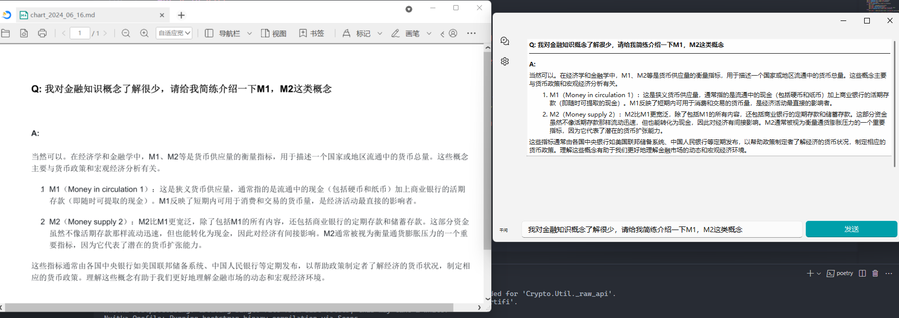

# 一个gptapi 桌面套件
------
使用了pyside6 和qfluentwidget 做的界面，qfluent 主要是用了侧边导航栏，后期考虑去掉这个依赖进一步减少编译后执行文件大小。
[chatdesk 桌面套件连接](https://gitee.com/adamszhang/panda-technology-stack/tree/master/python/chatdesk)

## 功能
- markdown 自动导出
- 国产api {千问，豆包，混元，千帆，DeepSeek，Kimi}
- 支持多轮对话，但是暂时没做单轮多轮的动态切换
- 支持api 厂商动态切换，左下角label 显示当前使用的api后端
- work线程实现异步读取响应流，但是考虑到防误触重发的问题，读取完成前，发送按钮不能再次点击
- 支持静态模型切换，目前配置文件存于工作目录，比使用环境变量更安全些
- 实验特性，多api 同时响应回答，目前没对多轮会话做支持；

## 主页面动态增长对话框
这边没有完全考虑仿照qq 那种一左一右的对话布局，因为比较麻烦；主要是在Scrollarea可滚动区域里面，添加重写的文本框；文本框在内容更新和变动时会自动适应内容大小，固定宽度；文本框超出滚动区域可视高度时会调整整个滚动区域的最小高度，避免压缩文本框；

**TODO**：
因为会根据滚动区域里面文本框的累积高度来调整滚动区域最小高度，避免压缩文本框，会在特定情况下发生侧边滚动条调变，后期可能考虑优化；
给模型切换设计更加灵活的触发方式；
支持历史记忆管理，增强多轮会话的关联性；
支持一些链模式，或者说对内容做多轮归纳增强；

## 会话窗口

```python

# 一个单线程的异步执行者
class MyThead(QThread):
    def __init__(self,parent):
        super().__init__(parent)
        self.queue =Queue(10)
        self.exist = False
    def addtask(self,fn):
        self.queue.put(fn)
    def stop(self):
        self.exist =True
        self.queue.put(lambda: logging.debug("线程shutdown") )
    def run(self):
        while not self.exist:
            try:
                fn =self.queue.get(timeout=1)
                if fn is None:
                    break
                if self.exist:
                    break
                try:
                    fn()
                except Exception as e:
                    logging.debug(f"线程内部执行错误{e=}")
                    break
            except Empty:
                if self.exist:
                    break
                continue
# 简单的 对话界面窗口
class Flow(QWidget):
    def __init__(self):
        super().__init__()
        self.layout_ = QVBoxLayout(self)
        self.layout_.setAlignment(Qt.AlignmentFlag.AlignTop)
        self.setLayout(self.layout_)
    def addWidget(self,w:QWidget):
        self.layout_.addWidget(w)
    
    
class TextArea(QTextEdit):
    def __init__(self,parent):
        super().__init__()
        self.setReadOnly(True)
        self.setVerticalScrollBarPolicy(Qt.ScrollBarPolicy.ScrollBarAlwaysOff)
        self.m_txtDefaultHeight = 50
        self.setMaximumHeight(50)
        self.setMinimumHeight(50)
        self.top,self.bottom = self.contentsMargins().top(), self.contentsMargins().bottom()
        self.ctx = ""
        self.pa = parent
        # 隐藏时间戳，后续可能会用到类似的注释
        self.ud = f"<!-- TS:{datetime.now().strftime('%Y-%m-%d %H:%M:%S')} -->"
        self.ds = f"{datetime.now().strftime('%Y_%m_%d')}"
        self.saved = False
        self.callback :Callable[[float],int] 
        self.lastH = -1.0
    def insertMarkdown(self,s:str):
        self.ctx +=s
        self.setMarkdown(self.ctx)
        self.checkResize()
    def regist(self,callback:Callable[[float],int] ):
        self.callback = callback
    # 适应窗口变动
    @Slot()
    def checkResize(self):
        # print("更新变动")
        h = self.document().size().height()
        outer =-1
        if h>max(self.lastH,outer):
            self.lastH = h
            outer =self.callback(h+self.top+self.bottom)
        if h>self.m_txtDefaultHeight:
            self.m_txtDefaultHeight = math.floor(h)
            
            self.setMaximumHeight(math.floor(h))
            self.setMinimumHeight(math.floor(h))
            rect = self.geometry()
            self.setGeometry(rect.x(),rect.y(),rect.width(),math.floor(h)+self.top+self.bottom)
    # 导出md 文件
    @Slot()
    def export2File(self):

        if self.saved:
            return
        with open(f"./chart_{self.ds}.md",mode="a+",encoding="utf8") as fw:
            size = self.ctx.split("-----",maxsplit=1)
            if len(size) >1 and len(size[1])>0:
                fw.write(self.ctx)
                fw.write(f"\n{self.ud}\n")
                self.saved =True

    def wheelEvent(self,e :QWheelEvent):
        self.pa.wheelEvent(e)
    def resizeEvent(self, e: QResizeEvent) -> None:
        self.document().setTextWidth(self.viewport().width())
        margins = self.contentsMargins()
        height = int(self.document().size().height() + margins.top() + margins.bottom())
        self.setMaximumHeight(height)
        self.setMinimumHeight(height)

class MyApp(QWidget):
    sig = Signal(str)
    def __init__(self, *args,**kwargs) -> None:
        super().__init__(*args,**kwargs)
        self.setWindowTitle("PYSIDE6 demo")
        self.id =0
        self.gid =0
        self.resize(800,450)
        self.m_end =0
        self.set_ui()
        self.ctx =""
    # 这部分还可以整理一下
    def set_ui(self):
        self.scrollarea = SingleDirectionScrollArea()
        self.scrollarea.setWidgetResizable(True)
        self.scrollbar = self.scrollarea.verticalScrollBar()
        self.flow = Flow()
        self.create_txt()
        self.flow.addWidget(self.txt)
        self.flow.setMinimumHeight(self.scrollarea.size().height())
        self.scrollarea.setWidget(self.flow)
        self.button = PrimaryPushButton("发送")
        self.inputtext = LineEdit()
        self.inputtext.setPlaceholderText("请输入你的想法")
        self.laout = QGridLayout(self)
        # self.appendWS([self.text,self.button,self.inputtext])
        self.laout.addWidget(self.scrollarea,0,0,3,4)
        self.laout.addWidget(self.inputtext,4,0,1,3)
        self.laout.addWidget(self.button,4,3,1,1)
        self.button.clicked.connect(self.magic)
        self.agent = None
        self.worker = MyThead(self)
        self.setStyleSheet("QPushButton{border-width:1px;border-radius:5px;background-color: #3366FF ;}\
                           QLabel{border:3px solid black ;border-radius:5px;color:black}")
    # 动态切换api 后端
    def changeAgent(self,s):
        if s in Agents:
            if s==da:
                return
            
            self.agent = Agents[s]
    # 根据内容更新滚动条高度
    def changeScrollBar(self, f:float):
            nexth =-1
            if self.m_end +f >= self.flow.minimumHeight():
                nexth = int(self.m_end+f)+50
                self.flow.setMinimumHeight(nexth)
                self.scrollbar.setValue(self.scrollbar.maximum())
            return nexth
    def create_txt(self):
        if self.gid>1:
            self.m_end =self.txt.geometry().y()+self.txt.geometry().height()+self.txt.top+self.txt.bottom
            self.sig.disconnect(self.txt.insertMarkdown)
        self.txt = TextArea(self)
        self.scrollbar.setValue(self.scrollbar.maximum())
        self.txt.regist(self.changeScrollBar)
        self.flow.addWidget(self.txt)
        self.sig.connect(self.txt.insertMarkdown)

    def appendWS(self,l:list[QWidget]):
        for it in l:
            self.layout.addWidget(it)
    # 异步任务
    def loopread(self,s:str):
        # 多api 响应，目前没做多轮兼容
        if useALL:
            for k,a in Agents.items():
                try:
                    self.append(f"\n\n`{k}`:  \n\n")
                    a.StreamCall(s,self.append)
                except Exception as e:
                    logging.debug(f"多轮提问错误{e=}")
        else:
            self.agent.StreamCall(s,self.append) # type: ignore
        self.button.setEnabled(True)
        if saveHistory:
            self.txt.export2File()

    def append(self,s):
        self.sig.emit(s)
    def showMessage(self,ty:str,s:str):
        TeachingTip.create(
                target=self.button, # type: ignore
                icon=InfoBarIcon.ERROR,
                title=ty,
                content=s,
                isClosable=True,
                tailPosition=TeachingTipTailPosition.BOTTOM_RIGHT,
                duration=2000,
                parent=self
            )
        logging.debug(f"type={ty},{s}")

    @Slot()
    def magic(self):
        if self.agent is None:
            # 延迟代理配置，使用户可以先通过界面生成配置文件后再重启后使用
            if len(Agents)==0 or da == "":
                self.showMessage("Error:","请先在设置页面配置一个chatgpt api的接口设置")
            else:
                self.agent = Agents[da]
        self.gid +=1
        if self.gid>1:
           self.create_txt()
        if self.inputtext.text()!="":
            self.button.setDisabled(True)
            self.txt.insertMarkdown(f"#### Q: {self.inputtext.text()}\n-----\n**A:**  \n")
            # 延迟启动异步线程
            if not self.worker.isRunning():
                self.worker.start()
            
            self.worker.addtask(lambda : self.loopread(self.inputtext.text()))
    # 用来处理线程关闭问题  
    def close(self) -> bool:
        self.worker.stop()
        self.worker.wait()
        self.worker.quit()
        self.worker.terminate()
        return super().close()
    def closeEvent(self, event) -> None:
        self.worker.stop()
        self.worker.wait()
        self.worker.quit()
        self.worker.terminate()
        event.accept()
        return super().closeEvent(event)

```

## api 后端
```python
# 千问，Kimi,deepseek
# 一直有ssl 验证的ca调用后面会排查一下怎么跳过
class openai:
    def __init__(self,a:auth) -> None:
        self.key =a.sk
        self.url =urlMap[a.type]
        self.client = OpenAI(api_key=self.key,base_url=self.url)
        self.history = [{'role': 'system', 'content': 'You are a helpful assistant.'}]
        self.model = ModelMap[a.type][0]
        self.isMulti = False
    def setModel(self,s:str):
        self.model = s


    def StreamCall(self,s:str,fn:Callable[[str],None]):
        if not self.isMulti:
            self.history = []
        self.history.append({'role': 'user', 'content': f'{s}'})
        cmp = self.client.chat.completions.create(
        model=self.model,
        messages=self.history, # type: ignore
        stream=True
        )
        temp = ""
        for chunk in cmp:
            ctx = chunk.choices[0].delta.content 
            try:
                if ctx and len(ctx)>0:
                    fn(ctx)
            except Exception as e:
                logging.debug(f"streamcall {e=}")
            if ctx:
                temp +=ctx 
        if self.isMulti:
            self.history.append({'role': 'system', 'content': f'{temp}'})

# 百度千帆
class qf:
    def __init__(self,sk=None,ak=None) -> None:
        if sk==None or ak==None:
            raise ValueError(f"{sk=},{ak=} is invalid")
        self.client = qianfan.ChatCompletion(ak=ak,sk=sk)
        self.model = ModelMap["千帆"][0]
        self.history = []
        self.isMulti =False
    def setModel(self,s:str):
        self.model = s
    def StreamCall(self,s:str,fn:Callable[[str],None]):
        temp = ""
        if not self.isMulti:
            self.history = []
        self.history.append({"role":"user","content":f"{s}"})
        resp = self.client.do(model=self.model,messages=self.history,stream=True)
        for chunk in resp:
            ctx = chunk["body"]["result"] 
            try:
                if len(ctx)>0:
                    fn(ctx)
            except Exception as e:
                showMessage("错误",f"{e=}",None,None)
            temp +=ctx
        if self.isMulti:
            self.history.append({'role': 'system', 'content': f'{temp}'})

import json
# 混元
from tencentcloud.common.common_client import CommonClient
from tencentcloud.common import credential
from tencentcloud.common.profile.client_profile import ClientProfile
from tencentcloud.common.profile.http_profile import HttpProfile


class hy:
    def __init__(self,sk=None,ak=None) -> None:
        if sk==None or ak==None:
            raise ValueError(f"{sk=},{ak=} is invalid")
        self.model = ModelMap["混元"][0]
        self.message = {"Messages":[],"Stream":True,"Model":self.model}
        self.history =self.message["Messages"]
        self.isMulti =False      
        cred = credential.Credential(ak, sk)

        httpProfile = HttpProfile()
        httpProfile.endpoint = "hunyuan.tencentcloudapi.com"
        clientProfile = ClientProfile()
        clientProfile.httpProfile = httpProfile

        params = "{}";
        self.client = CommonClient("hunyuan", "2023-09-01", cred, "", profile=clientProfile)
    def setModel(self,s:str):
        self.model = s
        self.message["Model"] = self.model
    def StreamCall(self,s:str,fn:Callable[[str],None]):
        temp = ""
        if not self.isMulti:
            self.message["Messages"] = []
        self.message["Messages"].append({"Role":"user","Content":f"{s}"})
        resp = self.client.call_sse("ChatCompletions", self.message)
        for chunk in resp:
            ctx = json.loads(chunk["data"])["Choices"][0]["Delta"]["Content"] 
            # ctx = chunk["body"]["result"] 
            try:
                if len(ctx)>0:
                    fn(ctx)
            except Exception as e:
                showMessage("错误",f"{e=}",None,None)
            temp +=ctx   
        if self.isMulti:
            self.history.append({'role': 'system', 'content': f'{temp}'})    

# 豆包的这个是比较恶心的，在ak，sk，上还要一个modelid 形式的key
from volcenginesdkarkruntime import Ark
class db:
    def __init__(self,sk=None,ak=None,model=None) -> None:
        if sk==None or ak==None or model==None:
            raise ValueError(f"{sk=},{ak=} is invalid")
        self.client = Ark(ak=ak,sk=sk,base_url="https://ark.cn-beijing.volces.com/api/v3")
        self.model = model
        self.history = []
        self.isMulti =False
    def setModel(self,s:str):
        self.model = s
    def StreamCall(self,s:str,fn:Callable[[str],None]):
        temp = ""
        if not self.isMulti:
            self.history = []
        self.history.append({"role":"user","content":f"{s}"})
        resp:  Stream[ChatCompletionChunk] = self.client.chat.completions.create(model=self.model,messages=self.history,stream=True) # type: ignore
        for chunk in resp:
            if not chunk.choices:
                continue
            ctx: str  = chunk.choices[0].delta.content # type: ignore
            try:
                if len(ctx)>0:
                    fn(ctx)
            except Exception as e:
                showMessage("错误",f"{e=}",None,None)
            temp +=ctx
        if self.isMulti:
            self.history.append({'role': 'system', 'content': f'{temp}'})

```

实现这个异步响应就是通过调用agent 接口的 streamcall ，通过传入的s 表示请求消息，fn表示每轮执行的回调函数，这里的ctx 之类的返回需要增加一个if ctx检查防止某些情况下拿到的对象是None 出现错误